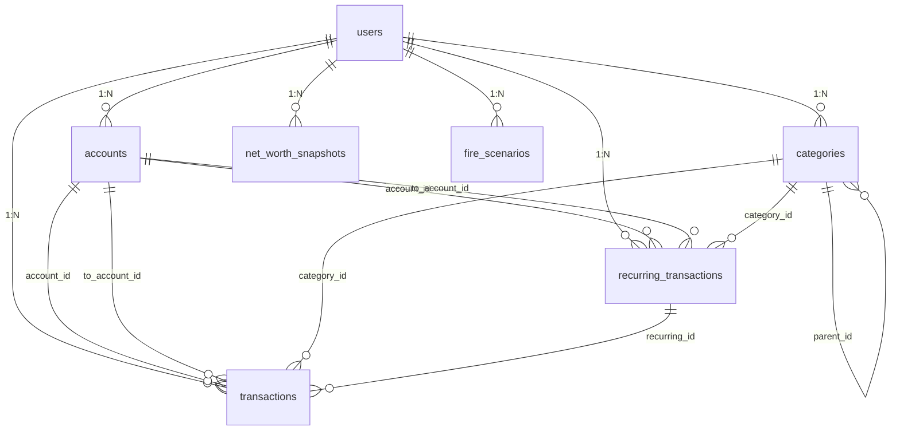
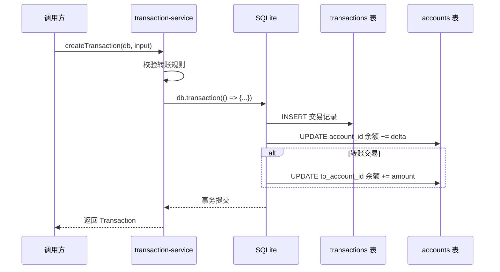
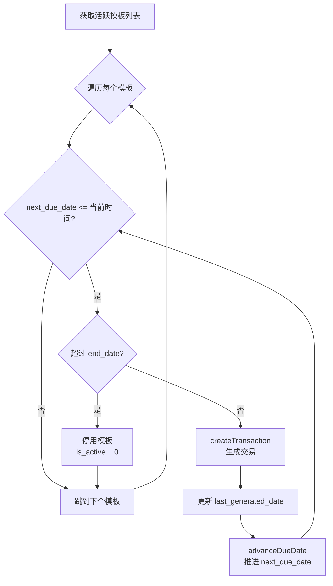
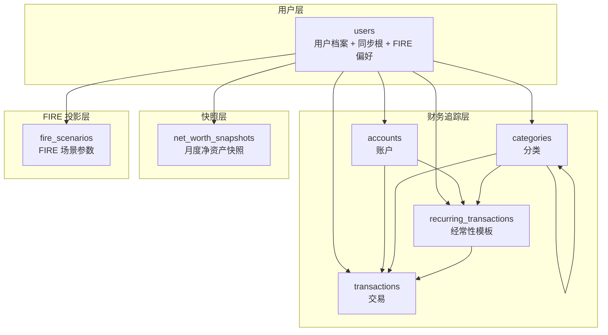
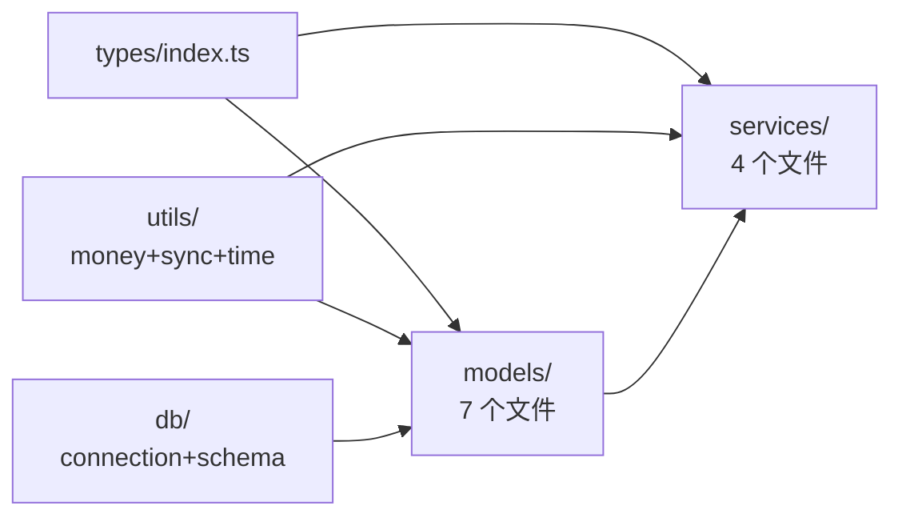
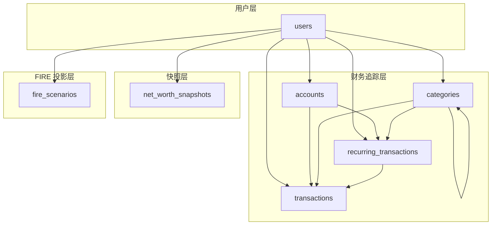
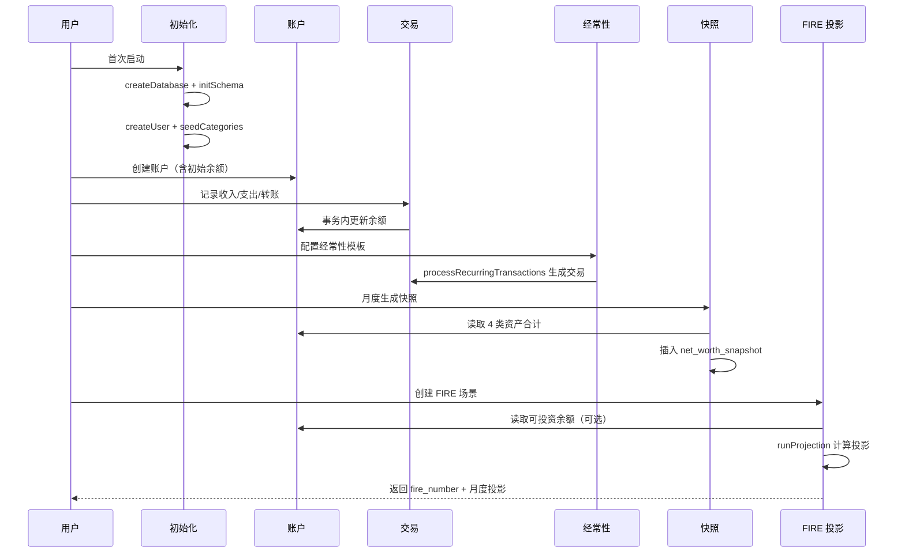

# FIRE APP Code Wiki 实施计划

> **For agentic workers:** REQUIRED SUB-SKILL: Use superpowers:subagent-driven-development (recommended) or superpowers:executing-plans to implement this plan task-by-task. Steps use checkbox (`- [ ]`) syntax for tracking.

**Goal:** 为 FIRE APP 仓库生成 9 份结构化 Code Wiki 文档（1 主页 + 8 子文件），覆盖代码层 + 设计文档导航，作为代码的索引与导航层。

**Architecture:** 按依赖顺序逐份编写 Wiki 文件：基础设施（database/utils）→ 类型与模型 → 业务服务 → 测试与文档索引 → 总览与主页。每个 Wiki 文件对应代码结构镜像的一个模块，遵循统一的文件头格式、源码链接规范、Mermaid 图规范。Wiki 以代码为权威，设计文档仅作导航。

**Tech Stack:** Markdown 文档；Mermaid 图（flowchart/erDiagram/sequenceDiagram）；`file:///` 可点击源码链接；目标代码栈为 TypeScript + better-sqlite3 + vitest

**Spec:** `docs/superpowers/specs/2026-07-15-fire-app-code-wiki-design.md`

---

## 文件结构

本计划产出的文件（全部位于 `docs/wiki/`）：

```
docs/wiki/
├── CODE_WIKI.md              # Task 9 产出（主页，最后写）
├── 01-overview.md            # Task 8 产出
├── 02-database.md            # Task 1 产出
├── 03-types.md               # Task 2 产出
├── 04-models.md              # Task 4 产出
├── 05-services.md            # Task 5 产出
├── 06-utils.md               # Task 3 产出
├── 07-tests.md               # Task 6 产出
└── 08-design-index.md        # Task 7 产出
```

需读取的源码文件（按任务依赖）：

```
fire-app/src/
├── db/connection.ts          # Task 1
├── db/schema.ts              # Task 1
├── types/index.ts            # Task 2
├── utils/money.ts            # Task 3
├── utils/sync.ts             # Task 3
├── utils/time.ts             # Task 3
├── models/user.ts            # Task 4
├── models/account.ts         # Task 4
├── models/category.ts        # Task 4
├── models/transaction.ts     # Task 4
├── models/recurring.ts       # Task 4
├── models/scenario.ts        # Task 4
├── models/snapshot.ts        # Task 4
├── services/fire-calc.ts     # Task 5
├── services/transaction-service.ts  # Task 5
├── services/recurring-service.ts    # Task 5
└── services/snapshot-service.ts     # Task 5
```

需读取的测试文件（Task 6）：

```
fire-app/tests/
├── db/connection.test.ts
├── db/schema.test.ts
├── integration/workflow.test.ts
├── models/account.test.ts
├── models/category.test.ts
├── models/user.test.ts
├── services/fire-calc.test.ts
├── services/recurring-service.test.ts
├── services/snapshot-service.test.ts
├── services/transaction-service.test.ts
├── utils/money.test.ts
├── utils/sync.test.ts
└── utils/time.test.ts
```

需读取的设计文档（Task 7）：

```
docs/superpowers/specs/*.md   (6 份)
docs/superpowers/plans/*.md   (3 份)
```

---

## 通用约定（所有任务遵循）

### 1. 文件头格式

每个 Wiki 文件**必须**以以下格式开头：

```markdown
# [文件标题]

> **最后更新**: 2026-07-15
> **对应代码**: `fire-app/src/xxx/`
> **导航**: [← 返回主页](CODE_WIKI.md) | [上一节](0N-xxx.md) | [下一节](0N+1-xxx.md)

---

```

具体导航链接按文件位置填充：
- `02-database.md` 上一节为 `01-overview.md`，下一节为 `03-types.md`
- `03-types.md` 上一节为 `02-database.md`，下一节为 `04-models.md`
- `04-models.md` 上一节为 `03-types.md`，下一节为 `05-services.md`
- `05-services.md` 上一节为 `04-models.md`，下一节为 `06-utils.md`
- `06-utils.md` 上一节为 `05-services.md`，下一节为 `07-tests.md`
- `07-tests.md` 上一节为 `06-utils.md`，下一节为 `08-design-index.md`
- `08-design-index.md` 上一节为 `07-tests.md`，下一节为（无，留空或写"（无）"）
- `01-overview.md` 上一节为（无），下一节为 `02-database.md`
- `CODE_WIKI.md` 不需要导航行（自身是主页）

### 2. 源码链接格式

所有引用源码的位置使用绝对路径 `file:///` 链接：

```markdown
- 见 [account.ts:103-119](file:///workspace/FIRE%20APP/fire-app/src/models/account.ts#L103-L119)
```

规则：
- 路径中空格用 `%20` 编码
- 行号锚点用 `#L起-止` 或 `#L单行`
- 链接文本用 basename（如 `account.ts`），**不**用反引号包裹
- 函数级引用带行号锚点；文件级引用可不带

### 3. Mermaid 图规范

- 代码块标注 `mermaid` 语言
- 节点文本用中文，标识符用英文
- 关键图后跟 1-2 句文字描述作为渲染降级

### 4. 术语统一

遵循 spec 5.4 节的术语统一表（金额=分、基点、软删除、LWW、可投资余额等）。

---

## Task 0: 创建 Wiki 目录

**Files:**
- Create: `docs/wiki/` (目录)

- [ ] **Step 1: 创建目录**

Run: `mkdir -p "/workspace/FIRE APP/docs/wiki"`
Expected: 目录创建成功，无输出

- [ ] **Step 2: 验证目录存在**

Run: `ls -la "/workspace/FIRE APP/docs/wiki"`
Expected: 显示空目录，路径为 `/workspace/FIRE APP/docs/wiki/`

---

## Task 1: 编写 02-database.md（数据库层）

**Files:**
- Create: `docs/wiki/02-database.md`
- Read: `fire-app/src/db/connection.ts`、`fire-app/src/db/schema.ts`

**Spec 参考**: spec 第 4.2 节

- [ ] **Step 1: 读取源码文件**

读取以下文件以获取准确内容：
- `/workspace/FIRE APP/fire-app/src/db/connection.ts`（22 行，含 `createDatabase` / `closeDatabase`）
- `/workspace/FIRE APP/fire-app/src/db/schema.ts`（173 行，含 7 张表 DDL + 9 个索引 + `initSchema`）

- [ ] **Step 2: 撰写文件头与第 1 节（连接管理）**

写入 `docs/wiki/02-database.md`，文件头按通用约定格式（上一节 `01-overview.md`，下一节 `03-types.md`）。

第 1 节"连接管理"内容：
- 描述 `createDatabase(path)` 函数：默认路径 `data/fire-app.db`，`:memory:` 用于测试
- 描述两个 PRAGMA：
  - `foreign_keys = ON`（强制外键约束）
  - `journal_mode = WAL`（仅文件库启用，内存库静默忽略）
- 描述 `closeDatabase(db)`：检查 `db.open` 后调用 `db.close()`
- 源码链接：[connection.ts:9](file:///workspace/FIRE%20APP/fire-app/src/db/connection.ts#L9) 等

- [ ] **Step 3: 撰写第 2 节（Schema 初始化）**

第 2 节"Schema 初始化"内容：
- `TABLE_NAMES` 常量：列出 7 张表名（users / accounts / categories / transactions / recurring_transactions / net_worth_snapshots / fire_scenarios）
- `DDL_STATEMENTS` 数组：包含 7 个 CREATE TABLE + 9 个 CREATE INDEX
- `initSchema(db)` 函数：遍历执行 DDL，源码链接 [schema.ts:169](file:///workspace/FIRE%20APP/fire-app/src/db/schema.ts#L169)
- 说明前向引用：transactions 表引用 recurring_transactions，但 recurring_transactions 在 DDL 数组中后定义；SQLite 允许（外键仅在启用时检查）

- [ ] **Step 4: 撰写第 3 节（7 张表逐表详解）**

按依赖顺序逐表详解。每张表用如下结构：

```markdown
### 3.N `表名`

**用途**：1 句话说明

**字段表**：

| 字段名 | 类型 | NOT NULL | 默认值 | CHECK 约束 | 说明 |
|--------|------|----------|--------|-----------|------|
| id | TEXT | ✓ | — | PRIMARY KEY | UUID v4 |
| ... | ... | ... | ... | ... | ... |

**外键关系**：
- `user_id` → users(id)
- ...

**索引**：（如有）
- `idx_xxx` on 表(字段)

**设计动机**：（如适用，1-2 句话说明关键设计选择）
```

7 张表的顺序与内容要点：

1. **users**（无外键）
   - 12 个字段：id, display_name, base_currency(默认 'CNY'), is_china_market(默认 1), default_withdrawal_rate(默认 350), default_expected_return(默认 700), default_inflation_rate(默认 300), encryption_key_hash, last_sync_at, sync_version, updated_at, deleted_flag
   - 设计动机：默认值反映中国市场假设（3.5% 提款率、7% 收益率、3% 通胀率）

2. **accounts** → users
   - 12 个字段：含 asset_class CHECK（4 值）、account_type CHECK（11 值）、current_balance INTEGER DEFAULT 0
   - 设计动机：金额用 INTEGER 存储"分"，避免浮点误差；负债账户余额为负数

3. **categories** → users + self-reference (parent_id)
   - 13 个字段：含 type CHECK（income/expense）、is_system、linked_fire_concept
   - 设计动机：parent_id 支持两级分类树；is_system 标记内置分类（用户不可删）

4. **recurring_transactions** → users + accounts + categories
   - 17 个字段：含 frequency CHECK（4 值）、next_due_date CHECK (>= start_date)、is_active、auto_create
   - 设计动机：interval 配合 frequency 支持"每 N 个月"等模式

5. **transactions** → users + accounts + categories + recurring_transactions（前向引用）
   - 13 个字段：含 transaction_type CHECK（4 值）、amount CHECK (> 0)、to_account_id（转账用）
   - 设计动机：单分录模型，转账用 to_account_id 表达双账户

6. **net_worth_snapshots** → users
   - 12 个字段：含 snapshot_year_month、4 个 total_* 字段、net_worth
   - UNIQUE(user_id, snapshot_year_month) 约束保证每月一条
   - 设计动机：快照预计算，避免实时聚合

7. **fire_scenarios** → users
   - 20 个字段：含 retirement_age CHECK (> current_age)、withdrawal_rate CHECK (BETWEEN 200 AND 600)
   - 设计动机：多场景支持保守/标准/激进对比

- [ ] **Step 5: 撰写第 4 节（ER 图）**

写入 Mermaid `erDiagram`，展示 7 张表的外键关系：



文字描述：7 张表均以 users 为中心，transactions 是关联最广的表（5 个外键），categories 自引用形成两级树。

- [ ] **Step 6: 撰写第 5 节（索引清单）**

列出 9 个索引的表格：

| 索引名 | 表 | 字段 | 用途 |
|--------|-----|------|------|
| idx_tx_user_date | transactions | (user_id, transaction_date DESC) | 按用户查询交易流水（时间倒序） |
| idx_tx_account | transactions | (account_id, transaction_date DESC) | 按账户查询交易历史 |
| idx_tx_category | transactions | (category_id) | 按分类聚合统计 |
| idx_tx_recurring | transactions | (recurring_id) | 查询某模板生成的交易 |
| idx_acc_user | accounts | (user_id) | 按用户查询账户列表 |
| idx_cat_user | categories | (user_id) | 按用户查询分类 |
| idx_recur_user | recurring_transactions | (user_id) | 按用户查询经常性模板 |
| idx_snap_user | net_worth_snapshots | (user_id, snapshot_date DESC) | 按用户查询快照（时间倒序） |
| idx_fire_user | fire_scenarios | (user_id) | 按用户查询 FIRE 场景 |

- [ ] **Step 7: 验证源码链接**

逐个检查文档中的 `file:///` 链接：
- 路径编码：`FIRE%20APP`（空格用 %20）
- 行号锚点格式：`#L数字` 或 `#L起-止`
- 抽样验证 3 个链接能正确指向源码行

- [ ] **Step 8: 验证 Mermaid 语法**

检查 `erDiagram` 代码块语法正确（关系符号 `||--o{` 表示一对多）。

- [ ] **Step 9: 提交**

```bash
cd "/workspace/FIRE APP"
git add docs/wiki/02-database.md
git commit -m "docs(wiki): add 02-database.md with 7-table schema details and ER diagram"
```

---

## Task 2: 编写 03-types.md（类型定义）

**Files:**
- Create: `docs/wiki/03-types.md`
- Read: `fire-app/src/types/index.ts`

**Spec 参考**: spec 第 4.3 节

- [ ] **Step 1: 读取源码文件**

读取 `/workspace/FIRE APP/fire-app/src/types/index.ts`（141 行，含 5 个枚举别名 + 7 个实体接口）。

- [ ] **Step 2: 撰写文件头与第 1 节（概述）**

写入 `docs/wiki/03-types.md`，文件头按通用约定（上一节 `02-database.md`，下一节 `04-models.md`）。

第 1 节"概述"内容：
- `types/index.ts` 是纯类型导出文件（无运行时代码）
- 所有类型用 `export` 导出，供 models / services / tests 引用
- 命名约定：snake_case（与数据库列名一致），TypeScript 接口名用 PascalCase
- 源码链接：[types/index.ts](file:///workspace/FIRE%20APP/fire-app/src/types/index.ts)

- [ ] **Step 3: 撰写第 2 节（5 个枚举别名）**

逐个列出 5 个 type alias，每个用以下格式：

```markdown
### 2.N `EnumName`

```typescript
export type EnumName = 'val1' | 'val2' | ...;
```

**值列表**：N 个
**对应 CHECK 约束**：表名(字段名) IN (...)
**使用场景**：哪些表/字段使用此类型
```

5 个枚举的内容：

1. `AssetClass`（4 值）：liquid / invested / use_asset / liability
   - 用于 accounts.asset_class
   - 对应 CHECK：accounts.asset_class IN ('liquid', 'invested', 'use_asset', 'liability')

2. `AccountType`（11 值）：checking / savings / cash / investment / retirement / fund / real_estate / vehicle / credit_card / loan / mortgage
   - 用于 accounts.account_type
   - 对应 CHECK：accounts.account_type IN (11 个值)

3. `TransactionType`（4 值）：income / expense / transfer / initial_balance
   - 用于 transactions.transaction_type 和 recurring_transactions.transaction_type（后者仅 3 值，无 initial_balance）
   - 对应 CHECK：transactions.transaction_type IN (4 个值)；recurring_transactions.transaction_type IN ('income', 'expense', 'transfer')

4. `CategoryType`（2 值）：income / expense
   - 用于 categories.type
   - 对应 CHECK：categories.type IN ('income', 'expense')

5. `Frequency`（4 值）：daily / weekly / monthly / yearly
   - 用于 recurring_transactions.frequency
   - 对应 CHECK：recurring_transactions.frequency IN (4 个值)

- [ ] **Step 4: 撰写第 3 节（7 个实体接口）**

逐个列出 7 个 interface，每个用字段表格式：

```markdown
### 3.N `InterfaceName`

对应表：`table_name`

| 字段名 | TypeScript 类型 | 可空 | 表列类型 | 说明 |
|--------|-----------------|------|----------|------|
| id | string | 否 | TEXT PRIMARY KEY | UUID v4 |
| ... | ... | ... | ... | ... |
```

7 个接口（按源码顺序）：

1. `User` → users 表，12 字段
2. `Account` → accounts 表，12 字段
3. `Transaction` → transactions 表，13 字段
4. `Category` → categories 表，13 字段
5. `RecurringTransaction` → recurring_transactions 表，17 字段
6. `NetWorthSnapshot` → net_worth_snapshots 表，12 字段
7. `FireScenario` → fire_scenarios 表，20 字段

每个接口字段表的内容从 `types/index.ts` 抄录，与 Task 1 的表字段表保持一致。

- [ ] **Step 5: 撰写第 4 节（接口与数据库行的映射约定）**

说明：
- 接口字段名与表列名完全一致（snake_case）
- INTEGER 列映射为 TypeScript `number`
- TEXT 列映射为 `string`
- 可空列（无 NOT NULL）映射为 `T | null`
- 0/1 标志位（如 is_china_market、deleted_flag、is_active）映射为 `number`（不是 boolean）
- 时间戳统一为 `number`（Unix 毫秒）

- [ ] **Step 6: 验证字段数量一致性**

检查 7 个接口的字段数与 Task 1 的 7 张表字段数一致：
- User: 12, Account: 12, Transaction: 13, Category: 13, RecurringTransaction: 17, NetWorthSnapshot: 12, FireScenario: 20

- [ ] **Step 7: 提交**

```bash
cd "/workspace/FIRE APP"
git add docs/wiki/03-types.md
git commit -m "docs(wiki): add 03-types.md with 5 enums and 7 entity interfaces"
```

---

## Task 3: 编写 06-utils.md（工具模块）

**Files:**
- Create: `docs/wiki/06-utils.md`
- Read: `fire-app/src/utils/money.ts`、`fire-app/src/utils/sync.ts`、`fire-app/src/utils/time.ts`

**Spec 参考**: spec 第 4.6 节

- [ ] **Step 1: 读取源码文件**

读取：
- `/workspace/FIRE APP/fire-app/src/utils/money.ts`（26 行，3 个函数）
- `/workspace/FIRE APP/fire-app/src/utils/sync.ts`（38 行，1 接口 + 3 函数）
- `/workspace/FIRE APP/fire-app/src/utils/time.ts`（44 行，4 个函数）

- [ ] **Step 2: 撰写文件头与第 1 节（模块概述）**

写入 `docs/wiki/06-utils.md`，文件头按通用约定（上一节 `05-services.md`，下一节 `07-tests.md`）。

第 1 节"模块概述"：
- utils 目录包含 3 个独立模块：money（金额/利率转换）、sync（同步元数据）、time（时间工具）
- 所有函数为纯函数，无副作用，无数据库依赖
- 被 models / services 广泛引用

- [ ] **Step 3: 撰写第 2 节（money.ts）**

```markdown
## 2. money.ts — 金额与利率转换

源码：[money.ts](file:///workspace/FIRE%20APP/fire-app/src/utils/money.ts)

### 2.1 `yuanToCents(yuan: number): number`

**用途**：元转分（金额存储为整数分，避免浮点误差）

**实现**：两阶段取整
```typescript
return Math.round(Math.round(yuan * 1000) / 10);
```

**陷阱说明**：直接 `Math.round(yuan * 100)` 会因 IEEE 754 浮点误差丢分。例如 `1.005 * 100` 在浮点下为 `100.4999...`，直接取整得 100 而非 101。两阶段取整先到毫（×1000）再到分（÷10）规避此问题。

### 2.2 `centsToYuan(cents: number): number`

**用途**：分转元（用于 UI 展示）
**实现**：`return cents / 100;`

### 2.3 `basisPointsToDecimal(basisPoints: number): number`

**用途**：基点转小数（利率字段存储为基点整数）
**实现**：`return basisPoints / 10000;`
**示例**：350 基点 → 0.035（即 3.5%）；100 基点 = 1%
```

- [ ] **Step 4: 撰写第 3 节（sync.ts）**

```markdown
## 3. sync.ts — 同步元数据

源码：[sync.ts](file:///workspace/FIRE%20APP/fire-app/src/utils/sync.ts)

### 3.1 `SyncMeta` 接口

| 字段 | 类型 | 说明 |
|------|------|------|
| updated_at | number | 最后修改时间（Unix 毫秒） |
| sync_version | number | 同步版本号，每次本地修改 +1 |
| deleted_flag | number | 软删除标志（0=活跃，1=已删除） |

### 3.2 `createSyncMeta(): SyncMeta`

**用途**：创建初始同步元数据（新记录）
**返回**：`{ updated_at: nowMs(), sync_version: 0, deleted_flag: 0 }`

### 3.3 `bumpSyncVersion(current: SyncMeta): SyncMeta`

**用途**：更新记录时递增同步版本号并刷新时间戳
**返回**：`{ updated_at: nowMs(), sync_version: current.sync_version + 1, deleted_flag: current.deleted_flag }`

### 3.4 `shouldRemoteWin(local: SyncMeta, remote: SyncMeta): boolean`

**用途**：LWW 冲突解决：判断远程记录是否应该覆盖本地
**规则**：`remote.updated_at >= local.updated_at` 时远程胜
**说明**：使用 `>=` 而非 `>` 是为了在时间戳相等时也接受远程更新（避免同步死锁）
```

- [ ] **Step 5: 撰写第 4 节（time.ts）**

```markdown
## 4. time.ts — 时间工具

源码：[time.ts](file:///workspace/FIRE%20APP/fire-app/src/utils/time.ts)

### 4.1 `nowMs(): number`

**用途**：当前 Unix 时间戳（毫秒）
**实现**：`return Date.now();`

### 4.2 `toYearMonth(timestampMs: number): string`

**用途**：从毫秒时间戳提取 "YYYY-MM" 格式字符串
**实现**：用 `getUTCFullYear()` 和 `getUTCMonth()` 拼接，月份补零
**示例**：`toYearMonth(1696118400000)` → `"2023-10"`
**说明**：使用 UTC 而非本地时间，确保跨时区一致

### 4.3 `addMonths(timestampMs: number, months: number): number`

**用途**：在时间戳上增加 N 个月，返回新的时间戳
**实现**：保持日历日不变（如 1 月 15 日 + 3 月 = 4 月 15 日）
**月末溢出处理**：1 月 31 日 + 1 月理论上 = 3 月 3 日，代码修正为 2 月 28/29 日（回退到上月最后一天）

```typescript
if (date.getUTCDate() < day) {
  date.setUTCDate(0); // 回退到上月最后一天
}
```

### 4.4 `monthsBetween(startMs: number, endMs: number): number`

**用途**：计算两个时间戳之间的月数差
**实现**：`yearDiff * 12 + monthDiff`
**说明**：返回完整月数差，不计算剩余天数
```

- [ ] **Step 6: 撰写第 5 节（UTC vs 本地时间约定）**

说明项目统一使用 UTC 时间（`getUTC*` 系列方法），原因：
- 用户可能跨时区使用（同步场景）
- 快照按月聚合，时区差异会导致月份边界错误
- 时间戳存储为 Unix 毫秒（时区无关），但提取年月时必须用 UTC

- [ ] **Step 7: 验证源码链接**

检查 3 个 `file:///` 链接正确指向 utils 目录下的 3 个文件。

- [ ] **Step 8: 提交**

```bash
cd "/workspace/FIRE APP"
git add docs/wiki/06-utils.md
git commit -m "docs(wiki): add 06-utils.md covering money/sync/time modules"
```

---

## Task 4: 编写 04-models.md（数据模型层）

**Files:**
- Create: `docs/wiki/04-models.md`
- Read: `fire-app/src/models/{user,account,category,transaction,recurring,scenario,snapshot}.ts`

**Spec 参考**: spec 第 4.4 节

- [ ] **Step 1: 读取 7 个 model 源码文件**

并行读取以下文件：
- `/workspace/FIRE APP/fire-app/src/models/user.ts`（96 行）
- `/workspace/FIRE APP/fire-app/src/models/account.ts`（120 行）
- `/workspace/FIRE APP/fire-app/src/models/category.ts`（119 行）
- `/workspace/FIRE APP/fire-app/src/models/transaction.ts`（11 行）
- `/workspace/FIRE APP/fire-app/src/models/recurring.ts`（49 行）
- `/workspace/FIRE APP/fire-app/src/models/scenario.ts`（53 行）
- `/workspace/FIRE APP/fire-app/src/models/snapshot.ts`（15 行）

- [ ] **Step 2: 撰写文件头与模块概述**

写入 `docs/wiki/04-models.md`，文件头按通用约定（上一节 `03-types.md`，下一节 `05-services.md`）。

模块概述：
- models 层是数据访问层（DAL），每个文件对应一张数据库表
- 职责：CRUD 操作 + 简单查询，不包含跨表事务（事务在 services 层）
- 依赖：better-sqlite3 Database 类型、types 接口、uuid 生成 ID、utils/time 时间戳
- 共同模式：所有写操作递增 sync_version、刷新 updated_at

- [ ] **Step 3: 撰写 user.ts 小节**

按统一格式：

```markdown
## 1. user.ts

源码：[user.ts](file:///workspace/FIRE%20APP/fire-app/src/models/user.ts)

**职责**：用户档案 CRUD 与默认偏好管理

**依赖**：DatabaseType、uuid、nowMs、User 接口

### 1.1 输入接口

#### `CreateUserInput`

| 字段 | 类型 | 可选 | 默认值 | 说明 |
|------|------|------|--------|------|
| id | string | ✓ | uuidv4() | 用户 ID |
| display_name | string | 否 | — | 显示名 |
| base_currency | string | ✓ | 'CNY' | 基础货币 |
| is_china_market | number | ✓ | 1 | 是否中国市场 |
| default_withdrawal_rate | number | ✓ | 350（中国）/400（非中国） | 默认提款率（基点） |
| default_expected_return | number | ✓ | 700 | 默认预期收益率（基点） |
| default_inflation_rate | number | ✓ | 300 | 默认通胀率（基点） |

#### `UpdateUserInput`
（同上但所有字段可选，额外含 encryption_key_hash、last_sync_at）

### 1.2 函数清单

| 函数名 | 签名 | 用途 | 读/写 | 递增 sync_version | 抛错条件 |
|--------|------|------|-------|------------------|----------|
| createUser | (db, input) => User | 创建用户 | 写 | 否（初始 0） | — |
| getUser | (db, id) => User \| null | 查询用户（过滤软删除） | 读 | — | — |
| updateUser | (db, id, input) => User | 更新用户 | 写 | 是 | User not found |

### 1.3 关键函数详解

#### `createUser`（[user.ts:28](file:///workspace/FIRE%20APP/fire-app/src/models/user.ts#L28)）

- 默认值逻辑：`is_china_market` 为 1 时 `default_withdrawal_rate` 默认 350，否则 400
- 使用命名参数（@id, @display_name...）的 INSERT 语句

#### `updateUser`（[user.ts:67](file:///workspace/FIRE%20APP/fire-app/src/models/user.ts#L67)）

- 先查当前记录（不存在则抛错）
- 用 spread 合并：`{ ...current, ...input, sync_version: +1, updated_at: nowMs() }`
- 全字段 UPDATE（非部分字段）
```

- [ ] **Step 4: 撰写 account.ts 小节**

按统一格式，覆盖：

- **职责**：账户 CRUD + 余额查询 + 软删除
- **输入接口**：`CreateAccountInput`（user_id, name, asset_class, account_type, initial_balance?, display_order?, note?）
- **函数清单**：
  - `createAccount` (db, input) => Account — 写，不递增（初始 0）
  - `getAccount` (db, id) => Account | null — 读
  - `getAccounts` (db, userId) => Account[] — 读，按 display_order + name 排序
  - `updateAccountBalance` (db, id, newBalance) => void — 写，**不**递增 sync_version（仅更新余额和 last_updated）
  - `getInvestableBalance` (db, userId) => number — 读，SUM(liquid + invested)
  - `getNetWorth` (db, userId) => number — 读，SUM(所有账户，含负债负数)
  - `hasTransactions` (db, accountId) => boolean — 读，检查关联交易
  - `softDeleteAccount` (db, id) => void — 写，递增，**抛错**：有关联交易 / Account not found
- **关键函数详解**：
  - `softDeleteAccount`（[account.ts:103](file:///workspace/FIRE%20APP/fire-app/src/models/account.ts#L103-L119)）：先调用 `hasTransactions` 检查，若有关联交易抛错"该账户下有关联交易，无法删除。请先处理关联交易。"；查不到记录抛错"Account not found: ${id}"
  - `getInvestableBalance`：SQL 用 `asset_class IN ('liquid', 'invested')`，COALESCE 处理空集

- [ ] **Step 5: 撰写 category.ts 小节**

按统一格式，覆盖：
- **职责**：分类 CRUD + 种子分类初始化
- **输入接口**：`CreateCategoryInput`
- **函数清单**：createCategory / getCategory / getCategories（支持按 type 过滤）/ seedCategories
- **关键函数详解**：
  - `seedCategories`（[category.ts:93](file:///workspace/FIRE%20APP/fire-app/src/models/category.ts#L93-L118)）：插入 18 个种子分类（11 支出 + 7 收入），5 个有 `linked_fire_concept`
  - 列出 5 个有 linked_fire_concept 的分类：保险(insurance_planning)、医疗(china_medical_insurance)、债务还款(debt_management)、租金收入(retirement_income_diversification)、社保养老金(china_pension_system)
  - 所有种子分类 is_system = 1（用户不可删）
  - **注意**：缺失设计文档规划文档中写"17 个"是错误，正确为 18 个（见 08-design-index.md 已知问题）

- [ ] **Step 6: 撰写 transaction.ts 小节**

按统一格式，覆盖：
- **职责**：交易查询（仅读操作）
- **函数清单**：
  - `getTransaction` (db, id) => Transaction | null — 过滤软删除
  - `getTransactionById` (db, id) => Transaction | null — 不过滤软删除（含已删除）
- **说明**：创建/编辑/删除交易在 `services/transaction-service.ts`（涉及事务边界，故放在 service 层）

- [ ] **Step 7: 撰写 recurring.ts 小节**

按统一格式，覆盖：
- **职责**：经常性交易模板 CRUD
- **输入接口**：`CreateRecurringInput`
- **函数清单**：createRecurring / getActiveRecurring / updateRecurring
- **关键函数详解**：
  - `updateRecurring`（[recurring.ts:44](file:///workspace/FIRE%20APP/fire-app/src/models/recurring.ts#L44-L48)）：用 `Partial<RecurringTransaction>` 接受部分字段，但 UPDATE 语句只更新 5 个字段（next_due_date, last_generated_date, is_active, sync_version, updated_at），**不**更新 amount/frequency 等核心字段
  - 设计动机：service 层只用此函数推进到期日和停用模板，不允许修改模板内容

- [ ] **Step 8: 撰写 scenario.ts 小节**

按统一格式，覆盖：
- **职责**：FIRE 场景 CRUD
- **输入接口**：`CreateScenarioInput`
- **函数清单**：createScenario / getScenario / getScenarios（按 updated_at DESC 排序）/ updateScenario
- **关键函数详解**：
  - `updateScenario`（[scenario.ts:47](file:///workspace/FIRE%20APP/fire-app/src/models/scenario.ts#L47-L52)）：用 `Partial<FireScenario>`，但锁定 id 和 user_id 不可改，全字段 UPDATE

- [ ] **Step 9: 撰写 snapshot.ts 小节**

按统一格式，覆盖：
- **职责**：净资产快照查询与插入（无 update）
- **函数清单**：
  - `getSnapshots` (db, userId) => NetWorthSnapshot[] — 按 snapshot_date DESC 排序
  - `getSnapshotByMonth` (db, userId, yearMonth) => NetWorthSnapshot | null — 按年月查询
  - `insertSnapshot` (db, snapshot) => void — 插入完整 snapshot 对象
- **说明**：快照生成协调（包括按月幂等检查）在 `services/snapshot-service.ts`

- [ ] **Step 10: 验证所有源码链接**

检查所有 `file:///` 链接路径正确（7 个文件），关键函数的行号锚点准确。

- [ ] **Step 11: 提交**

```bash
cd "/workspace/FIRE APP"
git add docs/wiki/04-models.md
git commit -m "docs(wiki): add 04-models.md covering 7 model files with function signatures"
```

---

## Task 5: 编写 05-services.md（业务服务层）

**Files:**
- Create: `docs/wiki/05-services.md`
- Read: `fire-app/src/services/{fire-calc,transaction-service,recurring-service,snapshot-service}.ts`

**Spec 参考**: spec 第 4.5 节

- [ ] **Step 1: 读取 4 个 service 源码文件**

并行读取：
- `/workspace/FIRE APP/fire-app/src/services/fire-calc.ts`（99 行）
- `/workspace/FIRE APP/fire-app/src/services/transaction-service.ts`（129 行）
- `/workspace/FIRE APP/fire-app/src/services/recurring-service.ts`（54 行）
- `/workspace/FIRE APP/fire-app/src/services/snapshot-service.ts`（40 行）

- [ ] **Step 2: 撰写文件头与模块概述**

写入 `docs/wiki/05-services.md`，文件头按通用约定（上一节 `04-models.md`，下一节 `06-utils.md`）。

模块概述：
- services 层是业务逻辑层，协调多个 model 的写操作
- 包含事务边界、跨表一致性、算法计算
- 4 个 service：fire-calc（计算）、transaction-service（交易+余额）、recurring-service（经常性引擎）、snapshot-service（快照生成）

- [ ] **Step 3: 撰写 fire-calc.ts 小节（FIRE 计算引擎）**

```markdown
## 1. fire-calc.ts — FIRE 计算引擎

源码：[fire-calc.ts](file:///workspace/FIRE%20APP/fire-app/src/services/fire-calc.ts)

**职责**：FIRE 数计算、退休投影模拟
**特点**：纯计算，无数据库写入；仅当 `auto_sync_assets=1` 时读 accounts 表获取可投资余额

### 1.1 输出接口

#### `MonthlyProjectionPoint`

| 字段 | 类型 | 说明 |
|------|------|------|
| month | number | 月序号（从 1 开始） |
| age | number | 当月年龄（含小数，如 30.25） |
| balance | number | 月末投资组合余额（分） |
| contribution | number | 当月投入（分） |
| growth | number | 当月增长（分） |
| cumulative_contribution | number | 累计投入（分） |
| cumulative_growth | number | 累计增长（分） |
| phase | 'accumulation' \| 'retirement' | 阶段标志 |

#### `ProjectionResult`

| 字段 | 类型 | 说明 |
|------|------|------|
| fire_number | number | 标准 FIRE 数（分） |
| adjusted_fire_number | number | 调整后 FIRE 数（扣减退休后其他收入） |
| retirement_portfolio | number | 退休时点的投资组合余额（分） |
| progress | number | 当前进度百分比（0-100，1 位小数） |
| monthly_projection | MonthlyProjectionPoint[] | 月度投影序列 |

### 1.2 函数清单

| 函数名 | 签名 | 用途 |
|--------|------|------|
| calculateFireNumber | (annualExpenses, withdrawalRateBp) => number | 标准 FIRE 数 |
| calculateAdjustedFireNumber | (annualExpenses, withdrawalRateBp, postRetirementMonthlyIncome) => number | 调整后 FIRE 数 |
| calculateAccumulation | (pv, pmt, annualReturnBp, months) => number | 未来值计算 |
| calculateProgress | (currentValue, fireNumber) => number | 进度百分比 |
| runProjection | (db, scenario) => ProjectionResult | 主投影函数 |

### 1.3 关键函数详解

#### `calculateFireNumber`（[fire-calc.ts:18](file:///workspace/FIRE%20APP/fire-app/src/services/fire-calc.ts#L18)）

**公式**：`fireNumber = annualExpenses × (10000 / withdrawalRateBp)`

**示例**：
- 年支出 40000 元，提款率 400 基点（4%）→ fireNumber = 40000 × 25 = 1000000 元（100 万元）
- 这就是经典的"4% 规则"：25 倍年支出

#### `calculateAdjustedFireNumber`（[fire-calc.ts:22](file:///workspace/FIRE%20APP/fire-app/src/services/fire-calc.ts#L22)）

**推导**：若退休后有其他月收入（如社保养老金），所需投资组合可减少
- 年其他收入 = postRetirementMonthlyIncome × 12
- 扣减额 = annualOtherIncome / (withdrawalRateBp / 10000)
- adjustedFireNumber = max(0, baseFireNumber - deduction)

#### `runProjection`（[fire-calc.ts:43](file:///workspace/FIRE%20APP/fire-app/src/services/fire-calc.ts#L43)）

**算法流程**：

```mermaid
flowchart TD
    A[开始] --> B{auto_sync_assets?}
    B -- 是 --> C[从 accounts 表读取可投资余额]
    B -- 否 --> D[使用 scenario.current_portfolio_value]
    C --> E[计算 fire_number 和 adjusted_fire_number]
    D --> E
    E --> F[积累阶段循环<br/>月数 = (retirement_age - current_age) × 12]
    F --> G[每月: 余额 += 余额×月收益率 + 月储蓄]
    G --> H{积累月数完成?}
    H -- 否 --> G
    H -- 是 --> I[记录 retirement_portfolio]
    I --> J[提款阶段循环<br/>月数 = retirement_years × 12]
    J --> K[每月: 余额 += 余额×月收益率 - 净提款<br/>提款按通胀递增]
    K --> L{提款月数完成?}
    L -- 否 --> K
    L -- 是 --> M[计算 progress]
    M --> N[返回 ProjectionResult]
```

**两阶段逻辑**：

1. **积累阶段**（[fire-calc.ts:60-71](file:///workspace/FIRE%20APP/fire-app/src/services/fire-calc.ts#L60-L71)）：
   - 月数 = (retirement_age - current_age) × 12
   - 每月：`balance += round(balance × monthlyReturnRate) + monthly_savings`
   - 记录 contribution（月储蓄）和 growth（月增长）

2. **提款阶段**（[fire-calc.ts:82-95](file:///workspace/FIRE%20APP/fire-app/src/services/fire-calc.ts#L82-L95)）：
   - 月数 = retirement_years × 12
   - 每月：`netWithdrawal = max(0, currentWithdrawal - monthlyOtherIncome)`
   - `balance += round(balance × monthlyReturnRate) - netWithdrawal`
   - `balance = max(0, balance)`（防止负数）
   - 提款按月通胀递增：`currentWithdrawal = round(currentWithdrawal × (1 + monthlyInflation))`

**数学公式与代码对应**：

| 公式 | 代码位置 | 说明 |
|------|----------|------|
| FIRE 数 = 年支出 × (10000 / 提款率基点) | line 19 | 4% 规则 |
| 月收益率 = 年收益率基点 / 10000 / 12 | line 57 | 基点转月小数 |
| 月增长 = round(余额 × 月收益率) | line 61 | 复利 |
| 净提款 = max(0, 月提款 - 月其他收入) | line 84 | 扣减其他收入 |
```

- [ ] **Step 4: 撰写 transaction-service.ts 小节（交易服务）**

```markdown
## 2. transaction-service.ts — 交易服务

源码：[transaction-service.ts](file:///workspace/FIRE%20APP/fire-app/src/services/transaction-service.ts)

**职责**：交易创建/编辑/删除，**强事务保证**交易与账户余额的原子性

### 2.1 输入接口

#### `CreateTransactionInput`

| 字段 | 类型 | 必填 | 说明 |
|------|------|------|------|
| user_id | string | 是 | 用户 ID |
| account_id | string | 是 | 借方账户 |
| to_account_id | string \| null | 转账必填 | 贷方账户（仅转账） |
| category_id | string \| null | 否 | 分类 ID |
| recurring_id | string \| null | 否 | 来源模板 ID |
| transaction_type | TransactionType | 是 | 交易类型 |
| amount | number | 是 | 金额（分，必须 > 0） |
| transaction_date | number | 是 | 交易日期（毫秒） |
| description | string \| null | 否 | 描述 |

#### `EditTransactionInput`
（同上但所有字段可选，无 user_id）

### 2.2 内部函数

#### `balanceDelta(type: TransactionType, amount: number): number`（[transaction-service.ts:29](file:///workspace/FIRE%20APP/fire-app/src/services/transaction-service.ts#L29)）

**用途**：计算交易对账户余额的增量影响

| 交易类型 | 余额增量 | 说明 |
|----------|----------|------|
| income | +amount | 收入增加余额 |
| initial_balance | +amount | 初始余额 |
| expense | -amount | 支出减少余额 |
| transfer | -amount | 转出方减少（转入方在调用处单独处理） |

### 2.3 公开函数

#### `createTransaction`（[transaction-service.ts:43](file:///workspace/FIRE%20APP/fire-app/src/services/transaction-service.ts#L43)）

**业务规则**：
- 转账必须有 `to_account_id`，否则抛错"转账交易必须指定 to_account_id"
- 转账的 `to_account_id` 不能等于 `account_id`，否则抛错"不能转账给自己"

**事务流程**：



#### `editTransaction`（[transaction-service.ts:74](file:///workspace/FIRE%20APP/fire-app/src/services/transaction-service.ts#L74)）

**三步事务流程**（在同一 `db.transaction` 内）：
1. **反向调整旧交易**：`updateBalance(-oldDelta, oldAccountId)`；若是旧转账，`updateBalance(-oldAmount, oldToAccountId)`
2. **正向应用新交易**：`updateBalance(newDelta, newAccountId)`；若是新转账，`updateBalance(newAmount, newToAccountId)`
3. **更新交易记录**：全字段 UPDATE，sync_version + 1

#### `deleteTransaction`（[transaction-service.ts:113](file:///workspace/FIRE%20APP/fire-app/src/services/transaction-service.ts#L113)）

**事务流程**：
1. 反向调整余额（同 edit 的第 1 步）
2. 软删除：`UPDATE transactions SET deleted_flag = 1, sync_version + 1`
```

- [ ] **Step 5: 撰写 recurring-service.ts 小节（经常性交易引擎）**

```markdown
## 3. recurring-service.ts — 经常性交易引擎

源码：[recurring-service.ts](file:///workspace/FIRE%20APP/fire-app/src/services/recurring-service.ts)

**职责**：扫描活跃模板，自动生成到期交易

### 3.1 内部函数

#### `advanceDueDate(currentDue: number, frequency: Frequency, interval: number): number`（[recurring-service.ts:7](file:///workspace/FIRE%20APP/fire-app/src/services/recurring-service.ts#L7)）

**用途**：根据频率推算下一个到期日

| 频率 | 计算方式 |
|------|----------|
| daily | currentDue + interval × 86400000 毫秒 |
| weekly | currentDue + interval × 7 × 86400000 毫秒 |
| monthly | addMonths(currentDue, interval) |
| yearly | addMonths(currentDue, interval × 12) |

### 3.2 `processRecurringTransactions`（[recurring-service.ts:17](file:///workspace/FIRE%20APP/fire-app/src/services/recurring-service.ts#L17)）

**主循环逻辑**：



**关键细节**：
- while 循环补单：可能一次性生成多个逾期交易（如离线多日）
- `end_date` 检查：超过则停用模板（is_active = 0），不再生成
- 循环结束后，若 next_due_date 已推进，更新模板

### 3.3 调用关系

- 依赖：`getActiveRecurring`（models/recurring）、`updateRecurring`（models/recurring）、`createTransaction`（services/transaction-service）
- 通过 `createTransaction` 间接调用，自动享受事务原子性保证
```

- [ ] **Step 6: 撰写 snapshot-service.ts 小节（快照服务）**

```markdown
## 4. snapshot-service.ts — 快照服务

源码：[snapshot-service.ts](file:///workspace/FIRE%20APP/fire-app/src/services/snapshot-service.ts)

**职责**：按月生成净资产快照，幂等

### 4.1 内部函数

#### `summarizeByAssetClass(db, userId)`（[snapshot-service.ts:7](file:///workspace/FIRE%20APP/fire-app/src/services/snapshot-service.ts#L7)）

**用途**：按 4 类资产分组求和

**SQL**：`SELECT asset_class, COALESCE(SUM(current_balance), 0) FROM accounts WHERE user_id = ? AND deleted_flag = 0 GROUP BY asset_class`

**返回**：

| 字段 | 说明 |
|------|------|
| total_liquid | 流动资产合计（分） |
| total_invested | 投资资产合计（分） |
| total_use_asset | 使用资产合计（分） |
| total_liability | 负债合计（分，负数） |

### 4.2 `generateMonthlySnapshot`（[snapshot-service.ts:21](file:///workspace/FIRE%20APP/fire-app/src/services/snapshot-service.ts#L21)）

**幂等性保证**：
1. 计算 `yearMonth = toYearMonth(nowMs())`
2. 查询 `getSnapshotByMonth(db, userId, yearMonth)`
3. 若已存在，返回 `null`（本月已生成）
4. 否则计算 4 类合计，net_worth = 4 类之和（负债为负数自然扣减）
5. 插入新快照

**net_worth 公式**：`total_liquid + total_invested + total_use_asset + total_liability`

### 4.3 `getSnapshots`（[snapshot-service.ts:38](file:///workspace/FIRE%20APP/fire-app/src/services/snapshot-service.ts#L38)）

按 `snapshot_date DESC` 排序返回所有快照
```

- [ ] **Step 7: 验证 Mermaid 图语法**

检查 3 个 Mermaid 代码块：
- fire-calc 的 `flowchart TD`（决策分支用 `{}`，流程用 `[]`）
- transaction-service 的 `sequenceDiagram`（participant/->>/>--> 语法）
- recurring-service 的 `flowchart TD`

- [ ] **Step 8: 验证所有源码链接与行号**

检查所有 `file:///` 链接的行号锚点与实际源码行号一致（重点检查 5 个关键函数的行号）。

- [ ] **Step 9: 提交**

```bash
cd "/workspace/FIRE APP"
git add docs/wiki/05-services.md
git commit -m "docs(wiki): add 05-services.md with 4 service modules and Mermaid diagrams"
```

---

## Task 6: 编写 07-tests.md（测试套件）

**Files:**
- Create: `docs/wiki/07-tests.md`
- Read: `fire-app/vitest.config.ts`、13 个测试文件

**Spec 参考**: spec 第 4.7 节

- [ ] **Step 1: 读取 vitest 配置与 13 个测试文件**

读取：
- `/workspace/FIRE APP/fire-app/vitest.config.ts`（15 行）
- 13 个测试文件（路径见计划开头的"需读取的测试文件"清单）

- [ ] **Step 2: 统计每个测试文件的 describe/it 数量**

对每个测试文件统计：
- `describe(...)` 块数
- `it(...)` 或 `test(...)` 数量
- 关键测试用例标题（前 3-5 个）

记录到临时表格，用于第 4 步的映射表。

- [ ] **Step 3: 撰写文件头与第 1 节（测试框架与配置）**

写入 `docs/wiki/07-tests.md`，文件头按通用约定（上一节 `06-utils.md`，下一节 `08-design-index.md`）。

第 1 节"测试框架与配置"内容：
- 框架：vitest 2.0
- 配置文件：[vitest.config.ts](file:///workspace/FIRE%20APP/fire-app/vitest.config.ts)
- 关键配置：
  - `globals: true`（describe/it/expect 全局可用）
  - `environment: 'node'`（Node.js 环境）
  - `include: ['tests/**/*.test.ts']`
  - `pool: 'threads'` + `singleThread: true`（单线程，避免 SQLite 并发问题）
- 运行命令：`npm test`（单次）/ `npm run test:watch`（监视模式）

- [ ] **Step 4: 撰写第 2 节（测试目录结构）**

```
fire-app/tests/
├── db/                  # 数据库层测试（2 个文件）
│   ├── connection.test.ts
│   └── schema.test.ts
├── models/              # 模型层测试（3 个文件）
│   ├── account.test.ts
│   ├── category.test.ts
│   └── user.test.ts
├── services/            # 服务层测试（4 个文件）
│   ├── fire-calc.test.ts
│   ├── recurring-service.test.ts
│   ├── snapshot-service.test.ts
│   └── transaction-service.test.ts
├── utils/               # 工具层测试（3 个文件）
│   ├── money.test.ts
│   ├── sync.test.ts
│   └── time.test.ts
└── integration/         # 集成测试（1 个文件）
    └── workflow.test.ts
```

- [ ] **Step 5: 撰写第 3 节（代码-测试映射表）**

写入填充了实际 describe/it 数量的映射表（数字来自第 2 步统计）：

| 源文件 | 测试文件 | describe 数 | it 数 | 覆盖范围 |
|--------|----------|------------|-------|----------|
| `src/db/connection.ts` | `tests/db/connection.test.ts` | (实际值) | (实际值) | 连接创建、WAL、关闭 |
| `src/db/schema.ts` | `tests/db/schema.test.ts` | (实际值) | (实际值) | 7 张表创建、索引、约束 |
| `src/models/account.ts` | `tests/models/account.test.ts` | (实际值) | (实际值) | CRUD + 软删除 + 余额查询 |
| `src/models/category.ts` | `tests/models/category.test.ts` | (实际值) | (实际值) | CRUD + seedCategories（18 个） |
| `src/models/user.ts` | `tests/models/user.test.ts` | (实际值) | (实际值) | CRUD + 默认值逻辑 |
| `src/services/fire-calc.ts` | `tests/services/fire-calc.test.ts` | (实际值) | (实际值) | FIRE 数公式 + 投影算法 |
| `src/services/recurring-service.ts` | `tests/services/recurring-service.test.ts` | (实际值) | (实际值) | 模板生成 + 频率推进 + end_date |
| `src/services/snapshot-service.ts` | `tests/services/snapshot-service.test.ts` | (实际值) | (实际值) | 幂等性 + net_worth 计算 |
| `src/services/transaction-service.ts` | `tests/services/transaction-service.test.ts` | (实际值) | (实际值) | 创建/编辑/删除 + 余额联动 + 转账 |
| `src/utils/money.ts` | `tests/utils/money.test.ts` | (实际值) | (实际值) | 元转分 + 基点转换 + 浮点误差 |
| `src/utils/sync.ts` | `tests/utils/sync.test.ts` | (实际值) | (实际值) | 同步元数据 + LWW 冲突 |
| `src/utils/time.ts` | `tests/utils/time.test.ts` | (实际值) | (实际值) | nowMs + toYearMonth + addMonths + 月末溢出 |
| —（端到端） | `tests/integration/workflow.test.ts` | (实际值) | (实际值) | 建账→记账→快照→FIRE 完整流程 |

- [ ] **Step 6: 撰写第 4 节（测试约定）**

内容：
- **内存数据库**：所有测试用 `createDatabase(':memory:')`，无文件 I/O
- **beforeEach 模式**：`createDatabase` + `initSchema(db)` + `createUser(db, ...)` + `seedCategories(db, userId)`
- **afterEach 模式**：`closeDatabase(db)`
- **单线程**：`singleThread: true` 避免 better-sqlite3 同步 API 的并发问题
- **断言风格**：`expect(x).toBe(y)` / `expect(x).toBeDefined()` / `expect(() => fn()).toThrow('...')`
- **集成测试**：`tests/integration/workflow.test.ts` 端到端验证完整用户流程

- [ ] **Step 7: 撰写第 5 节（关键测试用例示例）**

从 integration/workflow.test.ts 提取关键用例标题，说明覆盖的端到端流程：

```markdown
### 5.1 集成测试用例（[workflow.test.ts](file:///workspace/FIRE%20APP/fire-app/tests/integration/workflow.test.ts)）

**核心用例**：`完整工作流: 建账 → 记账 → 快照 → FIRE计算`

验证流程：
1. 创建 3 个账户（活期/基金/信用卡）
2. 验证初始余额（含负债负数）
3. 记录收入/支出/转账交易
4. 处理经常性交易模板
5. 生成月度快照
6. 创建 FIRE 场景并运行投影
```

- [ ] **Step 8: 验证映射表完整性**

检查映射表覆盖所有 13 个测试文件（12 单元 + 1 集成），且数字字段无 `?` 占位符。

- [ ] **Step 9: 提交**

```bash
cd "/workspace/FIRE APP"
git add docs/wiki/07-tests.md
git commit -m "docs(wiki): add 07-tests.md with code-test mapping table (13 test files)"
```

---

## Task 7: 编写 08-design-index.md（设计文档导航）

**Files:**
- Create: `docs/wiki/08-design-index.md`
- Read: 9 份设计/规划文档（6 spec + 3 plan）

**Spec 参考**: spec 第 4.8 节

- [ ] **Step 1: 读取 9 份文档的头部信息**

并行读取以下文件的前 30-50 行（获取标题、版本、日期、状态、范围）：

specs/:
- `2026-07-12-fire-app-user-data-model-design.md`
- `2026-07-15-fire-app-frontend-architecture-design.md`
- `2026-07-15-fire-app-ui-ux-design.md`
- `2026-07-15-fire-app-initialization-design.md`
- `2026-07-15-fire-app-missing-design-documents-plan.md`
- `2026-07-15-fire-app-design-documents-review.md`

plans/:
- `2026-07-13-fire-app-data-model-implementation.md`
- `2026-07-15-fire-app-desktop-mvp-milestone1.md`
- `2026-07-15-fire-app-stage1-design-documents.md`

- [ ] **Step 2: 撰写文件头与概述**

写入 `docs/wiki/08-design-index.md`，文件头按通用约定（上一节 `07-tests.md`，下一节"（无）"）。

文件顶部加警告提示：

```markdown
> ⚠️ **此文件为快照**：本索引记录的设计文档信息以编写时（2026-07-15）为准。
> 最新内容请以 `docs/superpowers/specs/` 和 `plans/` 下的原文档为权威。
> Wiki 全文遵循"代码为权威"原则，本索引仅作导航。
```

第 1 节"概述"：说明本文件是设计/规划文档的索引，Wiki 以代码为权威，本索引仅作导航。

- [ ] **Step 3: 撰写第 2 节（设计文档清单 6 spec）**

每份文档按统一格式：

```markdown
### 2.N [文档标题]

- **路径**：[specs/YYYY-MM-DD-xxx.md](file:///workspace/FIRE%20APP/docs/superpowers/specs/YYYY-MM-DD-xxx.md)
- **日期 / 版本 / 状态**：YYYY-MM-DD / vX.Y / 状态
- **范围**：1 句话
- **关键贡献**：
  - bullet 1
  - bullet 2
  - ...
- **与代码的对应关系**：哪些代码实现了文档中的什么
- **已知问题**：（如有，引用 review 文档）
```

6 份 spec 的关键信息（从文档头部提取）：

1. **用户数据模型设计**（2026-07-12，v1.0，待审核）
   - 范围：用户数据模型（7 张核心表）
   - 关键贡献：4 层架构、UUID 主键、同步元数据（LWW）、金额整数分存储、基点利率、18 个种子分类
   - 与代码对应：`src/db/schema.ts`、`src/types/index.ts`、所有 models
   - 已知问题：第 925 行 AccountType 枚举数写"10 种"，正确 11 种

2. **前端架构设计**（2026-07-15，待审核）
   - 范围：Electron + React 桌面应用架构
   - 关键贡献：进程模型、IPC 通道、状态管理、路由
   - 与代码对应：尚未实现（前端代码未落地）

3. **UI/UX 设计**（2026-07-15，待审核）
   - 范围：界面设计、交互流程
   - 关键贡献：页面布局、组件库选择、用户流程
   - 与代码对应：尚未实现

4. **应用初始化设计**（2026-07-15，待审核）
   - 范围：应用启动流程、数据库初始化、用户引导
   - 关键贡献：初始化序列、IPC 通道 `db:init`、首次用户创建、seedCategories 调用
   - 与代码对应：`src/db/connection.ts`、`src/db/schema.ts`、`src/models/category.ts` 的 `seedCategories`

5. **缺失设计文档规划**（2026-07-15，待审核）
   - 范围：识别设计空白，制定三阶段分批计划
   - 关键贡献：阶段划分（桌面 MVP → 跨平台 → 同步加密）、技术路径决策（Electron + React Native）
   - 已知问题：第 155 行种子分类数写"17 个"，正确 18 个

6. **设计文档全面复盘分析报告**（2026-07-15）
   - 范围：跨文档一致性检查、文档与代码对齐验证
   - 关键贡献：12 项一致性验证通过、2 个错误识别、5 项改进建议
   - 与代码对应：本文件是 Wiki 08-design-index 已知问题清单的来源

- [ ] **Step 4: 撰写第 3 节（实现计划清单 3 plan）**

每份 plan 按简化格式：

```markdown
### 3.N [文档标题]

- **路径**：[plans/YYYY-MM-DD-xxx.md](file:///workspace/FIRE%20APP/docs/superpowers/plans/YYYY-MM-DD-xxx.md)
- **日期 / 状态**：YYYY-MM-DD / 状态
- **范围**：1 句话
- **关键任务**：
  - bullet 1
  - bullet 2
```

3 份 plan 的关键信息：

1. **数据模型实施计划**（2026-07-13）
   - 范围：数据模型层代码实现
   - 关键任务：schema 创建、7 个 models、4 个 services、3 个 utils、12 个测试

2. **桌面 MVP 里程碑 1**（2026-07-15）
   - 范围：桌面应用 MVP 第一阶段
   - 关键任务：Electron 主进程、React 渲染层、IPC 桥接、基础页面

3. **阶段 1 设计文档编写计划**（2026-07-15）
   - 范围：编写 3 份设计文档（前端架构 + UI/UX + 初始化）
   - 关键任务：3 份 spec 文档的撰写流程

- [ ] **Step 5: 撰写第 4 节（已知问题清单）**

```markdown
## 4. 已知问题清单

以下问题来自 [设计文档审查报告](file:///workspace/FIRE%20APP/docs/superpowers/specs/2026-07-15-fire-app-design-documents-review.md)。

### 4.1 种子分类数量错误

| 维度 | 内容 |
|------|------|
| **位置** | `2026-07-15-fire-app-missing-design-documents-plan.md` 第 155 行 |
| **错误内容** | "17 个内置分类" |
| **正确值** | **18 个**（11 支出 + 7 收入） |
| **验证来源** | [category.ts](file:///workspace/FIRE%20APP/fire-app/src/models/category.ts) `SEED_CATEGORIES` 数组有 18 条记录 |
| **影响** | 低，仅规划文档计数错误 |
| **修正** | 将"17 个"改为"18 个" |

### 4.2 AccountType 枚举数量错误

| 维度 | 内容 |
|------|------|
| **位置** | `2026-07-12-fire-app-user-data-model-design.md` 第 925 行（决策记录 #17） |
| **错误内容** | "10 种完整枚举" |
| **正确值** | **11 种** |
| **验证来源** | [types/index.ts](file:///workspace/FIRE%20APP/fire-app/src/types/index.ts) `AccountType` 类型有 11 个值 |
| **影响** | 低，仅决策摘要行计数有误 |
| **修正** | 将"10 种"改为"11 种" |

### 4.3 修正原则

**Wiki 全文以代码为权威**：
- `seedCategories` 实际生成 18 条 → Wiki 描述为 18
- `AccountType` 实际有 11 个值 → Wiki 描述为 11
- 设计文档中的计数错误保留原样，仅在此处标注
```

- [ ] **Step 6: 撰写第 5 节（尚未实现的规划）**

```markdown
## 5. 尚未实现的规划

以下内容在设计文档中规划，但代码尚未落地。Wiki 02-06 文件中**不**描述这些内容。

### 5.1 前端代码

| 规划内容 | 设计文档 | 状态 |
|----------|----------|------|
| Electron 主进程 | 前端架构设计 | 未实现 |
| React 渲染层 | 前端架构设计 + UI/UX 设计 | 未实现 |
| IPC 通道（db:init 等） | 前端架构设计 + 初始化设计 | 未实现 |
| 状态管理 | 前端架构设计 | 未实现 |
| 路由 | 前端架构设计 | 未实现 |
| 用户引导流程 | 初始化设计 | 未实现 |

### 5.2 加密同步层

| 规划内容 | 设计文档 | 状态 |
|----------|----------|------|
| 加密密钥管理 | 数据模型设计（users.encryption_key_hash） | 未实现 |
| LWW 同步引擎 | 数据模型设计（sync_version、shouldRemoteWin） | 未实现（utils/sync.ts 仅提供原语） |
| 跨设备同步 | 缺失设计文档规划（阶段 3） | 未实现 |
```

- [ ] **Step 7: 验证所有文档链接**

检查 9 个 `file:///` 链接（6 spec + 3 plan）路径正确，文件确实存在。

- [ ] **Step 8: 提交**

```bash
cd "/workspace/FIRE APP"
git add docs/wiki/08-design-index.md
git commit -m "docs(wiki): add 08-design-index.md with 6 specs + 3 plans navigation and known issues"
```

---

## Task 8: 编写 01-overview.md（项目概览）

**Files:**
- Create: `docs/wiki/01-overview.md`
- Read: `fire-app/package.json`、`fire-app/tsconfig.json`、`fire-app/vitest.config.ts`

**Spec 参考**: spec 第 4.1 节

- [ ] **Step 1: 读取配置文件**

读取：
- `/workspace/FIRE APP/fire-app/package.json`（21 行，含依赖版本）
- `/workspace/FIRE APP/fire-app/tsconfig.json`（20 行，含编译选项）

- [ ] **Step 2: 撰写文件头与第 1 节（项目定位）**

写入 `docs/wiki/01-overview.md`，文件头按通用约定（上一节"（无）"，下一节 `02-database.md`）。

第 1 节"项目定位"内容：

```markdown
## 1. 项目定位

**FIRE APP** 是一款个人 FIRE（Financial Independence, Retire Early）计算应用，帮助用户：

- 记录个人财务流水（收入、支出、转账）
- 追踪多类账户与资产状态（流动/投资/使用/负债）
- 生成月度净资产快照
- 创建多场景 FIRE 投影（保守/标准/激进）

**设计哲学**：
- 本地优先（local-first）：数据存储在本地 SQLite
- 同步友好：所有表含同步元数据，支持记录级 LWW 冲突解决
- 数据完整性优先：交易与余额通过事务强一致保证
- FIRE 知识库对齐：账户分类、FIRE 概念与 `fire-knowledge-schema.yaml` v5.0 直接对应
```

- [ ] **Step 3: 撰写第 2 节（技术栈）**

```markdown
## 2. 技术栈

| 组件 | 技术 | 版本 | 用途 |
|------|------|------|------|
| 语言 | TypeScript | ^5.5.0 | 静态类型 JS |
| 数据库 | better-sqlite3 | ^11.0.0 | 嵌入式 SQLite |
| UUID | uuid | ^10.0.0 | 生成记录 ID |
| 测试 | vitest | ^2.0.0 | 单元 + 集成测试 |
| 模块系统 | ESM | ES2022 | ES Module（package.json `type: module`） |

**TypeScript 配置要点**（[tsconfig.json](file:///workspace/FIRE%20APP/fire-app/tsconfig.json)）：
- `target: ES2022` / `module: ES2022` / `moduleResolution: bundler`
- `strict: true`（严格类型检查）
- `declaration: true` + `declarationMap: true` + `sourceMap: true`
- `rootDir: ./src` / `outDir: ./dist`
- 排除 `node_modules` / `dist` / `tests`

**运行命令**：
- `npm test`：单次运行测试
- `npm run test:watch`：监视模式
```

- [ ] **Step 4: 撰写第 3 节（4 层架构详解）**

```markdown
## 3. 4 层架构

### 3.1 架构图



### 3.2 层级说明

| 层级 | 表 | 职责 | 记录数预估 |
|------|-----|------|-----------|
| 用户层 | users | 用户档案、同步根、FIRE 默认偏好 | 1 |
| 财务追踪层 | accounts / transactions / categories / recurring_transactions | 账户、流水、分类、模板 | 5-20 / 100-10000+ / 15-40 / 5-20 |
| 快照层 | net_worth_snapshots | 月度净资产快照（4 类资产明细） | 12-120 |
| FIRE 投影层 | fire_scenarios | 多场景 FIRE 参数（结果实时计算，不持久化） | 1-5 |

**关键设计**：
- FIRE 投影结果不持久化：每次查询时实时计算，避免数据冗余
- 快照预计算：避免实时聚合大量交易
- 所有层共享同步元数据（updated_at / sync_version / deleted_flag）
```

- [ ] **Step 5: 撰写第 4 节（与知识库对齐）**

```markdown
## 4. 与知识库 v5.0 的对齐关系

项目基于 `fire-knowledge-schema.yaml` v5.0 知识库设计，对齐关系：

| 知识库概念 | 代码实现 | 说明 |
|-----------|----------|------|
| 资产分类（4 类） | `AssetClass` 类型 | liquid / invested / use_asset / liability |
| 账户类型（11 种） | `AccountType` 类型 | checking / savings / cash / investment / retirement / fund / real_estate / vehicle / credit_card / loan / mortgage |
| 4% 规则 | `calculateFireNumber` | 25 倍年支出 |
| 中国市场假设 | `is_china_market` 字段 | 影响 default_withdrawal_rate（350 vs 400 基点） |
| 退休后其他收入 | `post_retirement_monthly_income` | 用于 `calculateAdjustedFireNumber` |
| 分类关联 FIRE 概念 | `linked_fire_concept` 字段 | 5 个种子分类有值（保险/医疗/债务/租金/养老金） |
```

- [ ] **Step 6: 撰写第 5 节（仓库目录结构）**

```markdown
## 5. 仓库目录结构

```
FIRE APP/
├── fire-app/                    # 应用代码
│   ├── src/
│   │   ├── db/                  # 数据库层（connection + schema）
│   │   ├── models/              # 数据模型层（7 个文件）
│   │   ├── services/            # 业务服务层（4 个文件）
│   │   ├── types/               # 类型定义（index.ts）
│   │   └── utils/               # 工具模块（money + sync + time）
│   ├── tests/                   # 测试套件（13 个文件）
│   ├── package.json
│   ├── tsconfig.json
│   └── vitest.config.ts
└── docs/
    ├── superpowers/
    │   ├── specs/               # 设计文档（6 份）
    │   └── plans/               # 实施计划（3 份）
    └── wiki/                    # Code Wiki（本套文档，9 份）
```
```

- [ ] **Step 7: 撰写第 6 节（模块依赖图）**

```markdown
## 6. 模块依赖关系



**依赖方向**：types / utils / db 是基础层（无内部依赖），models 依赖基础层，services 依赖 models + 基础层。services 层不互相依赖（除 recurring-service 调用 transaction-service 的 createTransaction）。
```

- [ ] **Step 8: 验证 Mermaid 图语法**

检查 2 个 Mermaid 代码块：
- 4 层架构 `flowchart TD`（subgraph 语法）
- 模块依赖 `flowchart LR`

- [ ] **Step 9: 提交**

```bash
cd "/workspace/FIRE APP"
git add docs/wiki/01-overview.md
git commit -m "docs(wiki): add 01-overview.md with project positioning and 4-layer architecture"
```

---

## Task 9: 编写 CODE_WIKI.md（主页）

**Files:**
- Create: `docs/wiki/CODE_WIKI.md`
- Read: 8 个已写好的 Wiki 子文件（验证链接有效性）

**Spec 参考**: spec 第 3.2 节

- [ ] **Step 1: 读取 8 个子文件标题与小节结构**

读取以下文件的前 30 行，提取标题和章节结构：
- `docs/wiki/01-overview.md`
- `docs/wiki/02-database.md`
- `docs/wiki/03-types.md`
- `docs/wiki/04-models.md`
- `docs/wiki/05-services.md`
- `docs/wiki/06-utils.md`
- `docs/wiki/07-tests.md`
- `docs/wiki/08-design-index.md`

- [ ] **Step 2: 撰写文件头与第 1 节（项目定位）**

写入 `docs/wiki/CODE_WIKI.md`。

```markdown
# FIRE APP Code Wiki

> **最后更新**: 2026-07-15
> **对应代码**: `fire-app/`
> **Spec**: [2026-07-15-fire-app-code-wiki-design.md](file:///workspace/FIRE%20APP/docs/superpowers/specs/2026-07-15-fire-app-code-wiki-design.md)

---

## 1. 项目一句话定位

**FIRE APP** 是一款基于 TypeScript + better-sqlite3 的个人 FIRE（Financial Independence, Retire Early）计算应用，采用 4 层数据架构（用户/财务追踪/快照/FIRE 投影），支持本地优先存储与 LWW 同步。

详见 [01-overview.md](01-overview.md)。
```

- [ ] **Step 3: 撰写第 2 节（快速导航）**

```markdown
## 2. 快速导航

### 我想了解...

| 我想知道... | 去哪里看 |
|------------|----------|
| 项目整体架构和技术栈 | [01-overview.md](01-overview.md) |
| 数据库表结构和 ER 关系 | [02-database.md](02-database.md) |
| TypeScript 类型定义 | [03-types.md](03-types.md) |
| 某个 model 的 CRUD 函数 | [04-models.md](04-models.md) |
| 交易如何更新账户余额 | [05-services.md](05-services.md#2-transaction-servicets--交易服务) |
| FIRE 数怎么算 | [05-services.md](05-services.md#1-fire-calcts--fire-计算引擎) |
| 金额为什么用整数 | [06-utils.md](06-utils.md#2-moneyts--金额与利率转换) |
| 同步冲突怎么解决 | [06-utils.md](06-utils.md#3-syncts--同步元数据) |
| 某个源文件有哪些测试 | [07-tests.md](07-tests.md) |
| 设计文档都在哪里 | [08-design-index.md](08-design-index.md) |
| 设计文档已知错误 | [08-design-index.md](08-design-index.md#4-已知问题清单) |

### 按代码路径查找

| 源码路径 | Wiki 文件 |
|----------|-----------|
| `src/db/connection.ts` | [02-database.md](02-database.md) |
| `src/db/schema.ts` | [02-database.md](02-database.md) |
| `src/types/index.ts` | [03-types.md](03-types.md) |
| `src/models/*.ts` | [04-models.md](04-models.md) |
| `src/services/*.ts` | [05-services.md](05-services.md) |
| `src/utils/*.ts` | [06-utils.md](06-utils.md) |
| `tests/**/*.test.ts` | [07-tests.md](07-tests.md) |
```

- [ ] **Step 4: 撰写第 3 节（全局约定速查表）**

```markdown
## 3. 全局约定速查

| 约定 | 实现方式 | 说明 |
|------|----------|------|
| 金额存储 | INTEGER（分） | 1 元 = 100 分，避免浮点误差 |
| 利率存储 | INTEGER（基点） | 350 基点 = 3.5%，100 基点 = 1% |
| 主键 | TEXT（UUID v4） | 支持离线创建，同步无冲突 |
| 时间戳 | INTEGER（Unix 毫秒） | UTC 时区 |
| 软删除 | `deleted_flag = 1` | 不物理删除，同步传播 |
| 同步版本 | `sync_version` | 每次本地修改 +1 |
| 冲突解决 | LWW（Last-Write-Wins） | 按 `updated_at` 比较，远程 >= 本地时远程胜 |
| 资产分类 | 4 类 | liquid / invested / use_asset / liability |
| 可投资余额 | liquid + invested | 用于 FIRE 投影 |
| 净资产 | 所有账户余额之和 | 负债为负数 |
| FIRE 数 | 年支出 × (10000 / 提款率基点) | 4% 规则 = 25 倍年支出 |
```

- [ ] **Step 5: 撰写第 4 节（4 层架构图）**

```markdown
## 4. 4 层架构



详见 [01-overview.md](01-overview.md#3-4-层架构)。
```

- [ ] **Step 6: 撰写第 5 节（端到端工作流）**

```markdown
## 5. 端到端工作流



**关键事务边界**：
- 交易创建/编辑/删除与账户余额更新在同一 `db.transaction` 内（原子性）
- 经常性交易通过 `createTransaction` 间接享受事务保证
- 快照生成依赖 UNIQUE(user_id, snapshot_year_month) 保证幂等
```

- [ ] **Step 7: 撰写第 6 节（文档约定与贡献指南）**

```markdown
## 6. 文档约定

### 6.1 源码链接格式

所有源码引用使用 `file:///` 协议绝对路径：

```
[account.ts:103-119](file:///workspace/FIRE%20APP/fire-app/src/models/account.ts#L103-L119)
```

- 路径空格用 `%20` 编码
- 行号锚点用 `#L起-止` 或 `#L单行`
- 链接文本用 basename，不用反引号

### 6.2 Mermaid 图

- 关键图后跟 1-2 句文字描述（防渲染环境缺失）
- 节点文本用中文，标识符用英文

### 6.3 术语统一

| Wiki 术语 | 代码标识符 |
|-----------|-----------|
| 金额（分） | `current_balance` / `amount` |
| 基点 | `withdrawal_rate` / `expected_return_rate` / `inflation_rate` |
| 软删除 | `deleted_flag = 1` |
| LWW | `shouldRemoteWin` |
| 可投资余额 | `getInvestableBalance` |

### 6.4 贡献指南（维护 Wiki）

**修改源码时**：
1. 更新对应模块 Wiki 文件的相关函数描述
2. 若新增/删除函数，更新"函数清单表"
3. 若新增源文件，在对应模块文件追加小节

**修改测试时**：
- 更新 [07-tests.md](07-tests.md) 的代码-测试映射表（describe/it 计数）

**新增设计文档时**：
- 在 [08-design-index.md](08-design-index.md) 追加条目

**重要**：Wiki 以代码为权威。若文档与代码不一致，以代码为准并在 08-design-index 标注差异。
```

- [ ] **Step 8: 验证所有内部链接**

检查主页中所有相对链接（`01-overview.md` 等）能正确指向已存在的文件。检查锚点链接（如 `#3-4-层架构`）符合 GitHub 锚点生成规则（小写、空格转横线、去除特殊字符）。

- [ ] **Step 9: 验证 Mermaid 图语法**

检查 2 个 Mermaid 代码块：
- 4 层架构 `flowchart TD`（`&` 多目标语法）
- 端到端工作流 `sequenceDiagram`

- [ ] **Step 10: 提交**

```bash
cd "/workspace/FIRE APP"
git add docs/wiki/CODE_WIKI.md
git commit -m "docs(wiki): add CODE_WIKI.md main page with navigation and global conventions"
```

---

## Task 10: 最终验收检查

**Files:**
- Read: 9 个 Wiki 文件

**Spec 参考**: spec 第 6.3 节验收标准

- [ ] **Step 1: 完整性检查**

验证 `fire-app/src/` 下所有 17 个 `.ts` 文件都被覆盖：
- `src/db/connection.ts`、`src/db/schema.ts` → 02-database ✓
- `src/types/index.ts` → 03-types ✓
- `src/models/{user,account,category,transaction,recurring,scenario,snapshot}.ts`（7 个）→ 04-models ✓
- `src/services/{fire-calc,transaction-service,recurring-service,snapshot-service}.ts`（4 个）→ 05-services ✓
- `src/utils/{money,sync,time}.ts`（3 个）→ 06-utils ✓

运行命令验证：
```bash
ls "/workspace/FIRE APP/fire-app/src/db/" "/workspace/FIRE APP/fire-app/src/types/" "/workspace/FIRE APP/fire-app/src/models/" "/workspace/FIRE APP/fire-app/src/services/" "/workspace/FIRE APP/fire-app/src/utils/" | grep ".ts$"
```
预期：列出 17 个 .ts 文件

- [ ] **Step 2: 可导航性检查**

从 `CODE_WIKI.md` 出发，验证：
- 快速导航表的每个链接可达对应文件
- 按代码路径查找表的每个链接可达对应文件
- 每个子文件的"返回主页"链接可达 `CODE_WIKI.md`
- 每个子文件的上一节/下一节链接正确

- [ ] **Step 3: 可跳转性检查**

抽样检查 10 个 `file:///` 链接能正确指向源码：
- 路径编码正确（`FIRE%20APP`）
- 行号锚点存在（如 `#L103-L119`）

- [ ] **Step 4: 代码-测试对齐检查**

验证 `07-tests.md` 的映射表：
- 覆盖所有 13 个测试文件（12 单元 + 1 集成）
- describe/it 数量字段无 `?` 占位符
- 每个有测试的源文件都有映射行

- [ ] **Step 5: 设计文档完整索引检查**

验证 `08-design-index.md`：
- 6 份 spec 全部有条目
- 3 份 plan 全部有条目
- 已知问题清单包含 2 个错误（种子分类数 + AccountType 枚举数）

- [ ] **Step 6: Mermaid 语法检查**

逐个检查所有 Mermaid 代码块语法正确：
- 02-database: 1 个 `erDiagram`
- 05-services: 3 个（fire-calc `flowchart`、transaction-service `sequenceDiagram`、recurring-service `flowchart`）
- 01-overview: 2 个（4 层架构 `flowchart`、模块依赖 `flowchart`）
- CODE_WIKI: 2 个（4 层架构 `flowchart`、端到端 `sequenceDiagram`）

- [ ] **Step 7: 术语一致性检查**

抽样检查术语使用：
- 金额相关描述用"分"
- 利率相关描述用"基点"
- 软删除用"deleted_flag = 1"
- LWW 用"shouldRemoteWin"

- [ ] **Step 8: 文件头格式检查**

验证 9 个文件的文件头格式统一：
- "最后更新" 日期为 2026-07-15
- "对应代码" 路径正确
- "导航" 链接正确（CODE_WIKI.md 无导航行）

- [ ] **Step 9: 提交最终验收**

```bash
cd "/workspace/FIRE APP"
git add docs/wiki/
git commit --allow-empty -m "docs(wiki): Code Wiki complete - 9 files passing acceptance criteria

- 02-database.md (7 tables DDL + ER diagram)
- 03-types.md (5 enums + 7 interfaces)
- 04-models.md (7 model files with function signatures)
- 05-services.md (4 services with Mermaid diagrams)
- 06-utils.md (money/sync/time modules)
- 07-tests.md (13 test files mapping)
- 08-design-index.md (6 specs + 3 plans + known issues)
- 01-overview.md (project positioning + 4-layer architecture)
- CODE_WIKI.md (main page with navigation)"
```

---

## 自审清单

完成所有任务后，对照 spec 检查：

### Spec 覆盖率

| Spec 章节 | 对应任务 | 状态 |
|-----------|----------|------|
| 1. 设计目标 | （设计目标，非实现） | — |
| 2. 设计决策摘要 | （决策记录，非实现） | — |
| 3.1 文件清单（9 个文件） | Task 1-9 | 全覆盖 |
| 3.2 主页结构 | Task 9 | 全覆盖 |
| 3.3 命名约定 | 通用约定 | 全覆盖 |
| 4.1 01-overview.md | Task 8 | 全覆盖 |
| 4.2 02-database.md | Task 1 | 全覆盖 |
| 4.3 03-types.md | Task 2 | 全覆盖 |
| 4.4 04-models.md | Task 4 | 全覆盖 |
| 4.5 05-services.md | Task 5 | 全覆盖 |
| 4.6 06-utils.md | Task 3 | 全覆盖 |
| 4.7 07-tests.md | Task 6 | 全覆盖 |
| 4.8 08-design-index.md | Task 7 | 全覆盖 |
| 5.1 源码链接格式 | 通用约定 | 全覆盖 |
| 5.2 Mermaid 图规范 | 通用约定 + 各任务 | 全覆盖 |
| 5.3 文档与代码不一致处理 | Task 7（已知问题） | 全覆盖 |
| 5.4 术语统一表 | 通用约定 + Task 9 | 全覆盖 |
| 5.5 文件顶部元信息 | 通用约定 | 全覆盖 |
| 6.1 维护策略 | Task 9（贡献指南） | 全覆盖 |
| 6.3 验收标准 | Task 10 | 全覆盖 |
| 7. 实施顺序建议 | Task 编号顺序 | 全覆盖 |

### 占位符扫描

✅ 无 "TBD" / "TODO" / "fill in" 占位符
✅ Task 6 的映射表数字来自实际扫描（第 2 步明确要求统计 describe/it 数）
✅ 所有源码链接路径为绝对路径（非 `xxx` 占位）
✅ 所有 Mermaid 图包含完整语法

### 类型一致性

✅ 函数名在 04-models 和 05-services 中一致（如 `createTransaction` 在 transaction model 不存在，仅在 transaction-service 存在）
✅ 表名在 02-database、03-types、04-models 中一致
✅ 字段名在 03-types 和 04-models 中一致
