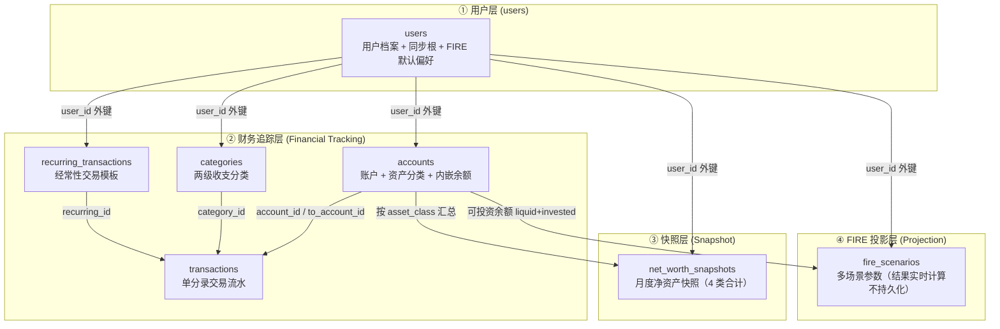
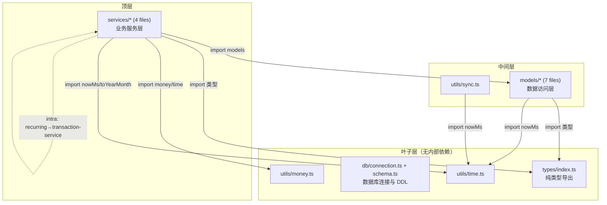

# 01-overview.md — 项目概览

> **最后更新**: 2026-07-15
> **对应代码**: `fire-app/src/`
> **导航**: [← 返回主页](CODE_WIKI.md) | [下一节](02-database.md)

---

## 1. 项目定位与目标

### 1.1 什么是 FIRE APP

FIRE APP 是一个**个人 FIRE 财务计算应用**。"FIRE" 是 **Financial Independence, Retire Early**（财务独立、提前退休）的缩写，是一套以"通过积累可投资资产达到覆盖终身支出的被动收入"为核心的财务规划方法论。本应用将该理念落地为一个可运行的数据模型与计算引擎，帮助个人用户追踪财务状况并量化自己的 FIRE 进度。

FIRE 方法论的两个核心概念在本应用中有直接体现：

- **FIRE Number（FIRE 数字）**：达到财务独立所需的可投资资产总额。经典公式为 `FIRE Number = 年支出 × (10000 / 提款率基点)`。在 4% 规则（提款率 400 基点）下，FIRE Number = 25 倍年支出；中国市场建议下调至 3.5%（350 基点），即约 28.57 倍年支出。计算见 [fire-calc.ts](file:///workspace/FIRE%20APP/fire-app/src/services/fire-calc.ts) 的 `calculateFireNumber`。
- **4% 法则（four_percent_rule）**：退休后每年从投资组合中提取 4%（中国市场 3.5%），组合在理论上可永续支撑。本应用通过 `withdrawal_rate` 字段（基点存储）参数化该法则，允许用户按保守/标准/激进多场景对比。

### 1.2 核心功能

围绕 FIRE 规划的四个核心能力，FIRE APP 的数据模型与计算引擎支撑以下功能：

| 功能 | 说明 | 对应数据层 |
|------|------|-----------|
| **财务流水记录** | 记录每一笔收入、支出、转账与初始余额，单分录记账模型，方向由 `transaction_type` 决定 | 财务追踪层 |
| **多类账户追踪** | 管理流动资产、投资资产、使用资产、负债四类账户，内嵌余额随交易实时联动 | 财务追踪层 |
| **净资产趋势快照** | 按月生成 4 类资产合计的净资产快照，支撑趋势可视化，幂等保证每月仅一条 | 快照层 |
| **FIRE 投影计算** | 基于年龄、储蓄、收益率、提款率等参数做多场景（保守/标准/激进）退休投影 | FIRE 投影层 |

四个功能对应数据模型的 4 个领域分层（详见第 3 节）：流水与账户追踪属于财务追踪层，快照属于快照层，FIRE 投影属于 FIRE 投影层。这种"功能-层级"的直接映射使数据模型天然按业务职责组织。

### 1.3 使用场景与设计取向

FIRE APP 面向**个人使用**，定位为本地优先（local-first）、离线友好的桌面/本地应用：

- **个人使用**：整个数据模型围绕**单用户**设计，`users` 表预期仅 1 条记录。所有表都以 `user_id` 隔离，但实际只有一个用户。这简化了权限模型与查询逻辑（所有查询都以 `user_id` 为前导字段建索引）。
- **本地优先**：数据存储在本地 SQLite 数据库（`better-sqlite3`），离线可完整使用全部功能。无云端依赖即可完成记账、快照、FIRE 投影全部计算。
- **离线友好 + 加密同步**：所有表统一含同步元数据三件套（`sync_version` / `updated_at` / `deleted_flag`），支持记录级 LWW（Last-Write-Wins）冲突解决；主键使用 UUID v4 以支持离线创建无冲突。加密同步层在设计文档中规划（零知识架构，云端仅存密文 blob），但**尚未实现**。

### 1.4 设计原则

数据模型遵循以下设计原则（依据设计文档 §1.2）：

| 原则 | 在代码中的体现 |
|------|---------------|
| **领域分层** | 7 张表按职责分为 4 层（用户/财务追踪/快照/FIRE 投影），关注点分离 |
| **YAGNI** | 只实现当前需要的功能。例如只支持单一货币（`base_currency`）、两级分类树（不支持无限层级）、FIRE 结果不持久化 |
| **数据完整性优先** | 交易与余额通过 `db.transaction` 强一致保证，账户有关联交易时禁止删除，禁止产生孤儿数据 |
| **同步友好** | 所有表统一含 `sync_version` / `updated_at` / `deleted_flag`，支持记录级 LWW 冲突解决 |
| **FIRE 知识库对齐** | 账户分类、FIRE 场景参数与 `fire-knowledge-schema.yaml` v5.0 概念直接对应（详见第 4 节） |

### 1.5 当前状态

> **代码是权威**：Wiki 描述代码实际落地状态，而非设计文档的完整愿景。

| 层次 | 状态 | 说明 |
|------|------|------|
| 数据库层（7 张表 + 9 索引） | ✅ 已实现 | [schema.ts](file:///workspace/FIRE%20APP/fire-app/src/db/schema.ts) + [connection.ts](file:///workspace/FIRE%20APP/fire-app/src/db/connection.ts) |
| 类型定义（5 枚举 + 7 接口） | ✅ 已实现 | [types/index.ts](file:///workspace/FIRE%20APP/fire-app/src/types/index.ts) |
| 数据模型层（7 个 model 文件，27 个函数） | ✅ 已实现 | [models/](file:///workspace/FIRE%20APP/fire-app/src/models/) |
| 业务服务层（4 个 service 文件） | ✅ 已实现 | [services/](file:///workspace/FIRE%20APP/fire-app/src/services/) |
| 工具模块（money / sync / time） | ✅ 已实现 | [utils/](file:///workspace/FIRE%20APP/fire-app/src/utils/) |
| 测试套件（12 单元 + 1 集成） | ✅ 已实现 | [tests/](file:///workspace/FIRE%20APP/fire-app/tests/) |
| 前端代码（IPC、React 组件、状态管理） | ⏳ 规划中 | 数据层已落地，前端代码**尚未落地**，见前端架构 spec |
| 加密同步层 | ⏳ 规划中 | 数据模型预留同步字段，同步引擎未实现 |

当前仓库的核心成果是**完整的本地数据层与 FIRE 计算引擎**——从数据库 schema、类型契约、CRUD 模型、事务化服务到测试覆盖，已构成可独立运行的后端核心；前端 UI 与跨设备同步为后续里程碑。

### 1.6 参考设计文档

本应用的用户数据模型设计基于：

- 路径：[docs/superpowers/specs/2026-07-12-fire-app-user-data-model-design.md](file:///workspace/FIRE%20APP/docs/superpowers/specs/2026-07-12-fire-app-user-data-model-design.md)
- 版本：1.0 / 知识库基础：`fire-knowledge-schema.yaml` v5.0
- 范围：用户数据模型（7 张核心表），不含 UI 设计、API 设计、计算引擎实现细节

> ⚠️ 设计文档与代码存在少量已知差异（如 AccountType 枚举数、种子分类数），Wiki 一律以代码为权威，差异集中记录在 [08-design-index.md](08-design-index.md) 的"已知问题"小节。

---

## 2. 技术栈

### 2.1 依赖与版本

以下版本信息来自 [package.json](file:///workspace/FIRE%20APP/fire-app/package.json)，Wiki 以代码为权威。

| 技术 | 版本 | 类型 | 用途 |
|------|------|------|------|
| TypeScript | ^5.5.0 | devDependency | 类型系统，编译期检查；types/index.ts 为纯类型导出 |
| Node.js | ≥ 20（由 @types/node ^20.14.0 推断） | 运行时 | JavaScript 运行时 |
| better-sqlite3 | ^11.0.0 | dependency | SQLite 驱动，同步 API，WAL 模式 |
| @types/better-sqlite3 | ^7.6.10 | devDependency | better-sqlite3 的类型声明 |
| uuid | ^10.0.0 | dependency | UUID v4 生成（`v4 as uuidv4`），所有表主键 |
| @types/uuid | ^10.0.0 | devDependency | uuid 的类型声明 |
| vitest | ^2.0.0 | devDependency | 测试框架，globals + node 环境 |
| ESM 模块 | `"type": "module"` | package.json 字段 | 全项目使用 ES Module，import 路径带 `.js` 扩展名 |

### 2.2 模块系统约定

`package.json` 中 `"type": "module"` 使整个项目以 **ESM** 运行。源码中所有相对导入显式带 `.js` 扩展名（如 `import { nowMs } from '../utils/time.js'`），这是 TypeScript ESM 编译输出的要求——`.ts` 源文件编译为 `.js` 后，导入路径必须指向真实存在的 `.js` 文件。

类型导入统一使用 `import type { ... }` 语法（如 `import type { Database as DatabaseType } from 'better-sqlite3'`），确保类型声明在编译期被完全擦除，不进入运行时 bundle。[types/index.ts](file:///workspace/FIRE%20APP/fire-app/src/types/index.ts) 即为纯类型导出文件，编译后输出的 `.js` 文件为空。

### 2.3 测试框架

测试使用 vitest 2.0，配置见 [vitest.config.ts](file:///workspace/FIRE%20APP/fire-app/vitest.config.ts)。两个 npm 脚本：

| 命令 | 用途 |
|------|------|
| `npm test` | 单次运行全部测试（`vitest run`） |
| `npm run test:watch` | 监听模式（`vitest`），开发时自动重跑 |

测试约定（详见 [07-tests.md](07-tests.md)）：
- 全部使用内存数据库（`:memory:'`），无文件 I/O，测试隔离且快速
- `beforeEach` 钩子建表 + 建用户 + seed 18 个分类，保证每个测试用例从干净状态开始
- `afterEach` 钩子关闭连接，避免连接泄漏

### 2.4 关键设计决策

下列设计决策贯穿全部 7 张表与所有模块，是理解代码的前提：

| 决策 | 体现 | 说明 |
|------|------|------|
| **整数存储金额** | 金额字段以"分"为单位存为 `INTEGER` | 1234.56 元 → 123456。避免 IEEE 754 浮点误差；转换见 [money.ts](file:///workspace/FIRE%20APP/fire-app/src/utils/money.ts) 的 `yuanToCents`（两阶段取整规避 `1.005 × 100 = 100.4999...` 陷阱） |
| **基点存储利率** | 利率字段以"基点"为单位存为 `INTEGER` | 1% = 100 基点，3.5% = 350。`withdrawal_rate` / `expected_return_rate` / `inflation_rate` 均用基点，避免浮点数同时保持精度 |
| **UUID v4 主键** | 所有表 `id` 字段为 `TEXT`（UUID v4） | 支持离线创建无冲突，多设备同步无需中央 ID 分配；由 `uuid` 包的 `v4 as uuidv4` 生成 |
| **软删除** | 所有删除操作置 `deleted_flag = 1` | 不物理删除，查询默认过滤 `deleted_flag = 0`；支持同步层删除传播；例外 `getTransactionById` 不过滤以供历史回溯 |
| **LWW 同步** | 每表含 `sync_version` / `updated_at` / `deleted_flag` | 记录级 Last-Write-Wins，按 `updated_at` 比较决定冲突胜者（`shouldRemoteWin` 返回 `remote.updated_at >= local.updated_at`） |
| **统一符号余额** | 资产余额 ≥ 0，负债余额 ≤ 0 | 净资产 = `SUM(current_balance)` 一条 SQL 即可计算，无需额外取反负债 |
| **UTC 毫秒时间戳** | 所有时间字段为 `INTEGER`（Unix 毫秒） | 跨时区一致，年月提取用 `getUTCFullYear` / `getUTCMonth`（见 [time.ts](file:///workspace/FIRE%20APP/fire-app/src/utils/time.ts) 的 `toYearMonth`） |
| **结果不持久化** | FIRE 投影结果实时计算 | `fire_scenarios` 仅存参数，600 个月度数据点由 `runProjection` 毫秒级算出，避免数据冗余与一致性问题 |
| **事务强一致** | 交易写操作包裹在 `db.transaction` 内 | 交易记录插入与账户余额更新原子化，任一步失败整体回滚（见 [transaction-service.ts](file:///workspace/FIRE%20APP/fire-app/src/services/transaction-service.ts)） |

---

## 3. 4 层架构详解

FIRE APP 的数据模型按职责分为 **4 层**，自上而下为：用户层 → 财务追踪层 → 快照层 → FIRE 投影层。分层是领域驱动的，每层关注一个业务子域，层间通过外键与数据流耦合。设计依据见设计文档 §1.3 架构总览。

### 3.1 架构总览图



上图展示 4 层架构与数据流向：`users` 是所有层的同步根与外键源头；财务追踪层内 4 张表相互关联（账户、分类、模板都指向交易）；快照层从账户层聚合；FIRE 投影层从账户层读取可投资余额作为投影起点。层间关系均为"上层依赖下层提供的数据"，不反向。

### 3.2 第 1 层：用户层

- **包含表**：`users`（1 张，预期仅 1 条记录）
- **职责**：
  - 存储用户档案（`display_name`、`base_currency`）
  - 作为整个数据模型的**同步根**（`encryption_key_hash`、`last_sync_at`）
  - 承载 **FIRE 计算默认偏好**（`default_withdrawal_rate`、`default_expected_return`、`default_inflation_rate`），新建 `fire_scenarios` 时自动填入
  - `is_china_market` 标志决定默认提款率（中国市场 350 基点 = 3.5%，全球 400 基点 = 4%）
- **与其他层关系**：被所有其他层的表通过 `user_id` 外键引用，是外键关系的根节点（无外键自身）
- **源码**：[models/user.ts](file:///workspace/FIRE%20APP/fire-app/src/models/user.ts)（3 个函数：createUser / getUser / updateUser）

### 3.3 第 2 层：财务追踪层

- **包含表**：`accounts`、`transactions`、`categories`、`recurring_transactions`（4 张）
- **职责**：
  - **accounts**：多类账户与资产分类（4 类 `asset_class` × 11 种 `account_type`），内嵌 `current_balance` 随交易实时联动
  - **transactions**：单分录交易流水，4 种 `transaction_type`（income / expense / transfer / initial_balance），转账用 `to_account_id` 表达双账户
  - **categories**：两级收支分类树（`parent_id` 自引用），18 个内置种子分类，5 个关联 FIRE 知识库概念
  - **recurring_transactions**：经常性交易模板，支持补生成遗漏交易（离线多日后打开 APP 自动补单）
- **与其他层关系**：
  - 所有表通过 `user_id` 引用用户层
  - 层内关联：`transactions.account_id` / `to_account_id` → accounts；`transactions.category_id` → categories；`transactions.recurring_id` → recurring_transactions
- **源码**：[models/account.ts](file:///workspace/FIRE%20APP/fire-app/src/models/account.ts)、[models/transaction.ts](file:///workspace/FIRE%20APP/fire-app/src/models/transaction.ts)、[models/category.ts](file:///workspace/FIRE%20APP/fire-app/src/models/category.ts)、[models/recurring.ts](file:///workspace/FIRE%20APP/fire-app/src/models/recurring.ts)；写操作事务在 [services/transaction-service.ts](file:///workspace/FIRE%20APP/fire-app/src/services/transaction-service.ts) 与 [services/recurring-service.ts](file:///workspace/FIRE%20APP/fire-app/src/services/recurring-service.ts)

### 3.4 第 3 层：快照层

- **包含表**：`net_worth_snapshots`（1 张）
- **职责**：
  - 按月生成净资产快照，预计算 4 类资产合计（`total_liquid` / `total_invested` / `total_use_asset` / `total_liability`）与 `net_worth`
  - 幂等保证：`UNIQUE(user_id, snapshot_year_month)` 约束 + 应用层 `getSnapshotByMonth` 预检查，每月每用户仅一条
  - "打开 APP 时生成"策略（本地应用无法可靠运行后台定时任务）
- **与其他层关系**：
  - 通过 `user_id` 引用用户层
  - **从 accounts 层聚合**：快照生成时按 `asset_class` 分组 `SUM(current_balance)` 汇总（见 [snapshot-service.ts](file:///workspace/FIRE%20APP/fire-app/src/services/snapshot-service.ts) 的 `summarizeByAssetClass`）
- **源码**：[models/snapshot.ts](file:///workspace/FIRE%20APP/fire-app/src/models/snapshot.ts)（仅查询与插入，无 update）+ [services/snapshot-service.ts](file:///workspace/FIRE%20APP/fire-app/src/services/snapshot-service.ts)（协调幂等与聚合）

### 3.5 第 4 层：FIRE 投影层

- **包含表**：`fire_scenarios`（1 张，仅存**参数**）
- **职责**：
  - 多场景 FIRE 投影参数（保守/标准/激进等，1-5 条），支持场景对比
  - 两个 CHECK 约束：`retirement_age > current_age`、`withdrawal_rate BETWEEN 200 AND 600`（2%-6% 合理区间）
  - `auto_sync_assets = 1` 时从 accounts 实时汇总可投资余额作为投影起点
- **关键特性：结果实时计算，不持久化**
  - `fire_scenarios` 表**只存输入参数**，投影结果（`fire_number`、`adjusted_fire_number`、`monthly_projection` 600 个月度数据点）由 [services/fire-calc.ts](file:///workspace/FIRE%20APP/fire-app/src/services/fire-calc.ts) 的 `runProjection` 每次实时计算返回
  - 设计动机：FIRE 公式计算在毫秒级完成，持久化会导致数据冗余与一致性问题（参数修改后结果过期）
- **与其他层关系**：
  - 通过 `user_id` 引用用户层
  - **从 accounts 层读取**：`runProjection` 调用 `getInvestableBalance`（liquid + invested）作为 `current_portfolio_value`
- **源码**：[models/scenario.ts](file:///workspace/FIRE%20APP/fire-app/src/models/scenario.ts)（CRUD）+ [services/fire-calc.ts](file:///workspace/FIRE%20APP/fire-app/src/services/fire-calc.ts)（纯计算引擎，无写库）

### 3.6 层间数据流小结

4 层之间的数据流是**单向向下**的：上层（用户层）提供身份与偏好，中层（财务追踪层）产生原始数据，下层（快照层、投影层）消费上层数据进行聚合与计算。具体数据流：

1. 用户层 → 财务追踪层：`user_id` 外键 + FIRE 默认偏好参数
2. 财务追踪层内部：交易写入时事务内联动账户余额（[transaction-service.ts](file:///workspace/FIRE%20APP/fire-app/src/services/transaction-service.ts)）
3. 财务追踪层 → 快照层：账户余额按 `asset_class` 聚合为月度快照
4. 财务追踪层 → FIRE 投影层：可投资余额（liquid + invested）作为投影起点；投影结果不回流到任何表

---

## 4. 知识库 v5.0 对齐

### 4.1 对齐基础

FIRE APP 的数据模型基于 **`fire-knowledge-schema.yaml` v5.0** 知识库构建。该知识库是 FIRE 方法论的结构化概念集，定义了中国市场适配、4% 法则、FIRE Number、税务规划、债务管理、保险规划、养老金体系、医保体系等核心概念。数据模型通过字段映射与概念关联两种方式与知识库对齐，使应用内的数据天然承载 FIRE 方法论语义。设计依据见设计文档 §3.1 与 §3.4 的知识库映射表。

### 4.2 关键对齐点

以下知识库概念在数据模型中有具象化的字段或枚举承载：

| 知识库概念 ID | 概念名称 | 数据模型映射 | 说明 |
|--------------|---------|-------------|------|
| `china_market_adjustment` | 中国市场特殊性 | `users.is_china_market` / `fire_scenarios.is_china_market` | 中国市场默认提款率 3.5%（非 4%），FIRE Number 倍数 28-33x（非 25x） |
| `four_percent_rule` | 4% 法则 | `users.default_withdrawal_rate` / `fire_scenarios.withdrawal_rate` | 中国市场下调至 3-3.5% |
| `fire_number` | FIRE 数字 | `accounts.asset_class = invested`（可投资资产）/ `fire_scenarios.annual_expenses` | 可投资资产计入 FIRE Number；自住房产不计入 |
| `investment_return` | 投资回报率 | `users.default_expected_return` / `fire_scenarios.expected_return_rate` | 使用实际回报率（5-7%） |
| `inflation_risk` | 通胀侵蚀风险 | `users.default_inflation_rate` / `fire_scenarios.inflation_rate` | 2-3% 通胀假设 |
| `compound_growth_projection` | 资产增长预测模型 | `fire-calc.ts` 的 `runProjection` / `calculateAccumulation` | FV 公式直接使用（PV + PMT + r + n） |
| `longevity_risk` | 长寿风险 | `fire_scenarios.retirement_years` | FIRE 退休期可达 40-50 年 |
| `retirement_income_diversification` | 退休后收入多元化 | `fire_scenarios.post_retirement_monthly_income` | 抵减 FIRE Number |
| `tax_planning` | 税务规划 | `accounts.account_type = retirement` | 退休账户类型 |
| `debt_management` | 债务管理 | `accounts.account_type = mortgage` / `categories.linked_fire_concept` | 房贷类型、债务还款分类 |
| `insurance_planning` | 保险规划 | `categories.linked_fire_concept` | 保险分类关联 |
| `china_pension_system` | 中国养老金体系 | `categories.linked_fire_concept` | 社保养老金收入分类 |
| `china_medical_insurance` | 中国医保体系 | `categories.linked_fire_concept` | 医疗分类关联 |

### 4.3 映射机制

知识库对齐通过两种机制实现：

1. **字段级映射**：`users` 表的 `is_china_market`、`default_withdrawal_rate`、`default_expected_return`、`default_inflation_rate` 等字段直接承载知识库概念参数。新建 FIRE 场景时这些默认值被填入 `fire_scenarios`，使知识库假设成为计算引擎的输入。`is_china_market` 标志是核心开关——它控制默认提款率（中国市场 350 基点 vs 全球 400 基点），并在 `createUser` 中根据该标志决定 `default_withdrawal_rate` 的默认值（见 [user.ts](file:///workspace/FIRE%20APP/fire-app/src/models/user.ts) 的 `createUser`）。

2. **概念关联字段**：`categories` 表的 `linked_fire_concept` 字段将收支分类与知识库概念 ID 关联。18 个内置种子分类中有 **5 个**带 `linked_fire_concept` 值（保险→`insurance_planning`、医疗→`china_medical_insurance`、债务还款→`debt_management`、租金收入→`retirement_income_diversification`、社保养老金→`china_pension_system`），可用于在应用中展示相关知识提示（如用户记录保险支出时展示对应概念的 key_insight）。种子分类定义见 [category.ts](file:///workspace/FIRE%20APP/fire-app/src/models/category.ts) 的 `SEED_CATEGORIES` 数组（[category.ts:18-39](file:///workspace/FIRE%20APP/fire-app/src/models/category.ts#L18-L39)）。

### 4.4 计算引擎与知识库公式的对应

FIRE 计算引擎（[fire-calc.ts](file:///workspace/FIRE%20APP/fire-app/src/services/fire-calc.ts)）直接实现知识库 `compound_growth_projection` 概念的数学公式，使投影结果与知识库定义的方法论一致：

| 知识库公式 | 代码实现 | 函数 |
|-----------|---------|------|
| FIRE Number = 年支出 × (10000 / 提款率基点) | `Math.floor(annualExpenses × (10000 / withdrawalRateBp))` | `calculateFireNumber` |
| 调整后 FIRE Number（扣减退休后其他收入现值） | `baseFireNumber - Math.floor(annualOtherIncome / (withdrawalRateBp / 10000))` | `calculateAdjustedFireNumber` |
| 资产增长 FV = PV×(1+r)^n + PMT×((1+r)^n-1)/r | 月度循环复利：`balance += Math.round(balance × monthlyReturnRate) + monthlySavings` | `runProjection` 积累阶段 |
| 进度 = 当前资产 / FIRE Number × 100% | `Math.round((currentValue / fireNumber) × 1000) / 10`（1 位小数） | `calculateProgress` |

> 知识库 `fire-knowledge-schema.yaml` 的完整内容不在 Wiki 范围内，本节仅描述数据模型与知识库的对齐关系。完整概念定义与映射总表见设计文档 §3.1（users 表映射）、§3.4（categories 表映射）、§8（知识库映射总表）。

---

## 5. 仓库目录结构

### 5.1 整体结构

```
FIRE APP/
├── fire-app/                    # 应用主代码（数据层 + 测试）
│   ├── src/                     # 源码
│   │   ├── db/                  # 数据库层：连接管理 + schema 定义
│   │   ├── models/              # 数据模型层：7 个文件，每文件对应一张表
│   │   ├── services/            # 业务服务层：4 个文件，事务与算法
│   │   ├── types/               # 类型定义：纯类型导出（5 枚举 + 7 接口）
│   │   └── utils/               # 工具模块：金额/同步/时间
│   ├── tests/                   # 测试套件（12 单元 + 1 集成）
│   │   ├── db/                  # 数据库层测试
│   │   ├── models/              # 模型层测试
│   │   ├── services/            # 服务层测试
│   │   ├── utils/               # 工具模块测试
│   │   └── integration/         # 端到端集成测试
│   ├── package.json             # 依赖与脚本
│   ├── tsconfig.json            # TypeScript 配置
│   └── vitest.config.ts         # 测试配置
└── docs/                        # 文档
    ├── wiki/                    # Code Wiki（本文件所在）
    └── superpowers/
        ├── specs/               # 设计文档（6 份）
        └── plans/               # 实施计划（3 份）
```

### 5.2 `fire-app/src/` 源码目录

| 目录 | 文件 | 职责 |
|------|------|------|
| `src/db/` | [connection.ts](file:///workspace/FIRE%20APP/fire-app/src/db/connection.ts)、[schema.ts](file:///workspace/FIRE%20APP/fire-app/src/db/schema.ts) | 数据库连接创建/关闭（WAL + 外键 PRAGMA）、7 张表与 9 索引的 DDL 集中定义 |
| `src/models/` | [user.ts](file:///workspace/FIRE%20APP/fire-app/src/models/user.ts)、[account.ts](file:///workspace/FIRE%20APP/fire-app/src/models/account.ts)、[category.ts](file:///workspace/FIRE%20APP/fire-app/src/models/category.ts)、[transaction.ts](file:///workspace/FIRE%20APP/fire-app/src/models/transaction.ts)、[recurring.ts](file:///workspace/FIRE%20APP/fire-app/src/models/recurring.ts)、[scenario.ts](file:///workspace/FIRE%20APP/fire-app/src/models/scenario.ts)、[snapshot.ts](file:///workspace/FIRE%20APP/fire-app/src/models/snapshot.ts) | 数据访问层（DAL），每文件对应一张表，提供 CRUD 与简单查询，不含跨表事务 |
| `src/services/` | [fire-calc.ts](file:///workspace/FIRE%20APP/fire-app/src/services/fire-calc.ts)、[transaction-service.ts](file:///workspace/FIRE%20APP/fire-app/src/services/transaction-service.ts)、[recurring-service.ts](file:///workspace/FIRE%20APP/fire-app/src/services/recurring-service.ts)、[snapshot-service.ts](file:///workspace/FIRE%20APP/fire-app/src/services/snapshot-service.ts) | 业务逻辑层，协调多 model 写操作，含事务边界与 FIRE 计算算法 |
| `src/types/` | [index.ts](file:///workspace/FIRE%20APP/fire-app/src/types/index.ts) | 纯类型导出文件，5 个枚举别名 + 7 个实体接口，无运行时代码 |
| `src/utils/` | [money.ts](file:///workspace/FIRE%20APP/fire-app/src/utils/money.ts)、[sync.ts](file:///workspace/FIRE%20APP/fire-app/src/utils/sync.ts)、[time.ts](file:///workspace/FIRE%20APP/fire-app/src/utils/time.ts) | 工具模块：金额/基点转换、LWW 同步元数据、时间戳与月份运算 |

### 5.3 `fire-app/tests/` 测试目录

| 目录 | 文件 | 覆盖 |
|------|------|------|
| `tests/db/` | connection.test.ts、schema.test.ts | 连接管理、WAL/外键 PRAGMA、schema 幂等初始化 |
| `tests/models/` | user.test.ts、account.test.ts、category.test.ts | 用户/账户/分类 CRUD 与软删除保护 |
| `tests/services/` | fire-calc.test.ts、transaction-service.test.ts、recurring-service.test.ts、snapshot-service.test.ts | FIRE 计算、交易事务、补单引擎、快照幂等 |
| `tests/utils/` | money.test.ts、sync.test.ts、time.test.ts | 金额转换、LWW 冲突、月份运算 |
| `tests/integration/` | workflow.test.ts | 端到端：建账→记账→快照→FIRE 投影 |

### 5.4 `docs/` 文档目录

| 目录 | 内容 |
|------|------|
| `docs/wiki/` | Code Wiki（CODE_WIKI.md 主页 + 01-08 子文件），代码结构镜像文档 |
| `docs/superpowers/specs/` | 6 份设计文档（数据模型、前端架构、UI/UX、初始化、缺失文档规划、跨文档审查） |
| `docs/superpowers/plans/` | 3 份实施计划（数据模型实现、桌面 MVP 里程碑 1、阶段 1 设计文档） |

> 设计文档与计划的导航见 [08-design-index.md](08-design-index.md)。

---

## 6. 模块依赖图

### 6.1 依赖方向总则

FIRE APP 的模块依赖遵循**单向分层**原则：上层模块依赖下层模块，不反向依赖，无循环依赖。依赖关系通过实际的 `import` 语句体现（**代码是权威**）。三个外部依赖（`better-sqlite3`、`uuid`、Node.js 内置）作为基础设施，被各层按需引入。

分层依赖关系（自底向上）：



上图箭头表示"import 依赖"（A → B 表示 A 依赖 B）。`types/`、`db/`、`utils/time`、`utils/money` 为叶子模块；`utils/sync` 依赖 `utils/time`；`models/` 依赖 `types/` 与 `utils/time`；`services/` 依赖 `models/`、`types/`、`utils/`。虚线箭头表示 services 内部的例外调用。

### 6.2 各层依赖详解

**① 叶子模块（无内部依赖）**

| 模块 | 外部依赖 | 内部依赖 | 说明 |
|------|---------|---------|------|
| [types/index.ts](file:///workspace/FIRE%20APP/fire-app/src/types/index.ts) | 无 | 无 | 纯 `export type` / `export interface`，编译后无运行时代码 |
| [db/connection.ts](file:///workspace/FIRE%20APP/fire-app/src/db/connection.ts) | better-sqlite3 | 无 | 连接创建/关闭 |
| [db/schema.ts](file:///workspace/FIRE%20APP/fire-app/src/db/schema.ts) | better-sqlite3（仅类型） | 无 | DDL 数组与 `initSchema` |
| [utils/time.ts](file:///workspace/FIRE%20APP/fire-app/src/utils/time.ts) | 无（用 `Date.now()`） | 无 | `nowMs` / `toYearMonth` / `addMonths` / `monthsBetween` |
| [utils/money.ts](file:///workspace/FIRE%20APP/fire-app/src/utils/money.ts) | 无 | 无 | `yuanToCents` / `centsToYuan` / `basisPointsToDecimal` |

**② 中间层**

| 模块 | 依赖 | 说明 |
|------|------|------|
| [utils/sync.ts](file:///workspace/FIRE%20APP/fire-app/src/utils/sync.ts) | utils/time.ts（`nowMs`） | `SyncMeta` 接口与 LWW 冲突解决（`shouldRemoteWin`） |
| [models/](file:///workspace/FIRE%20APP/fire-app/src/models/)（7 文件） | types/index.ts、utils/time.ts、better-sqlite3、uuid | 每文件对应一张表；写操作文件依赖 `nowMs`，纯查询文件（transaction.ts、snapshot.ts）仅依赖 types |

**③ 顶层**

| 模块 | 依赖 | 说明 |
|------|------|------|
| [services/fire-calc.ts](file:///workspace/FIRE%20APP/fire-app/src/services/fire-calc.ts) | utils/money.ts、models/account.ts、types/index.ts | 纯计算引擎，仅读 accounts 表 |
| [services/transaction-service.ts](file:///workspace/FIRE%20APP/fire-app/src/services/transaction-service.ts) | models/transaction.ts、utils/time.ts、types/index.ts、uuid | 交易事务服务 |
| [services/recurring-service.ts](file:///workspace/FIRE%20APP/fire-app/src/services/recurring-service.ts) | models/recurring.ts、utils/time.ts、types/index.ts、**services/transaction-service.ts** | 补单引擎，调用 transaction-service 生成交易 |
| [services/snapshot-service.ts](file:///workspace/FIRE%20APP/fire-app/src/services/snapshot-service.ts) | models/snapshot.ts、utils/time.ts、types/index.ts、uuid | 月度快照生成 |

### 6.3 依赖图关键特征

1. **无循环依赖**：所有 import 形成有向无环图（DAG）。`services → models → utils/types`，不存在反向边。

2. **types/ 是跨层共享契约**：[types/index.ts](file:///workspace/FIRE%20APP/fire-app/src/types/index.ts) 被 models/ 与 services/ 共同依赖，提供 5 个枚举别名与 7 个实体接口，是层间类型一致的保证。

3. **db/ 是运行时基础而非 import 依赖**：db/ 模块（connection.ts、schema.ts）提供连接创建与 schema 初始化，但**不被 models/ 或 services/ 直接 import**——models/services 直接从 `better-sqlite3` 导入 `Database` 类型，db/ 由应用入口与测试在启动时调用。因此 db/ 在 import 图中是叶子，在运行时是基础。

4. **services 内部有一个例外调用**：[recurring-service.ts](file:///workspace/FIRE%20APP/fire-app/src/services/recurring-service.ts) 调用 [transaction-service.ts](file:///workspace/FIRE%20APP/fire-app/src/services/transaction-service.ts) 的 `createTransaction` 来生成经常性交易。这是 services 层内部唯一的横向依赖，使补单引擎间接享受事务原子性保证。

5. **utils/ 内部有一个依赖**：[utils/sync.ts](file:///workspace/FIRE%20APP/fire-app/src/utils/sync.ts) 依赖 [utils/time.ts](file:///workspace/FIRE%20APP/fire-app/src/utils/time.ts) 的 `nowMs`，用于生成同步元数据时间戳。

6. **分层职责清晰**：models 层只做单表 CRUD（无跨表事务），services 层协调多 model 写操作并承载算法（FIRE 计算、补单、快照聚合），事务边界统一在 services 层用 `db.transaction(() => {...})` 包裹。

---

> **导航**: [← 返回主页](CODE_WIKI.md) | [下一节](02-database.md)
