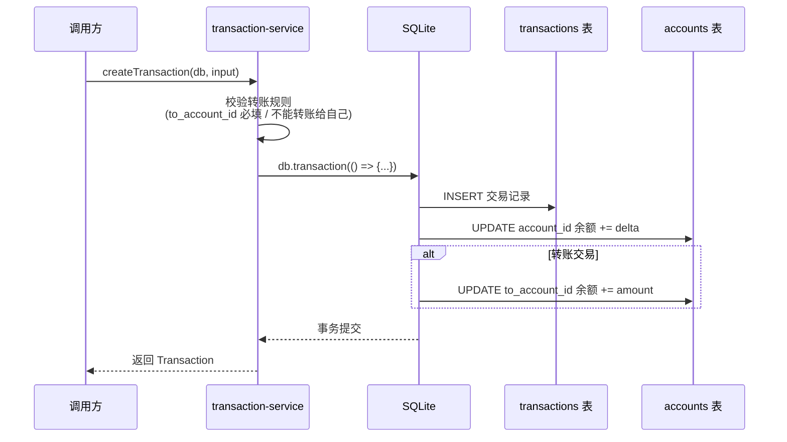
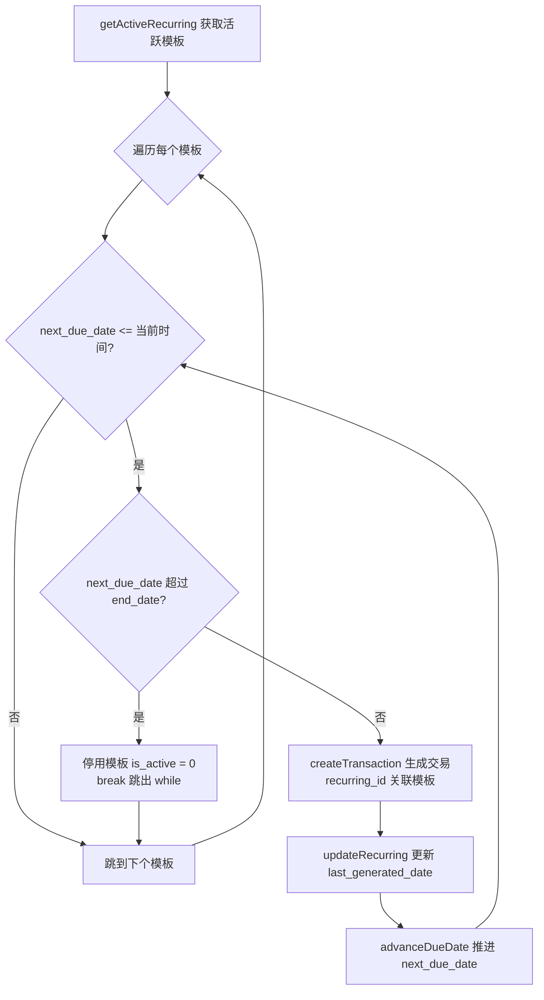

# 05-services.md — 业务服务层

> **最后更新**: 2026-07-15
> **对应代码**: `fire-app/src/services/`
> **导航**: [← 返回主页](CODE_WIKI.md) | [上一节](04-models.md) | [下一节](06-utils.md)

---

## 1. 模块概述

services 层是业务逻辑层，协调多个 model 的写操作。与 models 层（纯 CRUD）不同，services 层负责：

- **事务边界**：将"交易写入 + 余额更新"等多步操作包裹在 `db.transaction(() => {...})` 内，保证原子性
- **跨表一致性**：例如编辑交易时需同时调整新旧账户的余额
- **算法计算**：FIRE 投影、快照聚合等业务算法

services 目录包含 4 个文件：

| 文件 | 职责 | 行数 | 是否写库 | 是否含事务 |
|------|------|------|----------|-----------|
| [fire-calc.ts](file:///workspace/FIRE%20APP/fire-app/src/services/fire-calc.ts) | FIRE 数计算、退休投影模拟 | 99 | 否（仅读） | 否 |
| [transaction-service.ts](file:///workspace/FIRE%20APP/fire-app/src/services/transaction-service.ts) | 交易创建/编辑/删除 + 余额联动 | 129 | 是 | 是 |
| [recurring-service.ts](file:///workspace/FIRE%20APP/fire-app/src/services/recurring-service.ts) | 经常性交易模板补单引擎 | 54 | 是（间接） | 是（间接） |
| [snapshot-service.ts](file:///workspace/FIRE%20APP/fire-app/src/services/snapshot-service.ts) | 月度净资产快照生成 | 40 | 是 | 否（单次插入） |

**依赖方向**：services 依赖 models + utils + types。services 层之间存在一个例外调用：`recurring-service` 调用 `transaction-service` 的 `createTransaction`，从而间接享受事务原子性保证。

---

## 2. fire-calc.ts — FIRE 计算引擎

源码：[fire-calc.ts](file:///workspace/FIRE%20APP/fire-app/src/services/fire-calc.ts)

**职责**：FIRE 数计算、退休投影模拟（积累阶段 + 提款阶段）

**特点**：
- **纯计算引擎**：无任何数据库写入操作
- 仅当 `scenario.auto_sync_assets === 1` 时读 `accounts` 表（通过 `getInvestableBalance`）获取可投资余额作为初始本金；否则使用 `scenario.current_portfolio_value`
- 所有金额内部以"分"为单位参与运算，使用 `Math.round` / `Math.floor` 避免浮点累积误差

### 2.1 输出接口

#### `MonthlyProjectionPoint`（[fire-calc.ts:6-10](file:///workspace/FIRE%20APP/fire-app/src/services/fire-calc.ts#L6-L10)）

| 字段 | 类型 | 说明 |
|------|------|------|
| month | number | 月序号（从 1 开始，提款阶段接续积累阶段编号） |
| age | number | 当月年龄（含小数，如 30.25 = 30 岁 3 个月） |
| balance | number | 月末投资组合余额（分） |
| contribution | number | 当月投入（分，提款阶段为 0） |
| growth | number | 当月增长（分） |
| cumulative_contribution | number | 累计投入（分） |
| cumulative_growth | number | 累计增长（分） |
| phase | 'accumulation' \| 'retirement' | 阶段标志 |

#### `ProjectionResult`（[fire-calc.ts:12-16](file:///workspace/FIRE%20APP/fire-app/src/services/fire-calc.ts#L12-L16)）

| 字段 | 类型 | 说明 |
|------|------|------|
| fire_number | number | 标准 FIRE 数（分） |
| adjusted_fire_number | number | 调整后 FIRE 数（扣减退休后其他收入） |
| retirement_portfolio | number | 退休时点的投资组合余额（分，积累阶段结束时的余额） |
| progress | number | 当前进度百分比（0-100，1 位小数） |
| monthly_projection | MonthlyProjectionPoint[] | 月度投影序列（积累 + 提款） |

### 2.2 函数清单

| 函数名 | 签名 | 用途 |
|--------|------|------|
| calculateFireNumber | (annualExpenses, withdrawalRateBp) => number | 标准 FIRE 数 |
| calculateAdjustedFireNumber | (annualExpenses, withdrawalRateBp, postRetirementMonthlyIncome) => number | 调整后 FIRE 数 |
| calculateAccumulation | (pv, pmt, annualReturnBp, months) => number | 未来值（FV）计算 |
| calculateProgress | (currentValue, fireNumber) => number | 进度百分比 |
| runProjection | (db, scenario) => ProjectionResult | 主投影函数 |

### 2.3 关键函数详解

#### `calculateFireNumber`（[fire-calc.ts:18](file:///workspace/FIRE%20APP/fire-app/src/services/fire-calc.ts#L18)）

**公式**：`fireNumber = Math.floor(annualExpenses × (10000 / withdrawalRateBp))`

**示例**：
- 年支出 40000 元，提款率 400 基点（4%）→ `40000 × (10000 / 400) = 40000 × 25 = 1000000` 元（100 万元）
- 这就是经典的 **"4% 规则"**：25 倍年支出。提款率 350 基点（3.5%，中国市场默认）→ 约 28.57 倍年支出

#### `calculateAdjustedFireNumber`（[fire-calc.ts:22](file:///workspace/FIRE%20APP/fire-app/src/services/fire-calc.ts#L22)）

**推导**：若退休后有其他月收入（如社保养老金、租金），所需投资组合可相应减少。

1. `annualOtherIncome = postRetirementMonthlyIncome × 12`
2. `deduction = Math.floor(annualOtherIncome / (withdrawalRateBp / 10000))` —— 将年其他收入按提款率"资本化"为现值
3. `adjustedFireNumber = Math.max(0, baseFireNumber - deduction)`

**短路优化**：当 `postRetirementMonthlyIncome === 0` 时直接返回 `baseFireNumber`，避免除零和无意义计算。

#### `runProjection`（[fire-calc.ts:43](file:///workspace/FIRE%20APP/fire-app/src/services/fire-calc.ts#L43)）

**算法流程**：

```mermaid
flowchart TD
    A[开始 runProjection] --> B{auto_sync_assets = 1?}
    B -- 是 --> C[从 accounts 表读取可投资余额<br/>getInvestableBalance]
    B -- 否 --> D[使用 scenario.current_portfolio_value]
    C --> E[计算 fire_number 和 adjusted_fire_number]
    D --> E
    E --> F[积累阶段循环<br/>月数 = (retirement_age - current_age) × 12]
    F --> G[每月: 余额 += round(余额×月收益率) + 月储蓄]
    G --> H{积累月数完成?}
    H -- 否 --> G
    H -- 是 --> I[记录 retirement_portfolio]
    I --> J[提款阶段循环<br/>月数 = retirement_years × 12]
    J --> K[每月: 余额 += round(余额×月收益率) - 净提款<br/>提款按月通胀递增]
    K --> L{提款月数完成?}
    L -- 否 --> K
    L -- 是 --> M[计算 progress]
    M --> N[返回 ProjectionResult]
```

上图展示 `runProjection` 的两阶段算法：积累阶段按月复利增长并加入储蓄，提款阶段按月扣减净提款并按通胀递增。两个阶段的月增长均使用 `Math.round(余额 × 月收益率)` 取整，避免浮点累积。

**两阶段逻辑**：

1. **积累阶段**（[fire-calc.ts:60-71](file:///workspace/FIRE%20APP/fire-app/src/services/fire-calc.ts#L60-L71)）：
   - 月数 = `(scenario.retirement_age - scenario.current_age) × 12`
   - 每月：`monthGrowth = Math.round(balance × monthlyReturnRate)`；`balance += monthGrowth + scenario.monthly_savings`
   - 累计 `contribution`（月储蓄）和 `growth`（月增长）
   - phase 标记为 `'accumulation'`，年龄 = `current_age + (m + 1) / 12`

2. **提款阶段**（[fire-calc.ts:82-95](file:///workspace/FIRE%20APP/fire-app/src/services/fire-calc.ts#L82-L95)）：
   - 月数 = `scenario.retirement_years × 12`
   - 初始月提款 = `Math.round(scenario.annual_expenses / 12)`
   - 每月：`netWithdrawal = Math.max(0, currentWithdrawal - monthlyOtherIncome)`
   - `balance += monthGrowth - netWithdrawal`；`balance = Math.max(0, balance)`（防止负数）
   - 提款按月通胀递增：`currentWithdrawal = Math.round(currentWithdrawal × (1 + monthlyInflation))`
   - phase 标记为 `'retirement'`，月序号接续积累阶段

**数学公式与代码对应表**：

| 公式 | 代码位置 | 说明 |
|------|----------|------|
| FIRE 数 = 年支出 × (10000 / 提款率基点) | [fire-calc.ts:19](file:///workspace/FIRE%20APP/fire-app/src/services/fire-calc.ts#L19) | 4% 规则（25 倍年支出） |
| 月收益率 = 年收益率基点 / 10000 / 12 | [fire-calc.ts:57](file:///workspace/FIRE%20APP/fire-app/src/services/fire-calc.ts#L57) | 基点转月小数 |
| 月增长 = round(余额 × 月收益率) | [fire-calc.ts:61](file:///workspace/FIRE%20APP/fire-app/src/services/fire-calc.ts#L61) | 复利，取整避免浮点累积 |
| 净提款 = max(0, 月提款 - 月其他收入) | [fire-calc.ts:84](file:///workspace/FIRE%20APP/fire-app/src/services/fire-calc.ts#L84) | 扣减其他收入，下限 0 |

---

## 3. transaction-service.ts — 交易服务

源码：[transaction-service.ts](file:///workspace/FIRE%20APP/fire-app/src/services/transaction-service.ts)

**职责**：交易创建/编辑/删除，**强事务保证**交易记录与账户余额的原子性

### 3.1 输入接口

#### `CreateTransactionInput`（[transaction-service.ts:7-17](file:///workspace/FIRE%20APP/fire-app/src/services/transaction-service.ts#L7-L17)）

| 字段 | 类型 | 必填 | 说明 |
|------|------|------|------|
| user_id | string | 是 | 用户 ID |
| account_id | string | 是 | 借方账户 |
| to_account_id | string \| null | 转账必填 | 贷方账户（仅转账类型） |
| category_id | string \| null | 否 | 分类 ID |
| recurring_id | string \| null | 否 | 来源模板 ID（由 recurring-service 传入） |
| transaction_type | TransactionType | 是 | 交易类型 |
| amount | number | 是 | 金额（分，必须 > 0） |
| transaction_date | number | 是 | 交易日期（毫秒） |
| description | string \| null | 否 | 描述 |

#### `EditTransactionInput`（[transaction-service.ts:19-27](file:///workspace/FIRE%20APP/fire-app/src/services/transaction-service.ts#L19-L27)）

同上但所有字段可选（无 `user_id`，因为交易记录的归属不可更改）。`to_account_id` / `category_id` / `description` 使用 `!== undefined` 判断以区分"未提供"与"显式置 null"。

### 3.2 内部函数

#### `balanceDelta(type, amount)`（[transaction-service.ts:29](file:///workspace/FIRE%20APP/fire-app/src/services/transaction-service.ts#L29)）

**用途**：计算交易对 `account_id`（借方账户）余额的增量影响

| 交易类型 | 余额增量 | 说明 |
|----------|----------|------|
| income | +amount | 收入增加借方账户余额 |
| initial_balance | +amount | 初始余额增加借方账户余额 |
| expense | -amount | 支出减少借方账户余额 |
| transfer | -amount | 转出方减少（转入方 `to_account_id` 的 +amount 在调用处单独处理） |
| default | 0 | 兜底，理论上不可达 |

**设计要点**：转账的余额影响是"双账户"的——借方 `-amount`，贷方 `+amount`。`balanceDelta` 只返回借方增量，贷方增量在各公开函数内单独 `updateBalance.run(amount, ...)`。

### 3.3 公开函数

#### `createTransaction`（[transaction-service.ts:43](file:///workspace/FIRE%20APP/fire-app/src/services/transaction-service.ts#L43)）

**业务规则**（[transaction-service.ts:44-47](file:///workspace/FIRE%20APP/fire-app/src/services/transaction-service.ts#L44-L47)）：
- 转账必须有 `to_account_id`，否则抛错 `"转账交易必须指定 to_account_id"`
- 转账的 `to_account_id` 不能等于 `account_id`，否则抛错 `"不能转账给自己"`
- `amount` 必须由调用方保证 > 0（DB 层有 `CHECK (amount > 0)` 兜底）

**事务流程**：



上图展示创建交易的事务边界：交易记录插入与余额更新（含转账的双账户更新）在同一 `db.transaction` 内，任一步失败则整体回滚，保证交易与余额强一致。

#### `editTransaction`（[transaction-service.ts:74](file:///workspace/FIRE%20APP/fire-app/src/services/transaction-service.ts#L74)）

**前置校验**：先查 `getTransaction(db, id)`，不存在则抛错 `"Transaction not found: ${id}"`。若新类型为转账，同样校验 `to_account_id` 必填且不等于 `account_id`。

**三步事务流程**（在同一 `db.transaction` 内，[transaction-service.ts:95-108](file:///workspace/FIRE%20APP/fire-app/src/services/transaction-service.ts#L95-L108)）：

1. **反向调整旧交易**：`updateBalance(-oldDelta, oldAccountId)`；若旧交易是转账，再 `updateBalance(-oldAmount, oldToAccountId)`
2. **正向应用新交易**：`updateBalance(newDelta, newAccountId)`；若新交易是转账，再 `updateBalance(newAmount, newToAccountId)`
3. **更新交易记录**：全字段 UPDATE，`sync_version = oldTx.sync_version + 1`

**字段合并约定**：`to_account_id` / `category_id` / `description` 用 `!== undefined` 判断（区分"未提供"与"显式置 null"）；`transaction_type` / `amount` / `account_id` / `transaction_date` 用 `??` 取默认值。

#### `deleteTransaction`（[transaction-service.ts:113](file:///workspace/FIRE%20APP/fire-app/src/services/transaction-service.ts#L113)）

**事务流程**（[transaction-service.ts:122-128](file:///workspace/FIRE%20APP/fire-app/src/services/transaction-service.ts#L122-L128)）：

1. **反向调整余额**：`updateBalance(-delta, account_id)`；若是转账，再 `updateBalance(-amount, to_account_id)`（与 edit 的第 1 步一致）
2. **软删除**：`UPDATE transactions SET deleted_flag = 1, sync_version = sync_version + 1, updated_at = now`

**注意**：`deleteTransaction` 不物理删除记录，仅置 `deleted_flag = 1`，以便同步传播与审计追溯。

### 3.4 事务原子性说明

三个公开函数（create / edit / delete）均使用 better-sqlite3 的 `db.transaction(() => {...})()` 同步事务包装器：

- **同步执行**：better-sqlite3 是同步 API，事务内多语句无并发风险
- **原子性**：事务内任一语句抛错，整个事务回滚，余额与交易记录始终保持一致
- **隔离性**：单线程模型下无需额外隔离级别
- **转账双账户**：转账交易在事务内对两个账户各执行一次 `UPDATE accounts SET current_balance = current_balance + ?`，避免出现"钱凭空消失"或"凭空产生"

---

## 4. recurring-service.ts — 经常性交易引擎

源码：[recurring-service.ts](file:///workspace/FIRE%20APP/fire-app/src/services/recurring-service.ts)

**职责**：扫描活跃的经常性交易模板，对到期模板自动生成交易记录（支持离线补单）

### 4.1 内部函数

#### `advanceDueDate(currentDue, frequency, interval)`（[recurring-service.ts:7](file:///workspace/FIRE%20APP/fire-app/src/services/recurring-service.ts#L7)）

**用途**：根据频率推算下一个到期日（毫秒时间戳）

| 频率 | 计算方式 | 说明 |
|------|----------|------|
| daily | `currentDue + interval × 86400000` 毫秒 | `interval × 24 × 60 × 60 × 1000` |
| weekly | `currentDue + interval × 7 × 86400000` 毫秒 | `interval × 7 × 24 × 60 × 60 × 1000` |
| monthly | `addMonths(currentDue, interval)` | 复用 time.ts 的月末溢出处理 |
| yearly | `addMonths(currentDue, interval × 12)` | 转化为 12 × interval 个月 |

**设计要点**：`interval` 字段配合 `frequency` 支持"每 N 天/周/月/年"模式（如 `frequency=monthly, interval=3` 表示每季度）。月/年频率复用 `addMonths` 的月末溢出修正（如 1 月 31 日 + 1 月 → 2 月 28/29 日）。

### 4.2 `processRecurringTransactions`（[recurring-service.ts:17](file:///workspace/FIRE%20APP/fire-app/src/services/recurring-service.ts#L17)）

**签名**：`(db, userId) => Transaction[]`（返回本次生成的所有交易）

**主循环逻辑**：



上图展示 while 循环补单逻辑：对每个到期模板，循环生成交易并推进到期日，直到到期日晚于当前时间或超过 end_date。一次调用可生成多个逾期交易（如离线多日）。

**关键细节**（[recurring-service.ts:22-51](file:///workspace/FIRE%20APP/fire-app/src/services/recurring-service.ts#L22-L51)）：

- **while 循环补单**：`while (next_due_date <= currentTime)` —— 可能一次性生成多个逾期交易（如离线多日、模板到期日已过多次）
- **`end_date` 检查**：若 `next_due_date > end_date`，调用 `updateRecurring` 停用模板（`is_active = 0`）并 `break` 跳出 while
- **交易生成**：调用 `createTransaction` 时传入 `recurring_id: template.id`，建立交易与模板的关联
- **循环后收尾**（[recurring-service.ts:44-50](file:///workspace/FIRE%20APP/fire-app/src/services/recurring-service.ts#L44-L50)）：若 `next_due_date` 已推进，再次调用 `updateRecurring` 持久化新到期日；若新到期日超过 `end_date`，同时置 `is_active = 0`

### 4.3 调用关系

- **依赖**：
  - `getActiveRecurring`（[models/recurring.ts](file:///workspace/FIRE%20APP/fire-app/src/models/recurring.ts)）—— 获取所有 `is_active = 1` 的模板
  - `updateRecurring`（[models/recurring.ts](file:///workspace/FIRE%20APP/fire-app/src/models/recurring.ts)）—— 推进 `next_due_date`、更新 `last_generated_date`、停用模板
  - `createTransaction`（[transaction-service.ts](file:///workspace/FIRE%20APP/fire-app/src/services/transaction-service.ts)）—— 生成实际交易
  - `addMonths` / `nowMs`（[utils/time.ts](file:///workspace/FIRE%20APP/fire-app/src/utils/time.ts)）
- **事务原子性**：本函数本身不开启事务，但通过 `createTransaction` 间接调用，每笔生成的交易各自在 `db.transaction` 内完成"交易写入 + 余额更新"

---

## 5. snapshot-service.ts — 快照服务

源码：[snapshot-service.ts](file:///workspace/FIRE%20APP/fire-app/src/services/snapshot-service.ts)

**职责**：按月生成净资产快照，幂等（同月重复调用返回 null，不重复插入）

### 5.1 内部函数

#### `summarizeByAssetClass(db, userId)`（[snapshot-service.ts:7](file:///workspace/FIRE%20APP/fire-app/src/services/snapshot-service.ts#L7)）

**用途**：按 4 类资产分组求和，返回各资产类的合计余额

**SQL**（[snapshot-service.ts:8](file:///workspace/FIRE%20APP/fire-app/src/services/snapshot-service.ts#L8)）：

```sql
SELECT asset_class, COALESCE(SUM(current_balance), 0) AS total
FROM accounts
WHERE user_id = ? AND deleted_flag = 0
GROUP BY asset_class
```

**返回**：

| 字段 | 说明 |
|------|------|
| total_liquid | 流动资产合计（分） |
| total_invested | 投资资产合计（分） |
| total_use_asset | 使用资产合计（分） |
| total_liability | 负债合计（分，**负数**） |

**设计要点**：
- `COALESCE(SUM(...), 0)` 处理空集（用户无某类账户时返回 0 而非 null）
- `deleted_flag = 0` 过滤软删除账户
- 负债账户的 `current_balance` 本身为负数（见 [02-database.md](02-database.md) accounts 表设计），因此 `total_liability` 自然为负数

### 5.2 `generateMonthlySnapshot`（[snapshot-service.ts:21](file:///workspace/FIRE%20APP/fire-app/src/services/snapshot-service.ts#L21)）

**签名**：`(db, userId) => NetWorthSnapshot | null`

**幂等性保证**（[snapshot-service.ts:22-25](file:///workspace/FIRE%20APP/fire-app/src/services/snapshot-service.ts#L22-L25)）：

1. 计算 `yearMonth = toYearMonth(nowMs())`（"YYYY-MM" 格式，UTC 时区）
2. 查询 `getSnapshotByMonth(db, userId, yearMonth)`
3. **若已存在，返回 `null`**（本月已生成，跳过）
4. 否则调用 `summarizeByAssetClass` 计算 4 类合计
5. 计算 `net_worth`（见下方公式）
6. 调用 `insertSnapshot` 插入新快照，返回新快照对象

**net_worth 计算公式**（[snapshot-service.ts:31](file:///workspace/FIRE%20APP/fire-app/src/services/snapshot-service.ts#L31)）：

```
net_worth = total_liquid + total_invested + total_use_asset + total_liability
```

由于 `total_liability` 为负数，求和时自然扣减负债，无需额外取反。例如：流动 10 万 + 投资 50 万 + 使用资产 30 万 + 负债 -20 万 = 净资产 70 万。

**幂等性双重保证**：
- 应用层：`getSnapshotByMonth` 返回非 null 时直接 return null
- 数据库层：`net_worth_snapshots` 表的 `UNIQUE(user_id, snapshot_year_month)` 约束兜底（见 [02-database.md](02-database.md)）

### 5.3 `getSnapshots`（[snapshot-service.ts:38](file:///workspace/FIRE%20APP/fire-app/src/services/snapshot-service.ts#L38)）

**签名**：`(db, userId) => NetWorthSnapshot[]`

**SQL**：`SELECT * FROM net_worth_snapshots WHERE user_id = ? AND deleted_flag = 0 ORDER BY snapshot_date DESC`

- 按 `snapshot_date DESC` 排序（最新快照在前）
- 过滤软删除记录
