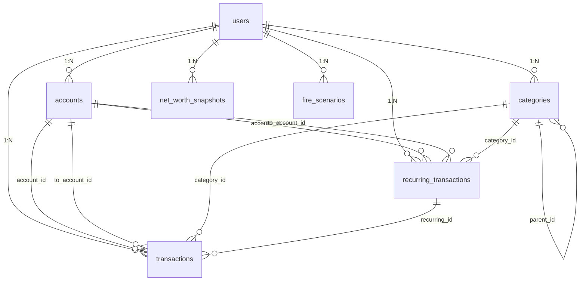

# 02-database.md — 数据库层

> **最后更新**: 2026-07-30
> **对应代码**: `packages/shared/src/db/`
> **导航**: [← 返回主页](CODE_WIKI.md) | [上一节](01-overview.md) | [下一节](03-types.md)

---

## 1. 连接管理

源码：[connection.ts](file:///workspace/packages/shared/src/db/connection.ts)

`connection.ts` 是数据库层的入口，负责创建与关闭 better-sqlite3 连接，并设置两个关键 PRAGMA。

### 1.1 `createDatabase(path): DatabaseType`

源码：[connection.ts:10](file:///workspace/packages/shared/src/db/connection.ts#L10)

```typescript
export function createDatabase(path: string): DatabaseType
```

**参数**：
- `path`：数据库文件路径（**必填**，空值抛错以避免误用相对默认值导致数据写到非预期位置）
- `db-manager.ts` 始终传入固定绝对路径（`%APPDATA%/fire-app/fire-app.db`）
- 传入 `':memory:'` 创建内存数据库（测试用，无文件 I/O）

**两个 PRAGMA**：

| PRAGMA | 位置 | 作用 |
|--------|------|------|
| `foreign_keys = ON` | [connection.ts:13](file:///workspace/packages/shared/src/db/connection.ts#L13) | 强制外键约束（better-sqlite3 默认关闭，必须显式开启） |
| `journal_mode = WAL` | [connection.ts:17](file:///workspace/packages/shared/src/db/connection.ts#L17) | Write-Ahead Logging，提升并发读写性能 |

**WAL 模式策略**（[connection.ts:16-18](file:///workspace/packages/shared/src/db/connection.ts#L16-L18)）：

```typescript
if (path !== ':memory:') {
  db.pragma('journal_mode = WAL');
}
```

仅文件库启用 WAL；内存库（`:memory:`）不支持 WAL，调用会被 SQLite 静默忽略，因此用条件判断跳过。这保证测试用内存库时不会产生告警或意外行为。

### 1.2 `closeDatabase(db): void`

源码：[connection.ts:26](file:///workspace/packages/shared/src/db/connection.ts#L26)

```typescript
export function closeDatabase(db: DatabaseType): void
```

**实现**（[connection.ts:27-29](file:///workspace/packages/shared/src/db/connection.ts#L27-L29)）：先检查 `db.open` 状态，再调用 `db.close()`。避免重复关闭已关闭的连接抛错，是测试 `afterEach` 钩子安全调用的保障。

---

## 2. Schema 初始化

源码：[schema.ts](file:///workspace/packages/shared/src/db/schema.ts)

`schema.ts` 集中定义全部 7 张表与 14 个索引（13 partial index + 1 unique partial index）的 DDL，并通过 `initSchema` 一次性执行。M9 加固在表级 / 列级补全了 24 处 CHECK 约束，并以 partial index（`WHERE deleted_flag = 0`）替换原全量索引以缩小体积并避免行内软删过滤。

### 2.1 `TABLE_NAMES` 常量

源码：[schema.ts:4-12](file:///workspace/packages/shared/src/db/schema.ts#L4-L12)

```typescript
export const TABLE_NAMES = [
  'users',
  'accounts',
  'categories',
  'transactions',
  'recurring_transactions',
  'net_worth_snapshots',
  'fire_scenarios',
] as const;
```

7 张表名以 `as const` 断言为只读元组，供 models 层引用以避免硬编码字符串。

### 2.2 `DDL_STATEMENTS` 数组

源码：[schema.ts:14-175](file:///workspace/packages/shared/src/db/schema.ts#L14-L175)

按顺序包含 21 条 DDL：
- 7 个 `CREATE TABLE IF NOT EXISTS`（第 16-155 行），其中 5 张表内嵌 24 处 CHECK 约束（accounts 3 / categories 1 / transactions 4 / recurring_transactions 6 / fire_scenarios 10，详见第 3 节逐表详解）
- 14 个 `CREATE INDEX IF NOT EXISTS`（第 159-174 行），全部为 partial index（`WHERE deleted_flag = 0`），其中 `idx_cat_unique_active` 为偏唯一索引（partial UNIQUE）

所有语句都用 `IF NOT EXISTS`，使 `initSchema` 可安全重复调用（幂等）。

### 2.3 `initSchema(db): void`

源码：[schema.ts:180](file:///workspace/packages/shared/src/db/schema.ts#L180)

```typescript
export function initSchema(db: DatabaseType): void {
  for (const ddl of DDL_STATEMENTS) {
    db.exec(ddl);
  }
}
```

遍历 `DDL_STATEMENTS` 数组逐条 `db.exec`。better-sqlite3 的 `exec` 是同步 API，因此 schema 初始化完成后即可立即使用。

### 2.4 前向引用说明

[schema.ts:70-71](file:///workspace/packages/shared/src/db/schema.ts#L70-L71) 注释指出：`transactions` 表（第 4 项）通过外键引用 `recurring_transactions` 表（第 5 项），但后者在 DDL 数组中后定义。这是合法的，因为 SQLite 仅在 `foreign_keys = ON` 时检查外键完整性，而表创建时不会校验被引用表是否存在。因此 DDL 数组顺序不影响 schema 初始化。

---

## 3. 7 张表逐表详解

按依赖顺序（被引用表在前）逐表详解。每张表所有字段表中的"NOT NULL"列：`✓` 表示有 NOT NULL 约束，`—` 表示允许 NULL。

### 3.1 `users`

**用途**：用户档案、同步根节点、FIRE 计算默认偏好。

**字段表**：

| 字段名 | 类型 | NOT NULL | 默认值 | CHECK 约束 | 说明 |
|--------|------|----------|--------|-----------|------|
| id | TEXT | ✓ | — | PRIMARY KEY | UUID v4 |
| display_name | TEXT | ✓ | — | — | 用户显示名 |
| base_currency | TEXT | ✓ | 'CNY' | — | 基础货币（ISO 4217） |
| is_china_market | INTEGER | ✓ | 1 | — | 是否中国市场（1=是，0=否） |
| default_withdrawal_rate | INTEGER | ✓ | 350 | — | 默认提款率（基点，350 = 3.5%） |
| default_expected_return | INTEGER | ✓ | 700 | — | 默认预期收益率（基点，700 = 7%） |
| default_inflation_rate | INTEGER | ✓ | 300 | — | 默认通胀率（基点，300 = 3%） |
| encryption_key_hash | TEXT | — | — | — | 加密密钥哈希（同步加密用，尚未实现） |
| last_sync_at | INTEGER | — | — | — | 最后同步时间戳（Unix 毫秒） |
| sync_version | INTEGER | ✓ | 0 | — | 同步版本号，每次本地修改 +1 |
| updated_at | INTEGER | ✓ | — | — | 最后修改时间戳（Unix 毫秒） |
| deleted_flag | INTEGER | ✓ | 0 | — | 软删除标志（0=活跃，1=已删除） |

**外键关系**：无（根表）。

**索引**：无（单用户场景，按 id 主键查询足够）。

**设计动机**：默认值反映中国市场假设——3.5% 提款率（保守于国际通用 4% 规则，适配中国市场预期）、7% 收益率、3% 通胀率。这些值在 `createUser` 时根据 `is_china_market` 标志可被覆盖（详见 [04-models.md](04-models.md)）。

DDL：[schema.ts:16-29](file:///workspace/packages/shared/src/db/schema.ts#L16-L29)

### 3.2 `accounts`

**用途**：用户名下的所有账户（流动/投资/使用/负债四类资产）。

**字段表**：

| 字段名 | 类型 | NOT NULL | 默认值 | CHECK 约束 | 说明 |
|--------|------|----------|--------|-----------|------|
| id | TEXT | ✓ | — | PRIMARY KEY | UUID v4 |
| user_id | TEXT | ✓ | — | — | 所属用户 ID |
| name | TEXT | ✓ | — | — | 账户名 |
| asset_class | TEXT | ✓ | — | IN ('liquid','invested','use_asset','liability') | 资产分类（4 值） |
| account_type | TEXT | ✓ | — | IN (11 个值) | 账户类型（11 值） |
| current_balance | INTEGER | ✓ | 0 | asset_class != 'liability' OR current_balance <= 0 | 当前余额（分；负债为负数） |
| last_updated | INTEGER | ✓ | — | — | 余额最后更新时间戳 |
| display_order | INTEGER | ✓ | 0 | — | 显示顺序 |
| note | TEXT | — | — | — | 备注 |
| sync_version | INTEGER | ✓ | 0 | — | 同步版本号 |
| updated_at | INTEGER | ✓ | — | — | 最后修改时间戳 |
| deleted_flag | INTEGER | ✓ | 0 | — | 软删除标志 |

`account_type` 的 CHECK 约束允许的 11 个值：`checking`、`savings`、`cash`、`investment`、`retirement`、`fund`、`real_estate`、`vehicle`、`credit_card`、`loan`、`mortgage`（见 [schema.ts:37-42](file:///workspace/packages/shared/src/db/schema.ts#L37-L42)）。

**外键关系**：
- `user_id` → users(id)

**索引**（2 个，均为 partial index `WHERE deleted_flag = 0`）：
- `idx_acc_user_class` on accounts(user_id, asset_class)
- `idx_acc_user` on accounts(user_id)

（[schema.ts:165-166](file:///workspace/packages/shared/src/db/schema.ts#L165-L166)）

**设计动机**：金额用 INTEGER 存储"分"，避免 IEEE 754 浮点误差（参见 [06-utils.md](06-utils.md) 的 `yuanToCents` 说明）。负债账户（asset_class = 'liability'）的 `current_balance` 为负数，使净资产计算可直接 SUM 所有账户余额。`current_balance` 的 CHECK 约束 `asset_class != 'liability' OR current_balance <= 0` 强制负债账户余额必须 ≤ 0（M9 加固），防止数据错误导致净资产虚高。

DDL：[schema.ts:32-50](file:///workspace/packages/shared/src/db/schema.ts#L32-L50)

### 3.3 `categories`

**用途**：收支分类，支持两级树结构与 FIRE 概念关联。

**字段表**：

| 字段名 | 类型 | NOT NULL | 默认值 | CHECK 约束 | 说明 |
|--------|------|----------|--------|-----------|------|
| id | TEXT | ✓ | — | PRIMARY KEY | UUID v4 |
| user_id | TEXT | ✓ | — | — | 所属用户 ID |
| parent_id | TEXT | — | — | — | 父分类 ID（自引用，支持两级树） |
| name | TEXT | ✓ | — | — | 分类名 |
| type | TEXT | ✓ | — | IN ('income','expense') | 分类类型（2 值） |
| icon | TEXT | — | — | — | 图标标识 |
| color | TEXT | — | — | — | 颜色值 |
| linked_fire_concept | TEXT | — | — | — | 关联的 FIRE 知识库概念标识 |
| display_order | INTEGER | ✓ | 0 | — | 显示顺序 |
| is_system | INTEGER | ✓ | 0 | — | 是否系统内置（1=是，用户不可删） |
| sync_version | INTEGER | ✓ | 0 | — | 同步版本号 |
| updated_at | INTEGER | ✓ | — | — | 最后修改时间戳 |
| deleted_flag | INTEGER | ✓ | 0 | — | 软删除标志 |

**外键关系**：
- `user_id` → users(id)
- `parent_id` → categories(id)（自引用，允许 NULL）

**索引**（2 个，均为 partial index `WHERE deleted_flag = 0`）：
- `idx_cat_user` on categories(user_id)
- `idx_cat_unique_active` UNIQUE on categories(user_id, name, type)（偏唯一索引：同一用户下未删除的 (name, type) 唯一，软删除记录不参与去重）

（[schema.ts:167](file:///workspace/packages/shared/src/db/schema.ts#L167) 与 [schema.ts:170](file:///workspace/packages/shared/src/db/schema.ts#L170)）

**设计动机**：`parent_id` 支持两级分类树（一级为大类，二级为子类）。`is_system` 标记内置分类（如 `seedCategories` 注入的 18 个），用户不可删除这些分类（避免破坏统计完整性）。`linked_fire_concept` 字段将分类与 FIRE 知识库 v5.0 的概念关联，5 个种子分类有值（详见 [04-models.md](04-models.md) 的 `seedCategories` 小节）。

DDL：[schema.ts:53-67](file:///workspace/packages/shared/src/db/schema.ts#L53-L67)

### 3.4 `recurring_transactions`

**用途**：经常性交易模板，按频率自动生成交易记录。

**字段表**：

| 字段名 | 类型 | NOT NULL | 默认值 | CHECK 约束 | 说明 |
|--------|------|----------|--------|-----------|------|
| id | TEXT | ✓ | — | PRIMARY KEY | UUID v4 |
| user_id | TEXT | ✓ | — | — | 所属用户 ID |
| account_id | TEXT | ✓ | — | — | 借方账户 ID |
| to_account_id | TEXT | — | — | — | 贷方账户 ID（仅转账模板） |
| category_id | TEXT | — | — | — | 分类 ID |
| transaction_type | TEXT | ✓ | — | IN ('income','expense','transfer') | 交易类型（3 值，无 initial_balance） |
| amount | INTEGER | ✓ | — | amount > 0 | 金额（分，必须为正） |
| frequency | TEXT | ✓ | — | IN ('daily','weekly','monthly','yearly') | 频率（4 值） |
| interval | INTEGER | ✓ | 1 | interval > 0 | 间隔（配合 frequency 表示"每 N 个单位"） |
| start_date | INTEGER | ✓ | — | — | 起始日期（Unix 毫秒） |
| end_date | INTEGER | — | — | end_date IS NULL OR end_date >= start_date | 结束日期（NULL 表示无限期） |
| next_due_date | INTEGER | ✓ | — | next_due_date >= start_date | 下次到期日 |
| last_generated_date | INTEGER | — | — | — | 上次生成交易日期 |
| description | TEXT | — | — | — | 描述 |
| is_active | INTEGER | ✓ | 1 | — | 是否活跃（1=活跃，0=已停用） |
| auto_create | INTEGER | ✓ | 1 | — | 是否自动创建交易（1=是） |
| sync_version | INTEGER | ✓ | 0 | — | 同步版本号 |
| updated_at | INTEGER | ✓ | — | — | 最后修改时间戳 |
| deleted_flag | INTEGER | ✓ | 0 | — | 软删除标志 |

**外键关系**：
- `user_id` → users(id)
- `account_id` → accounts(id)
- `to_account_id` → accounts(id)
- `category_id` → categories(id)

**索引**（2 个，均 partial index）：
- `idx_recur_active` on recurring_transactions(user_id) `WHERE is_active = 1 AND deleted_flag = 0`（仅活跃模板）
- `idx_recur_user` on recurring_transactions(user_id) `WHERE deleted_flag = 0`

（[schema.ts:171-172](file:///workspace/packages/shared/src/db/schema.ts#L171-L172)）

**设计动机**：`interval` 配合 `frequency` 支持"每 N 个月"等模式（如 `frequency='monthly'` + `interval=3` 表示每季度）。`interval > 0`、`next_due_date >= start_date`、`end_date IS NULL OR end_date >= start_date` 三处 CHECK 约束（M9 加固）防止配置错误（如负间隔、到期日早于起始日）。`transaction_type` 不允许 `initial_balance`（初始余额不应作为经常性模板）。`end_date` 允许 NULL 表示无限期循环。

DDL：[schema.ts:93-114](file:///workspace/packages/shared/src/db/schema.ts#L93-L114)

### 3.5 `transactions`

**用途**：所有交易流水记录（收入/支出/转账/初始余额）。

**字段表**：

| 字段名 | 类型 | NOT NULL | 默认值 | CHECK 约束 | 说明 |
|--------|------|----------|--------|-----------|------|
| id | TEXT | ✓ | — | PRIMARY KEY | UUID v4 |
| user_id | TEXT | ✓ | — | — | 所属用户 ID |
| account_id | TEXT | ✓ | — | — | 借方账户 ID |
| to_account_id | TEXT | — | — | 见下方表级约束 | 贷方账户 ID（仅转账） |
| category_id | TEXT | — | — | — | 分类 ID |
| recurring_id | TEXT | — | — | — | 来源模板 ID（前向引用） |
| transaction_type | TEXT | ✓ | — | IN ('income','expense','transfer','initial_balance') | 交易类型（4 值） |
| amount | INTEGER | ✓ | — | amount > 0 | 金额（分，必须为正） |
| transaction_date | INTEGER | ✓ | — | — | 交易日期（Unix 毫秒） |
| description | TEXT | — | — | — | 描述 |
| sync_version | INTEGER | ✓ | 0 | — | 同步版本号 |
| updated_at | INTEGER | ✓ | — | — | 最后修改时间戳 |
| deleted_flag | INTEGER | ✓ | 0 | — | 软删除标志 |

**表级 CHECK 约束**（M9 加固，2 处，见 [schema.ts:88-89](file:///workspace/packages/shared/src/db/schema.ts#L88-L89)）：
- `transaction_type != 'transfer' OR to_account_id IS NOT NULL`：转账交易必须指定贷方账户
- `to_account_id IS NULL OR to_account_id != account_id`：贷方账户不能与借方账户相同（防止自转）

**外键关系**：
- `user_id` → users(id)
- `account_id` → accounts(id)
- `to_account_id` → accounts(id)
- `category_id` → categories(id)
- `recurring_id` → recurring_transactions(id)（前向引用）

**索引**（6 个，全部 `WHERE deleted_flag = 0`，查询最密集的表）：
- `idx_tx_user_date` on transactions(user_id, transaction_date DESC, updated_at DESC)
- `idx_tx_account` on transactions(account_id, transaction_date DESC)
- `idx_tx_to_account` on transactions(to_account_id)
- `idx_tx_category` on transactions(category_id)
- `idx_tx_recurring` on transactions(recurring_id)
- `idx_tx_recurring_date` on transactions(recurring_id, transaction_date)

（[schema.ts:159-164](file:///workspace/packages/shared/src/db/schema.ts#L159-L164)）

**设计动机**：采用单分录模型，转账交易用 `to_account_id` 表达双账户关系（借方扣减，贷方增加），避免引入独立的双分录账本结构。`amount` 必须为正数（CHECK `amount > 0`），方向由 `transaction_type` 决定（详见 [05-services.md](05-services.md) 的 `balanceDelta` 函数）。两处表级 CHECK（M9 加固）确保转账交易完整性：转账必须带 `to_account_id`，且贷方 ≠ 借方。`recurring_id` 为可空外键，标记由经常性模板自动生成的交易；`idx_tx_recurring_date` 复合索引优化"某模板最近一条交易"查询。

DDL：[schema.ts:72-90](file:///workspace/packages/shared/src/db/schema.ts#L72-L90)

### 3.6 `net_worth_snapshots`

**用途**：月度净资产快照，预计算 4 类资产合计避免实时聚合。

**字段表**：

| 字段名 | 类型 | NOT NULL | 默认值 | CHECK 约束 | 说明 |
|--------|------|----------|--------|-----------|------|
| id | TEXT | ✓ | — | PRIMARY KEY | UUID v4 |
| user_id | TEXT | ✓ | — | — | 所属用户 ID |
| snapshot_date | INTEGER | ✓ | — | — | 快照日期（Unix 毫秒） |
| snapshot_year_month | TEXT | ✓ | — | — | 快照年月（"YYYY-MM" 格式） |
| total_liquid | INTEGER | ✓ | — | — | 流动资产合计（分） |
| total_invested | INTEGER | ✓ | — | — | 投资资产合计（分） |
| total_use_asset | INTEGER | ✓ | — | — | 使用资产合计（分） |
| total_liability | INTEGER | ✓ | — | — | 负债合计（分，负数） |
| net_worth | INTEGER | ✓ | — | — | 净资产（4 类之和，分） |
| sync_version | INTEGER | ✓ | 0 | — | 同步版本号 |
| updated_at | INTEGER | ✓ | — | — | 最后修改时间戳 |
| deleted_flag | INTEGER | ✓ | 0 | — | 软删除标志 |

**表级约束**：`UNIQUE(user_id, snapshot_year_month)`（[schema.ts:130](file:///workspace/packages/shared/src/db/schema.ts#L130)）

**外键关系**：
- `user_id` → users(id)

**索引**：`idx_snap_user` on net_worth_snapshots(user_id, snapshot_year_month DESC) `WHERE deleted_flag = 0`（[schema.ts:173](file:///workspace/packages/shared/src/db/schema.ts#L173)）

**设计动机**：快照预计算 4 类资产合计（liquid / invested / use_asset / liability），避免每次查询净资产时实时聚合大量交易记录。`UNIQUE(user_id, snapshot_year_month)` 约束保证每月每用户仅一条快照，是 `generateMonthlySnapshot` 幂等性的数据库层保障（详见 [05-services.md](05-services.md) 的快照服务小节）。`total_liability` 为负数，使 `net_worth = 4 类之和` 自然扣减负债。

DDL：[schema.ts:117-131](file:///workspace/packages/shared/src/db/schema.ts#L117-L131)

### 3.7 `fire_scenarios`

**用途**：FIRE 投影场景参数（保守/标准/激进等多场景对比）。

**字段表**：

| 字段名 | 类型 | NOT NULL | 默认值 | CHECK 约束 | 说明 |
|--------|------|----------|--------|-----------|------|
| id | TEXT | ✓ | — | PRIMARY KEY | UUID v4 |
| user_id | TEXT | ✓ | — | — | 所属用户 ID |
| name | TEXT | ✓ | — | — | 场景名 |
| description | TEXT | — | — | — | 场景描述 |
| current_age | INTEGER | ✓ | — | current_age >= 0 | 当前年龄 |
| retirement_age | INTEGER | ✓ | — | retirement_age > current_age | 退休年龄 |
| current_portfolio_value | INTEGER | ✓ | 0 | current_portfolio_value >= 0 | 当前投资组合价值（分） |
| auto_sync_assets | INTEGER | ✓ | 1 | — | 是否自动同步资产（1=从 accounts 表读取） |
| monthly_savings | INTEGER | ✓ | 0 | monthly_savings >= 0 | 月储蓄（分） |
| annual_expenses | INTEGER | ✓ | — | annual_expenses > 0 | 年支出（分） |
| expected_return_rate | INTEGER | ✓ | — | expected_return_rate BETWEEN -1000 AND 5000 | 预期收益率（基点） |
| inflation_rate | INTEGER | ✓ | 300 | inflation_rate BETWEEN -1000 AND 5000 | 通胀率（基点，300 = 3%） |
| withdrawal_rate | INTEGER | ✓ | — | withdrawal_rate BETWEEN 200 AND 600 | 提款率（基点，200-600 即 2%-6%） |
| retirement_years | INTEGER | ✓ | 30 | retirement_years > 0 | 退休后年数 |
| post_retirement_monthly_income | INTEGER | ✓ | 0 | post_retirement_monthly_income >= 0 | 退休后月其他收入（分，如社保养老金） |
| is_china_market | INTEGER | ✓ | 1 | — | 是否中国市场 |
| is_active | INTEGER | ✓ | 1 | — | 是否活跃场景 |
| sync_version | INTEGER | ✓ | 0 | — | 同步版本号 |
| updated_at | INTEGER | ✓ | — | — | 最后修改时间戳 |
| deleted_flag | INTEGER | ✓ | 0 | — | 软删除标志 |

**外键关系**：
- `user_id` → users(id)

**索引**：`idx_fire_user` on fire_scenarios(user_id) `WHERE deleted_flag = 0`（[schema.ts:174](file:///workspace/packages/shared/src/db/schema.ts#L174)）

**设计动机**：多场景支持保守/标准/激进对比（不同 `withdrawal_rate` / `expected_return_rate` / `retirement_age` 组合）。M9 加固补全了 10 处 CHECK 约束防止不合理配置：`current_age >= 0` 与 `retirement_age > current_age` 确保退休发生在未来；`current_portfolio_value` / `monthly_savings` / `post_retirement_monthly_income` 均 `>= 0`，`annual_expenses > 0` 与 `retirement_years > 0` 禁止零或负值；`expected_return_rate` 与 `inflation_rate` 限制在 `BETWEEN -1000 AND 5000`（允许极端负利率 / 高通胀场景但封顶）；`withdrawal_rate BETWEEN 200 AND 600` 限制提款率在 2%-6% 合理区间（过低导致 FIRE 数过高不切实际，过高有耗尽风险）。FIRE 投影结果**不持久化**——每次查询时由 `runProjection` 实时计算（详见 [05-services.md](05-services.md) 的 fire-calc 小节），避免数据冗余与一致性问题。

DDL：[schema.ts:134-155](file:///workspace/packages/shared/src/db/schema.ts#L134-L155)

---

## 4. ER 图

下图展示 7 张表的外键关系，标识符为表名（英文），关系标签为外键字段名。



7 张表均以 `users` 为中心形成星型结构。`transactions` 是关联最广的表，共有 5 个外键（user_id / account_id / to_account_id / category_id / recurring_id）。`categories` 通过 `parent_id` 自引用形成两级树。`accounts` 同时作为借方（`account_id`）和贷方（`to_account_id`）出现在 `transactions` 与 `recurring_transactions` 两张表中，支持转账交易的双账户表达。

---

## 5. 索引清单

源码：[schema.ts:159-174](file:///workspace/packages/shared/src/db/schema.ts#L159-L174)

共 14 个索引（13 partial index + 1 partial UNIQUE index），全部使用 `CREATE INDEX IF NOT EXISTS`（幂等）。M9 加固将原全量索引全部改为 partial index（`WHERE deleted_flag = 0`），仅索引未软删记录，缩小索引体积并避免查询时的行内软删过滤。`transactions` 表占 6 个（查询热点），其余 4 张业务表合计 8 个。

| 索引名 | 表 | 字段 | WHERE 谓词 | 用途 |
|--------|-----|------|-----------|------|
| idx_tx_user_date | transactions | (user_id, transaction_date DESC, updated_at DESC) | deleted_flag = 0 | 按用户查询交易流水（时间倒序） |
| idx_tx_account | transactions | (account_id, transaction_date DESC) | deleted_flag = 0 | 按账户查询交易历史 |
| idx_tx_to_account | transactions | (to_account_id) | deleted_flag = 0 | 按贷方账户查询转账 |
| idx_tx_category | transactions | (category_id) | deleted_flag = 0 | 按分类聚合统计 |
| idx_tx_recurring | transactions | (recurring_id) | deleted_flag = 0 | 查询某模板生成的交易 |
| idx_tx_recurring_date | transactions | (recurring_id, transaction_date) | deleted_flag = 0 | 查询某模板最近一条交易 |
| idx_acc_user_class | accounts | (user_id, asset_class) | deleted_flag = 0 | 按用户 + 资产分类聚合 |
| idx_acc_user | accounts | (user_id) | deleted_flag = 0 | 按用户查询账户列表 |
| idx_cat_user | categories | (user_id) | deleted_flag = 0 | 按用户查询分类 |
| idx_cat_unique_active | categories | (user_id, name, type) UNIQUE | deleted_flag = 0 | 偏唯一：同用户未删 (name, type) 唯一 |
| idx_recur_active | recurring_transactions | (user_id) | is_active = 1 AND deleted_flag = 0 | 仅活跃模板（生成器扫描） |
| idx_recur_user | recurring_transactions | (user_id) | deleted_flag = 0 | 按用户查询经常性模板 |
| idx_snap_user | net_worth_snapshots | (user_id, snapshot_year_month DESC) | deleted_flag = 0 | 按用户查询快照（年月倒序） |
| idx_fire_user | fire_scenarios | (user_id) | deleted_flag = 0 | 按用户查询 FIRE 场景 |

**索引设计原则**：
- 所有索引都以 `user_id` 为前导字段，因为绝大多数查询都按用户隔离
- 全部索引为 partial index（`WHERE deleted_flag = 0`），软删记录不进索引——既减小体积，又让查询无需再加 `deleted_flag = 0` 过滤
- `idx_cat_unique_active` 是唯一的 partial UNIQUE 索引：在未软删记录中保证 `(user_id, name, type)` 唯一，软删后即可重建同名分类（避免"删了又建"被唯一约束挡住）
- `idx_recur_active` 进一步叠加 `is_active = 1`，专供经常性模板生成器扫描活跃模板
- `transactions` 与 `net_worth_snapshots` 的索引含 `DESC` 排序的日期/年月字段，优化"最近 N 条"类查询
- `idx_tx_recurring_date` 复合索引覆盖"某模板最近一条交易"的查询模式
- `users` 表无索引（单用户场景，主键查询足够）

---

## 6. 数据导出信封（Export Envelope）

源码：[export-service.ts](file:///workspace/packages/shared/src/services/export-service.ts)

M8 引入的导出功能将单用户全量数据封装为 `ExportEnvelope`（JSON 信封），用于跨设备迁移 / 备份。M9 加固在导入侧拒绝加密文件（见下方 crypto 标记）。

### 6.1 `EXPORT_TABLE_NAMES` 常量

源码：[export-service.ts:4-7](file:///workspace/packages/shared/src/services/export-service.ts#L4-L7)

```typescript
export const EXPORT_TABLE_NAMES = [
  'users', 'accounts', 'categories', 'transactions',
  'recurring_transactions', 'net_worth_snapshots', 'fire_scenarios',
] as const;
```

7 张表全部参与导出（与 `TABLE_NAMES` 一致）。`ExportTableName` 类型由该常量派生，供 `buildCsvExport` 单表 CSV 导出复用。

### 6.2 `ExportEnvelope` 结构

源码：[export-service.ts:11-26](file:///workspace/packages/shared/src/services/export-service.ts#L11-L26)

```typescript
export interface ExportEnvelope {
  header: {
    format: 'fire-app-export';
    version: '1.0';
    exported_at: number;
    app_version: string;
    table_count: number;
    record_count: number;
    crypto: null;
  };
  data: {
    users: User[]; accounts: Account[]; categories: Category[];
    transactions: Transaction[]; recurring_transactions: RecurringTransaction[];
    net_worth_snapshots: NetWorthSnapshot[]; fire_scenarios: FireScenario[];
  };
}
```

**header**（元数据）：
- `format: 'fire-app-export'`：固定魔数，导入侧据此识别文件格式
- `version: '1.0'`：信封格式版本
- `exported_at`：导出时间戳（Unix 毫秒）
- `app_version`：导出时的应用版本号（由调用方传入）
- `table_count` / `record_count`：表数（7）与记录总数，供导入前校验
- `crypto: null`：加密标记。M9 加固要求导入侧拒绝 `crypto` 非 null 的文件——即**拒绝导入加密文件**（加密导入流程尚未实现，避免误将未解密数据落库）

**data**：7 张表的记录数组，字段类型与 [03-types.md](03-types.md) 定义一致。

### 6.3 `buildExportEnvelope` 实现

源码：[export-service.ts:28-46](file:///workspace/packages/shared/src/services/export-service.ts#L28-L46)

```typescript
export function buildExportEnvelope(db: DatabaseType, userId: string, appVersion: string): ExportEnvelope
```

按 `userId` 过滤 7 张表数据并组装信封。**关键安全处理**：`users` 表查询使用显式列名，剔除 `encryption_key_hash`（以 `NULL as encryption_key_hash` 占位），避免导出文件含加密密钥哈希导致离线密码爆破（[export-service.ts:31](file:///workspace/packages/shared/src/services/export-service.ts#L31)）。其余 6 张表用 `SELECT *`，因不含敏感字段。

`serializeExportEnvelope` 将信封序列化为带缩进的 JSON 字符串（[export-service.ts:48-50](file:///workspace/packages/shared/src/services/export-service.ts#L48-L50)），便于人工检视与版本对比。
