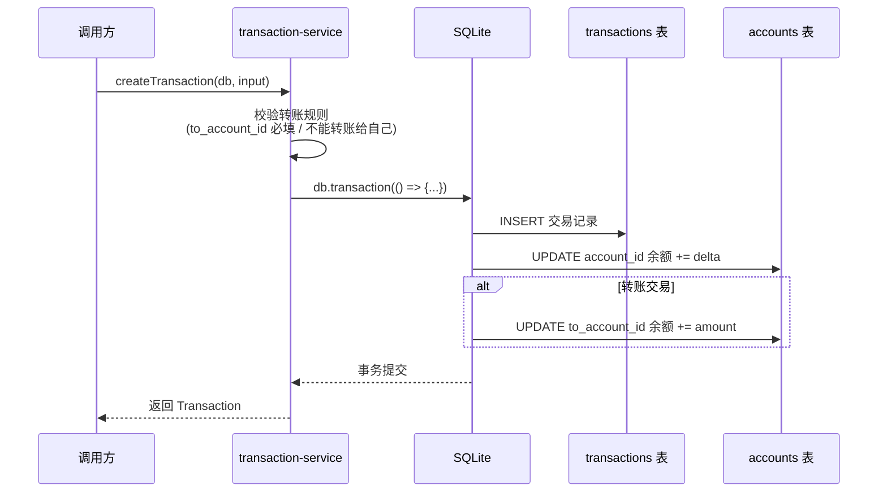
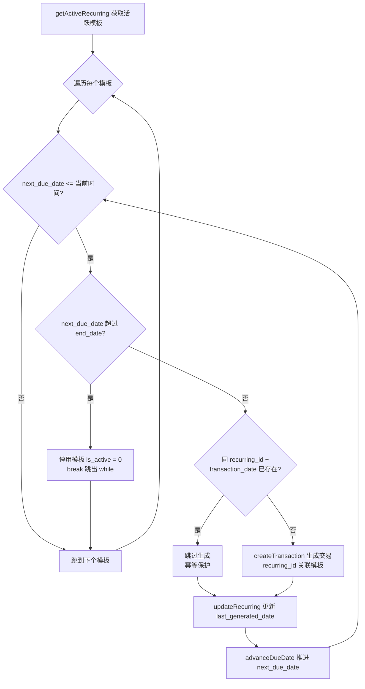

# 05-services.md — 业务服务层

> **最后更新**: 2026-07-30
> **对应代码**: `packages/shared/src/services/`
> **导航**: [← 返回主页](CODE_WIKI.md) | [上一节](04-models.md) | [下一节](06-utils.md)

---

## 1. 模块概述

services 层是业务逻辑层，协调多个 model 的写操作。与 models 层（纯 CRUD）不同，services 层负责：

- **事务边界**：将"交易写入 + 余额更新"等多步操作包裹在 `db.transaction(() => {...})` 内，保证原子性
- **跨表一致性**：例如编辑交易时需同时调整新旧账户的余额
- **算法计算**：FIRE 投影、快照聚合等业务算法

services 目录包含 9 个文件（本节覆盖 8 个，`category-service.ts` 为简单分类 CRUD 封装，此处不展开）：

| 文件 | 职责 | 行数 | 是否写库 | 是否含事务 |
|------|------|------|----------|-----------|
| [fire-calc.ts](file:///workspace/packages/shared/src/services/fire-calc.ts) | FIRE 数计算、退休投影模拟 | 99 | 否（仅读） | 否 |
| [transaction-service.ts](file:///workspace/packages/shared/src/services/transaction-service.ts) | 交易创建/编辑/删除 + 余额联动 | 129 | 是 | 是 |
| [recurring-service.ts](file:///workspace/packages/shared/src/services/recurring-service.ts) | 经常性交易模板补单引擎 | 65 | 是 | 是 |
| [snapshot-service.ts](file:///workspace/packages/shared/src/services/snapshot-service.ts) | 月度净资产快照生成 | 40 | 是 | 否（单次插入） |
| [export-service.ts](file:///workspace/packages/shared/src/services/export-service.ts) | 导出信封构建（JSON/CSV） | 72 | 否（仅读） | 否 |
| [column-whitelist.ts](file:///workspace/packages/shared/src/services/column-whitelist.ts) | 列名白名单校验（防 SQL 注入） | 36 | 否 | 否 |
| [import-service.ts](file:///workspace/packages/shared/src/services/import-service.ts) | JSON LWW 导入 + CSV 交易导入 | 207 | 是 | 是 |
| [clear-service.ts](file:///workspace/packages/shared/src/services/clear-service.ts) | 清空所有交易 + 账户余额归零 | 35 | 是 | 是 |

**依赖方向**：services 依赖 models + utils + types + `import-templates/`。services 层之间的调用关系：
- `recurring-service` 与 `import-service` 均调用 `transaction-service` 的 `createTransaction`，复用其事务原子性保证
- `import-service` 依赖 `column-whitelist`（列过滤）、`export-service`（`ExportTableName`/`ExportEnvelope` 类型）、`import-templates/`（模板/关键词/占位符）

---

## 2. fire-calc.ts — FIRE 计算引擎

源码：[fire-calc.ts](file:///workspace/packages/shared/src/services/fire-calc.ts)

**职责**：FIRE 数计算、退休投影模拟（积累阶段 + 提款阶段）

**特点**：
- **纯计算引擎**：无任何数据库写入操作
- 仅当 `scenario.auto_sync_assets === 1` 时读 `accounts` 表（通过 `getInvestableBalance`）获取可投资余额作为初始本金；否则使用 `scenario.current_portfolio_value`
- 所有金额内部以"分"为单位参与运算，使用 `Math.round` / `Math.floor` 避免浮点累积误差

### 2.1 输出接口

#### `MonthlyProjectionPoint`（[fire-calc.ts:6-10](file:///workspace/packages/shared/src/services/fire-calc.ts#L6-L10)）

| 字段 | 类型 | 说明 |
|------|------|------|
| month | number | 月序号（从 1 开始，提款阶段接续积累阶段编号） |
| age | number | 当月年龄（含小数，如 30.25 = 30 岁 3 个月） |
| balance | number | 月末投资组合余额（分） |
| contribution | number | 当月投入（分，提款阶段为 0） |
| growth | number | 当月增长（分） |
| cumulative_contribution | number | 累计投入（分） |
| cumulative_growth | number | 累计增长（分） |
| phase | 'accumulation' \| 'retirement' | 阶段标志 |

#### `ProjectionResult`（[fire-calc.ts:12-16](file:///workspace/packages/shared/src/services/fire-calc.ts#L12-L16)）

| 字段 | 类型 | 说明 |
|------|------|------|
| fire_number | number | 标准 FIRE 数（分） |
| adjusted_fire_number | number | 调整后 FIRE 数（扣减退休后其他收入） |
| retirement_portfolio | number | 退休时点的投资组合余额（分，积累阶段结束时的余额） |
| progress | number | 当前进度百分比（0-100，1 位小数） |
| monthly_projection | MonthlyProjectionPoint[] | 月度投影序列（积累 + 提款） |

### 2.2 函数清单

| 函数名 | 签名 | 用途 |
|--------|------|------|
| calculateFireNumber | (annualExpenses, withdrawalRateBp) => number | 标准 FIRE 数 |
| calculateAdjustedFireNumber | (annualExpenses, withdrawalRateBp, postRetirementMonthlyIncome) => number | 调整后 FIRE 数 |
| calculateAccumulation | (pv, pmt, annualReturnBp, months) => number | 未来值（FV）计算 |
| calculateProgress | (currentValue, fireNumber) => number | 进度百分比 |
| runProjection | (db, scenario) => ProjectionResult | 主投影函数 |

### 2.3 关键函数详解

#### `calculateFireNumber`（[fire-calc.ts:18](file:///workspace/packages/shared/src/services/fire-calc.ts#L18)）

**公式**：`fireNumber = Math.floor(annualExpenses × (10000 / withdrawalRateBp))`

**示例**：
- 年支出 40000 元，提款率 400 基点（4%）→ `40000 × (10000 / 400) = 40000 × 25 = 1000000` 元（100 万元）
- 这就是经典的 **"4% 规则"**：25 倍年支出。提款率 350 基点（3.5%，中国市场默认）→ 约 28.57 倍年支出

#### `calculateAdjustedFireNumber`（[fire-calc.ts:22](file:///workspace/packages/shared/src/services/fire-calc.ts#L22)）

**推导**：若退休后有其他月收入（如社保养老金、租金），所需投资组合可相应减少。

1. `annualOtherIncome = postRetirementMonthlyIncome × 12`
2. `deduction = Math.floor(annualOtherIncome / (withdrawalRateBp / 10000))` —— 将年其他收入按提款率"资本化"为现值
3. `adjustedFireNumber = Math.max(0, baseFireNumber - deduction)`

**短路优化**：当 `postRetirementMonthlyIncome === 0` 时直接返回 `baseFireNumber`，避免除零和无意义计算。

#### `runProjection`（[fire-calc.ts:43](file:///workspace/packages/shared/src/services/fire-calc.ts#L43)）

**算法流程**：

```mermaid
flowchart TD
    A[开始 runProjection] --> B{auto_sync_assets = 1?}
    B -- 是 --> C[从 accounts 表读取可投资余额<br/>getInvestableBalance]
    B -- 否 --> D[使用 scenario.current_portfolio_value]
    C --> E[计算 fire_number 和 adjusted_fire_number]
    D --> E
    E --> F[积累阶段循环<br/>月数 = (retirement_age - current_age) × 12]
    F --> G[每月: 余额 += round(余额×月收益率) + 月储蓄]
    G --> H{积累月数完成?}
    H -- 否 --> G
    H -- 是 --> I[记录 retirement_portfolio]
    I --> J[提款阶段循环<br/>月数 = retirement_years × 12]
    J --> K[每月: 余额 += round(余额×月收益率) - 净提款<br/>提款按月通胀递增]
    K --> L{提款月数完成?}
    L -- 否 --> K
    L -- 是 --> M[计算 progress]
    M --> N[返回 ProjectionResult]
```

上图展示 `runProjection` 的两阶段算法：积累阶段按月复利增长并加入储蓄，提款阶段按月扣减净提款并按通胀递增。两个阶段的月增长均使用 `Math.round(余额 × 月收益率)` 取整，避免浮点累积。

**两阶段逻辑**：

1. **积累阶段**（[fire-calc.ts:60-71](file:///workspace/packages/shared/src/services/fire-calc.ts#L60-L71)）：
   - 月数 = `(scenario.retirement_age - scenario.current_age) × 12`
   - 每月：`monthGrowth = Math.round(balance × monthlyReturnRate)`；`balance += monthGrowth + scenario.monthly_savings`
   - 累计 `contribution`（月储蓄）和 `growth`（月增长）
   - phase 标记为 `'accumulation'`，年龄 = `current_age + (m + 1) / 12`

2. **提款阶段**（[fire-calc.ts:82-95](file:///workspace/packages/shared/src/services/fire-calc.ts#L82-L95)）：
   - 月数 = `scenario.retirement_years × 12`
   - 初始月提款 = `Math.round(scenario.annual_expenses / 12)`
   - 每月：`netWithdrawal = Math.max(0, currentWithdrawal - monthlyOtherIncome)`
   - `balance += monthGrowth - netWithdrawal`；`balance = Math.max(0, balance)`（防止负数）
   - 提款按月通胀递增：`currentWithdrawal = Math.round(currentWithdrawal × (1 + monthlyInflation))`
   - phase 标记为 `'retirement'`，月序号接续积累阶段

**数学公式与代码对应表**：

| 公式 | 代码位置 | 说明 |
|------|----------|------|
| FIRE 数 = 年支出 × (10000 / 提款率基点) | [fire-calc.ts:19](file:///workspace/packages/shared/src/services/fire-calc.ts#L19) | 4% 规则（25 倍年支出） |
| 月收益率 = 年收益率基点 / 10000 / 12 | [fire-calc.ts:57](file:///workspace/packages/shared/src/services/fire-calc.ts#L57) | 基点转月小数 |
| 月增长 = round(余额 × 月收益率) | [fire-calc.ts:61](file:///workspace/packages/shared/src/services/fire-calc.ts#L61) | 复利，取整避免浮点累积 |
| 净提款 = max(0, 月提款 - 月其他收入) | [fire-calc.ts:84](file:///workspace/packages/shared/src/services/fire-calc.ts#L84) | 扣减其他收入，下限 0 |

---

## 3. transaction-service.ts — 交易服务

源码：[transaction-service.ts](file:///workspace/packages/shared/src/services/transaction-service.ts)

**职责**：交易创建/编辑/删除，**强事务保证**交易记录与账户余额的原子性

### 3.1 输入接口

#### `CreateTransactionInput`（[transaction-service.ts:7-17](file:///workspace/packages/shared/src/services/transaction-service.ts#L7-L17)）

| 字段 | 类型 | 必填 | 说明 |
|------|------|------|------|
| user_id | string | 是 | 用户 ID |
| account_id | string | 是 | 借方账户 |
| to_account_id | string \| null | 转账必填 | 贷方账户（仅转账类型） |
| category_id | string \| null | 否 | 分类 ID |
| recurring_id | string \| null | 否 | 来源模板 ID（由 recurring-service 传入） |
| transaction_type | TransactionType | 是 | 交易类型 |
| amount | number | 是 | 金额（分，必须 > 0） |
| transaction_date | number | 是 | 交易日期（毫秒） |
| description | string \| null | 否 | 描述 |

#### `EditTransactionInput`（[transaction-service.ts:19-27](file:///workspace/packages/shared/src/services/transaction-service.ts#L19-L27)）

同上但所有字段可选（无 `user_id`，因为交易记录的归属不可更改）。`to_account_id` / `category_id` / `description` 使用 `!== undefined` 判断以区分"未提供"与"显式置 null"。

### 3.2 内部函数

#### `balanceDelta(type, amount)`（[transaction-service.ts:29](file:///workspace/packages/shared/src/services/transaction-service.ts#L29)）

**用途**：计算交易对 `account_id`（借方账户）余额的增量影响

| 交易类型 | 余额增量 | 说明 |
|----------|----------|------|
| income | +amount | 收入增加借方账户余额 |
| initial_balance | +amount | 初始余额增加借方账户余额 |
| expense | -amount | 支出减少借方账户余额 |
| transfer | -amount | 转出方减少（转入方 `to_account_id` 的 +amount 在调用处单独处理） |
| default | 0 | 兜底，理论上不可达 |

**设计要点**：转账的余额影响是"双账户"的——借方 `-amount`，贷方 `+amount`。`balanceDelta` 只返回借方增量，贷方增量在各公开函数内单独 `updateBalance.run(amount, ...)`。

### 3.3 公开函数

#### `createTransaction`（[transaction-service.ts:43](file:///workspace/packages/shared/src/services/transaction-service.ts#L43)）

**业务规则**（[transaction-service.ts:44-47](file:///workspace/packages/shared/src/services/transaction-service.ts#L44-L47)）：
- 转账必须有 `to_account_id`，否则抛错 `"转账交易必须指定 to_account_id"`
- 转账的 `to_account_id` 不能等于 `account_id`，否则抛错 `"不能转账给自己"`
- `amount` 必须由调用方保证 > 0（DB 层有 `CHECK (amount > 0)` 兜底）

**事务流程**：



上图展示创建交易的事务边界：交易记录插入与余额更新（含转账的双账户更新）在同一 `db.transaction` 内，任一步失败则整体回滚，保证交易与余额强一致。

#### `editTransaction`（[transaction-service.ts:74](file:///workspace/packages/shared/src/services/transaction-service.ts#L74)）

**前置校验**：先查 `getTransaction(db, id)`，不存在则抛错 `"Transaction not found: ${id}"`。若新类型为转账，同样校验 `to_account_id` 必填且不等于 `account_id`。

**三步事务流程**（在同一 `db.transaction` 内，[transaction-service.ts:95-108](file:///workspace/packages/shared/src/services/transaction-service.ts#L95-L108)）：

1. **反向调整旧交易**：`updateBalance(-oldDelta, oldAccountId)`；若旧交易是转账，再 `updateBalance(-oldAmount, oldToAccountId)`
2. **正向应用新交易**：`updateBalance(newDelta, newAccountId)`；若新交易是转账，再 `updateBalance(newAmount, newToAccountId)`
3. **更新交易记录**：全字段 UPDATE，`sync_version = oldTx.sync_version + 1`

**字段合并约定**：`to_account_id` / `category_id` / `description` 用 `!== undefined` 判断（区分"未提供"与"显式置 null"）；`transaction_type` / `amount` / `account_id` / `transaction_date` 用 `??` 取默认值。

#### `deleteTransaction`（[transaction-service.ts:113](file:///workspace/packages/shared/src/services/transaction-service.ts#L113)）

**事务流程**（[transaction-service.ts:122-128](file:///workspace/packages/shared/src/services/transaction-service.ts#L122-L128)）：

1. **反向调整余额**：`updateBalance(-delta, account_id)`；若是转账，再 `updateBalance(-amount, to_account_id)`（与 edit 的第 1 步一致）
2. **软删除**：`UPDATE transactions SET deleted_flag = 1, sync_version = sync_version + 1, updated_at = now`

**注意**：`deleteTransaction` 不物理删除记录，仅置 `deleted_flag = 1`，以便同步传播与审计追溯。

### 3.4 事务原子性说明

三个公开函数（create / edit / delete）均使用 better-sqlite3 的 `db.transaction(() => {...})()` 同步事务包装器：

- **同步执行**：better-sqlite3 是同步 API，事务内多语句无并发风险
- **原子性**：事务内任一语句抛错，整个事务回滚，余额与交易记录始终保持一致
- **隔离性**：单线程模型下无需额外隔离级别
- **转账双账户**：转账交易在事务内对两个账户各执行一次 `UPDATE accounts SET current_balance = current_balance + ?`，避免出现"钱凭空消失"或"凭空产生"

---

## 4. recurring-service.ts — 经常性交易引擎

源码：[recurring-service.ts](file:///workspace/packages/shared/src/services/recurring-service.ts)

**职责**：扫描活跃的经常性交易模板，对到期模板自动生成交易记录（支持离线补单）

### 4.1 内部函数

#### `advanceDueDate(currentDue, frequency, interval)`（[recurring-service.ts:7](file:///workspace/packages/shared/src/services/recurring-service.ts#L7)）

**用途**：根据频率推算下一个到期日（毫秒时间戳）

| 频率 | 计算方式 | 说明 |
|------|----------|------|
| daily | `currentDue + interval × 86400000` 毫秒 | `interval × 24 × 60 × 60 × 1000` |
| weekly | `currentDue + interval × 7 × 86400000` 毫秒 | `interval × 7 × 24 × 60 × 60 × 1000` |
| monthly | `addMonths(currentDue, interval)` | 复用 time.ts 的月末溢出处理 |
| yearly | `addMonths(currentDue, interval × 12)` | 转化为 12 × interval 个月 |

**设计要点**：`interval` 字段配合 `frequency` 支持"每 N 天/周/月/年"模式（如 `frequency=monthly, interval=3` 表示每季度）。月/年频率复用 `addMonths` 的月末溢出修正（如 1 月 31 日 + 1 月 → 2 月 28/29 日）。

### 4.2 `processRecurringTransactions`（[recurring-service.ts:17](file:///workspace/packages/shared/src/services/recurring-service.ts#L17)）

**签名**：`(db, userId) => Transaction[]`（返回本次生成的所有交易）

**主循环逻辑**：



上图展示 while 循环补单逻辑：对每个到期模板，循环生成交易并推进到期日，直到到期日晚于当前时间或超过 end_date。一次调用可生成多个逾期交易（如离线多日）。新增的幂等检查确保同一 `(recurring_id, transaction_date)` 不会重复生成交易，使得重试安全。

**关键细节**（[recurring-service.ts:27-61](file:///workspace/packages/shared/src/services/recurring-service.ts#L27-L61)）：

- **while 循环补单**：`while (next_due_date <= currentTime)` —— 可能一次性生成多个逾期交易（如离线多日、模板到期日已过多次）
- **`end_date` 检查**（[recurring-service.ts:31-34](file:///workspace/packages/shared/src/services/recurring-service.ts#L31-L34)）：若 `next_due_date > end_date`，调用 `updateRecurring` 停用模板（`is_active = 0`）并 `break` 跳出 while
- **幂等检查**（[recurring-service.ts:38-39](file:///workspace/packages/shared/src/services/recurring-service.ts#L38-L39)）：预编译语句 `SELECT 1 FROM transactions WHERE recurring_id = ? AND transaction_date = ? AND deleted_flag = 0 LIMIT 1` 命中则跳过 `createTransaction`，避免重复生成
- **交易生成**（[recurring-service.ts:40-47](file:///workspace/packages/shared/src/services/recurring-service.ts#L40-L47)）：调用 `createTransaction` 时传入 `recurring_id: template.id`，建立交易与模板的关联
- **last_generated_date 持久化**（[recurring-service.ts:50](file:///workspace/packages/shared/src/services/recurring-service.ts#L50)）：无论是否跳过生成，均调用 `updateRecurring` 更新 `last_generated_date`，记录"已处理到的到期日"
- **循环后收尾**（[recurring-service.ts:54-60](file:///workspace/packages/shared/src/services/recurring-service.ts#L54-L60)）：若 `next_due_date` 已推进，再次调用 `updateRecurring` 持久化新到期日；若新到期日超过 `end_date`，同时置 `is_active = 0`

### 4.3 调用关系

- **依赖**：
  - `getActiveRecurring`（[models/recurring.ts](file:///workspace/packages/shared/src/models/recurring.ts)）—— 获取所有 `is_active = 1` 的模板
  - `updateRecurring`（[models/recurring.ts](file:///workspace/packages/shared/src/models/recurring.ts)）—— 推进 `next_due_date`、更新 `last_generated_date`、停用模板
  - `createTransaction`（[transaction-service.ts](file:///workspace/packages/shared/src/services/transaction-service.ts)）—— 生成实际交易
  - `addMonths` / `nowMs`（[utils/time.ts](file:///workspace/packages/shared/src/utils/time.ts)）
- **事务原子性**（[recurring-service.ts:26-62](file:///workspace/packages/shared/src/services/recurring-service.ts#L26-L62)）：整个模板遍历 + 补单循环包裹在外层 `db.transaction(() => {...})()` 内，所有 `createTransaction` + `updateRecurring` 调用原子提交，任一模板失败则整体回滚
- **幂等性**：预编译语句 `checkExisting`（[recurring-service.ts:24](file:///workspace/packages/shared/src/services/recurring-service.ts#L24)）按 `(recurring_id, transaction_date)` 去重；即便 `last_generated_date` 落后于实际进度（如手动补单后再次调用），也不会重复生成交易，重试安全

---

## 5. snapshot-service.ts — 快照服务

源码：[snapshot-service.ts](file:///workspace/packages/shared/src/services/snapshot-service.ts)

**职责**：按月生成净资产快照，幂等（同月重复调用返回 null，不重复插入）

### 5.1 内部函数

#### `summarizeByAssetClass(db, userId)`（[snapshot-service.ts:7](file:///workspace/packages/shared/src/services/snapshot-service.ts#L7)）

**用途**：按 4 类资产分组求和，返回各资产类的合计余额

**SQL**（[snapshot-service.ts:8](file:///workspace/packages/shared/src/services/snapshot-service.ts#L8)）：

```sql
SELECT asset_class, COALESCE(SUM(current_balance), 0) AS total
FROM accounts
WHERE user_id = ? AND deleted_flag = 0
GROUP BY asset_class
```

**返回**：

| 字段 | 说明 |
|------|------|
| total_liquid | 流动资产合计（分） |
| total_invested | 投资资产合计（分） |
| total_use_asset | 使用资产合计（分） |
| total_liability | 负债合计（分，**负数**） |

**设计要点**：
- `COALESCE(SUM(...), 0)` 处理空集（用户无某类账户时返回 0 而非 null）
- `deleted_flag = 0` 过滤软删除账户
- 负债账户的 `current_balance` 本身为负数（见 [02-database.md](02-database.md) accounts 表设计），因此 `total_liability` 自然为负数

### 5.2 `generateMonthlySnapshot`（[snapshot-service.ts:21](file:///workspace/packages/shared/src/services/snapshot-service.ts#L21)）

**签名**：`(db, userId) => NetWorthSnapshot | null`

**幂等性保证**（[snapshot-service.ts:22-25](file:///workspace/packages/shared/src/services/snapshot-service.ts#L22-L25)）：

1. 计算 `yearMonth = toYearMonth(nowMs())`（"YYYY-MM" 格式，UTC 时区）
2. 查询 `getSnapshotByMonth(db, userId, yearMonth)`
3. **若已存在，返回 `null`**（本月已生成，跳过）
4. 否则调用 `summarizeByAssetClass` 计算 4 类合计
5. 计算 `net_worth`（见下方公式）
6. 调用 `insertSnapshot` 插入新快照，返回新快照对象

**net_worth 计算公式**（[snapshot-service.ts:31](file:///workspace/packages/shared/src/services/snapshot-service.ts#L31)）：

```
net_worth = total_liquid + total_invested + total_use_asset + total_liability
```

由于 `total_liability` 为负数，求和时自然扣减负债，无需额外取反。例如：流动 10 万 + 投资 50 万 + 使用资产 30 万 + 负债 -20 万 = 净资产 70 万。

**幂等性双重保证**：
- 应用层：`getSnapshotByMonth` 返回非 null 时直接 return null
- 数据库层：`net_worth_snapshots` 表的 `UNIQUE(user_id, snapshot_year_month)` 约束兜底（见 [02-database.md](02-database.md)）

### 5.3 `getSnapshots`（[snapshot-service.ts:38](file:///workspace/packages/shared/src/services/snapshot-service.ts#L38)）

**签名**：`(db, userId) => NetWorthSnapshot[]`

**SQL**：`SELECT * FROM net_worth_snapshots WHERE user_id = ? AND deleted_flag = 0 ORDER BY snapshot_date DESC`

- 按 `snapshot_date DESC` 排序（最新快照在前）
- 过滤软删除记录

---

## 6. export-service.ts — 导出服务

源码：[export-service.ts](file:///workspace/packages/shared/src/services/export-service.ts)

**职责**：构建 FIRE APP 全量导出信封（JSON）与单表 CSV 导出，供跨设备同步与人工查阅

### 6.1 常量与类型

#### `EXPORT_TABLE_NAMES`（[export-service.ts:4-7](file:///workspace/packages/shared/src/services/export-service.ts#L4-L7)）

7 张导出表的只读元组：`'users' | 'accounts' | 'categories' | 'transactions' | 'recurring_transactions' | 'net_worth_snapshots' | 'fire_scenarios'`。`ExportTableName` 为其联合类型。

#### `ExportEnvelope`（[export-service.ts:11-26](file:///workspace/packages/shared/src/services/export-service.ts#L11-L26)）

| 字段 | 类型 | 说明 |
|------|------|------|
| header.format | `'fire-app-export'` | 格式标识，导入时严格校验 |
| header.version | `'1.0'` | 版本号，导入时拒绝不匹配版本 |
| header.exported_at | number | 导出时间戳（毫秒） |
| header.app_version | string | 应用版本 |
| header.table_count | number | 表数量（= 7） |
| header.record_count | number | 记录总数 |
| header.crypto | `null` | 加密标志（当前始终为 null） |
| data | 7 张表的记录数组 | 强类型聚合 |

### 6.2 `buildExportEnvelope`（[export-service.ts:28](file:///workspace/packages/shared/src/services/export-service.ts#L28)）

**签名**：`(db, userId, appVersion) => ExportEnvelope`

**脱敏设计**（[export-service.ts:31](file:///workspace/packages/shared/src/services/export-service.ts#L31)）：`users` 表使用显式列名查询，剔除 `encryption_key_hash`（用 `NULL as encryption_key_hash` 占位），避免离线密码爆破。其余 6 张表使用 `SELECT *`。

**SQL（users 表）**：
```sql
SELECT id, display_name, base_currency, is_china_market,
       default_withdrawal_rate, default_expected_return, default_inflation_rate,
       NULL as encryption_key_hash, last_sync_at, sync_version, updated_at, deleted_flag
FROM users WHERE id = ?
```

**返回**：组装好的 `ExportEnvelope`，`record_count` 为 7 张表记录数求和。

### 6.3 `serializeExportEnvelope` / `buildCsvExport`

- `serializeExportEnvelope`（[export-service.ts:48](file:///workspace/packages/shared/src/services/export-service.ts#L48)）：`JSON.stringify(envelope, null, 2)` 美化输出
- `buildCsvExport`（[export-service.ts:52](file:///workspace/packages/shared/src/services/export-service.ts#L52)）：单表 CSV 导出，`users` 表用 `id` 列过滤、其余表用 `user_id`；空表返回空字符串；含特殊字符（`"`、`,`、换行）的字段用双引号包裹并转义

---

## 7. column-whitelist.ts — 列名白名单

源码：[column-whitelist.ts](file:///workspace/packages/shared/src/services/column-whitelist.ts)

**职责**：维护 7 张导出表的合法列名清单，供 `import-service` 在 LWW 合并前过滤记录字段，防止 SQL 注入（导入文件可能含恶意列名）

### 7.1 白名单常量

`COLUMN_WHITELIST`（[column-whitelist.ts:7-15](file:///workspace/packages/shared/src/services/column-whitelist.ts#L7-L15)）：`Record<ExportTableName, readonly string[]>`，与 `db/schema.ts` 保持同步。涵盖 7 张表的全部合法列名（含 `sync_version` / `updated_at` / `deleted_flag` 等同步元字段）。

`COLUMN_NAME_REGEX`（[column-whitelist.ts:17](file:///workspace/packages/shared/src/services/column-whitelist.ts#L17)）：`/^[a-zA-Z_][a-zA-Z0-9_]*$/` —— 标准 SQL 标识符正则，拒绝含特殊字符的列名。

### 7.2 函数清单

| 函数名 | 签名 | 用途 |
|--------|------|------|
| getColumnWhitelist | (tableName) => readonly string[] | 返回指定表的合法列名（无匹配返回空数组） |
| isValidColumnName | (column) => boolean | 校验列名是否符合标识符正则 |
| filterRecordColumns | (tableName, record) => Record<string, unknown> | 过滤记录仅保留白名单 + 合法列名字段 |

### 7.3 `filterRecordColumns` 详解（[column-whitelist.ts:27](file:///workspace/packages/shared/src/services/column-whitelist.ts#L27)）

**流程**：将白名单转为 `Set` → 遍历记录字段 → 仅当 `allowed.has(key) && isValidColumnName(key)` 时保留 → 返回过滤后的新对象。

**双重防御**：
- `allowed.has(key)`：拒绝不在白名单的列名（防止写入未授权字段）
- `isValidColumnName(key)`：拒绝含特殊字符的列名（防止通过列名注入 SQL，如 `id; DROP TABLE users--`）

**调用方**：`import-service` 的 `insertRecord` / `updateRecord` 在拼接 SQL 前调用本函数过滤（见 [§8.3](#83-内部函数)）。

---

## 8. import-service.ts — 导入服务

源码：[import-service.ts](file:///workspace/packages/shared/src/services/import-service.ts)

**职责**：JSON 全量导入（LWW 合并）+ CSV 交易批量导入（复用模板系统）

### 8.1 输入接口

#### `ImportResult`（[import-service.ts:11-17](file:///workspace/packages/shared/src/services/import-service.ts#L11-L17)）

| 字段 | 类型 | 说明 |
|------|------|------|
| success | boolean | 是否成功 |
| inserted | number | 新增记录数 |
| updated | number | 更新记录数（LWW 命中且 updated_at 更新） |
| skipped | number | 跳过记录数（LWW 落后或 CSV 重复） |
| errors | string[] | 错误信息列表 |

#### `CsvImportParams`（[import-service.ts:19-25](file:///workspace/packages/shared/src/services/import-service.ts#L19-L25)）

| 字段 | 类型 | 说明 |
|------|------|------|
| templateId | string | 模板 ID（见 [§10](#10-m8-模板系统-import-templates)） |
| filePath | string | CSV 文件路径 |
| accountId | string | 目标账户 ID |
| userId | string | 用户 ID |
| transactions | ParsedCsvTransaction[] | 已解析的交易列表 |

### 8.2 `importJsonWithLww`（[import-service.ts:27](file:///workspace/packages/shared/src/services/import-service.ts#L27)）

**签名**：`(db, envelope) => ImportResult`

**流程**：

1. **envelope 校验**（`validateEnvelope`，[import-service.ts:64-89](file:///workspace/packages/shared/src/services/import-service.ts#L64-L89)）：
   - `format` 必须为 `'fire-app-export'`，否则拒绝
   - `version` 必须为 `'1.0'`，否则拒绝
   - `crypto` 必须为 `null`（**拒绝加密文件**）
   - data 键名必须严格等于 7 张表名集合
   - 每条记录字段名必须在列白名单内（调用 `getColumnWhitelist`）
2. **获取本地用户 ID**：`getLocalUserId` 取首个未删除用户；无则失败
3. **事务性合并**（`db.transaction`，[import-service.ts:45-56](file:///workspace/packages/shared/src/services/import-service.ts#L45-L56)）：按依赖顺序遍历 7 张表（users → categories → accounts → recurring_transactions → transactions → net_worth_snapshots → fire_scenarios），逐条 `mergeRecordLww`
4. **跨用户归一**（`normalizeUserId`，[import-service.ts:126-129](file:///workspace/packages/shared/src/services/import-service.ts#L126-L129)）：所有记录的 `user_id`（users 表为 `id`）统一改写为本地用户 ID

**LWW 合并策略**（`mergeRecordLww`，[import-service.ts:91-103](file:///workspace/packages/shared/src/services/import-service.ts#L91-L103)）：

| 本地是否存在 | 比较 `updated_at` | 动作 |
|--------------|-------------------|------|
| 否 | — | insert |
| 是 | 记录 > 本地 | update |
| 是 | 记录 ≤ 本地 | skip |

### 8.3 内部函数

- `insertRecord`（[import-service.ts:105](file:///workspace/packages/shared/src/services/import-service.ts#L105)）：`filterRecordColumns` 过滤后拼接 `INSERT`，占位符 `?` 绑定参数（防注入）
- `updateRecord`（[import-service.ts:113](file:///workspace/packages/shared/src/services/import-service.ts#L113)）：同上，剔除 `id` 列后拼接 `UPDATE ... WHERE id = ?`

### 8.4 `importCsvTransactions`（[import-service.ts:131](file:///workspace/packages/shared/src/services/import-service.ts#L131)）

**签名**：`(db, params) => ImportResult`

**流程**：

1. 校验目标账户存在（`SELECT * FROM accounts WHERE id = ? AND user_id = ?`）
2. 事务性批量插入（`db.transaction`，[import-service.ts:141-159](file:///workspace/packages/shared/src/services/import-service.ts#L141-L159)）：
   - 跳过 `tx.isDuplicate`（由 `markDuplicateTransactions` 标记）
   - **复用 `createTransaction`**：统一余额联动语义（income/expense/transfer 余额增量由 `transaction-service` 的 `balanceDelta` 计算），消除符号处理分叉
   - `amount` 取 `Math.abs(tx.amount)`（DB `CHECK (amount > 0)`，统一存正数）

**设计要点**：与早期"手动 INSERT + 手动余额更新"实现不同，现统一走 `createTransaction`，确保 CSV 导入与 UI 录入的余额联动逻辑完全一致。

### 8.5 `markDuplicateTransactions`（[import-service.ts:167](file:///workspace/packages/shared/src/services/import-service.ts#L167)）

**签名**：`(db, accountId, transactions) => ParsedCsvTransaction[]`

**dedupHash 格式**：`transaction_date|amount|transaction_type|description`

- 含 `transaction_type`：避免同日同金额同描述的 income/expense 误判（如工资收入与同名支出）
- `amount` 取绝对值：CSV 中支出可能为负数，DB 中统一存正数
- 与本地 `transactions` 表（`deleted_flag = 0`）比对，命中则置 `isDuplicate = true`

### 8.6 `resolveCategoryForTransactions`（[import-service.ts:183](file:///workspace/packages/shared/src/services/import-service.ts#L183)）

**签名**：`(transactions, systemCategories, _templateCategoryMapping) => ParsedCsvTransaction[]`

**三级分类解析**（优先级从高到低）：

1. **模板映射**：`tx.mappedCategoryId`（模板 `categoryMapping` 产出）→ `resolveCategoryPlaceholder` 解析为真实分类 ID
2. **关键词推断**：`inferCategory(tx.description, tx.productDescription)`（见 [§10.4](#104-keyword-rules)）→ `resolveCategoryPlaceholder` 解析
3. **默认分类**：income → `其他收入`，其余 → `其他支出`

**占位符机制**：模板与关键词规则产出的是占位符（如 `__CATEGORY_FOOD__`），由 `resolveCategoryPlaceholder` 映射到系统分类名再查 UUID（见 [§10.5](#105-placeholder-resolver)）。

---

## 9. clear-service.ts — 清空服务

源码：[clear-service.ts](file:///workspace/packages/shared/src/services/clear-service.ts)

**职责**：一键清空用户所有交易数据（交易 + 经常性交易模板 + 账户余额归零），用于"重新开始"场景

### 9.1 `ClearResult` 类型（[clear-service.ts:4-10](file:///workspace/packages/shared/src/services/clear-service.ts#L4-L10)）

| 字段 | 类型 | 说明 |
|------|------|------|
| success | boolean | 是否成功 |
| clearedTransactionCount | number | 清空的交易数（执行前计数） |
| clearedRecurringCount | number | 清空的经常性交易模板数 |
| resetAccountCount | number | 余额归零的账户数 |
| error? | string | 失败时的错误信息 |

### 9.2 `clearAllTransactions`（[clear-service.ts:12](file:///workspace/packages/shared/src/services/clear-service.ts#L12)）

**签名**：`(db, userId) => ClearResult`

**事务流程**（`db.transaction`，[clear-service.ts:18-30](file:///workspace/packages/shared/src/services/clear-service.ts#L18-L30)）：

1. **执行前计数**：分别统计 `transactions` / `recurring_transactions` / `accounts` 中 `deleted_flag = 0` 的记录数
2. **软删除交易**：`UPDATE transactions SET deleted_flag = 1, sync_version = sync_version + 1, updated_at = ? WHERE user_id = ? AND deleted_flag = 0`
3. **软删除经常性模板**：同上语句作用于 `recurring_transactions`
4. **账户余额归零**：`UPDATE accounts SET current_balance = 0, last_updated = ?, sync_version = sync_version + 1, updated_at = ? WHERE user_id = ? AND deleted_flag = 0`

**设计要点**：
- **软删除而非物理删除**：保留记录便于同步传播与审计追溯（与 `deleteTransaction` 一致）
- **补 `sync_version + 1` 与 `updated_at`**：确保清空操作能被同步层识别并传播到其他设备
- **账户保留**：仅归零余额，不删除账户本身（用户可继续使用现有账户结构）
- **错误兜底**：`try/catch` 捕获异常，返回 `success: false` + `error` 字段，不向上抛

---

## 10. M8 模板系统（import-templates/）

源码目录：[import-templates/](file:///workspace/packages/shared/src/import-templates/)

**职责**：CSV 交易导入的模板系统，支持 7 套预设模板，覆盖主流中国支付/银行渠道

### 10.1 预设模板清单

| 模板 ID | 显示名 | 源码 |
|---------|--------|------|
| alipay | 支付宝 | [alipay.ts](file:///workspace/packages/shared/src/import-templates/alipay.ts) |
| wechat-pay | 微信支付 | [wechat-pay.ts](file:///workspace/packages/shared/src/import-templates/wechat-pay.ts) |
| cmb-debit | 招商银行借记卡 | [cmb-debit.ts](file:///workspace/packages/shared/src/import-templates/cmb-debit.ts) |
| icbc-debit | 工商银行借记卡 | [icbc-debit.ts](file:///workspace/packages/shared/src/import-templates/icbc-debit.ts) |
| ccb-debit | 建设银行借记卡 | [ccb-debit.ts](file:///workspace/packages/shared/src/import-templates/ccb-debit.ts) |
| boc-debit | 中国银行借记卡 | [boc-debit.ts](file:///workspace/packages/shared/src/import-templates/boc-debit.ts) |
| rcu-debit | 农村信用社借记卡 | [rcu-debit.ts](file:///workspace/packages/shared/src/import-templates/rcu-debit.ts) |

### 10.2 registry.ts — 模板注册中心

源码：[registry.ts](file:///workspace/packages/shared/src/import-templates/registry.ts)

| 函数名 | 签名 | 用途 |
|--------|------|------|
| getAllTemplates | () => CsvImportTemplate[] | 返回全部 7 套模板 |
| getTemplate | (id) => CsvImportTemplate \| undefined | 按 ID 查模板 |
| detectTemplate | (fileHeadContent) => string \| null | 按文件特征自动识别模板 |

**`detectTemplate` 算法**（[registry.ts:23-29](file:///workspace/packages/shared/src/import-templates/registry.ts#L23-L29)）：遍历模板，若 `template.fileSignatures.every(sig => fileHeadContent.includes(sig))`（所有签名均命中）则返回该模板 ID；无匹配返回 `null`。

### 10.3 types.ts — 模板类型

源码：[types.ts](file:///workspace/packages/shared/src/import-templates/types.ts)

#### `CsvImportTemplate` 接口（[types.ts:28-39](file:///workspace/packages/shared/src/import-templates/types.ts#L28-L39)）

| 字段 | 类型 | 说明 |
|------|------|------|
| id | string | 模板唯一标识 |
| displayName | string | 显示名 |
| description | string | 描述 |
| fileSignatures | string[] | 文件特征签名（用于 `detectTemplate`） |
| encoding | `'utf-8' \| 'gbk'` | 文件编码 |
| headerLineCount | number | 头部行数（跳过解析） |
| columnMapping | ColumnMapping | 列映射（日期/金额/描述/对方/商品/分类） |
| categoryMapping | Record<string, string> | 原始分类 → 占位符映射 |
| amountConvention | `'positive_is_income' \| 'positive_is_expense' \| 'signed'` | 金额符号约定 |
| parseHook? | (rawRows) => ParsedCsvTransaction[] | 自定义解析钩子 |

#### `ParsedCsvTransaction` 接口（[types.ts:3-17](file:///workspace/packages/shared/src/import-templates/types.ts#L3-L17)）

解析后的中间结构，含 `mappedCategoryId`（模板映射占位符）、`inferredCategoryId`（关键词推断占位符）、`finalCategoryId`（由 `import-service` 填充的真实 UUID）、`dedupHash`、`isDuplicate` 等字段。

### 10.4 keyword-rules.ts — 关键词推断

源码：[keyword-rules.ts](file:///workspace/packages/shared/src/import-templates/keyword-rules.ts)

**`KEYWORD_RULES`**（[keyword-rules.ts:6-18](file:///workspace/packages/shared/src/import-templates/keyword-rules.ts#L6-L18)）：11 条规则，覆盖食品/交通/住房/购物/娱乐/医疗/保险/个人护理/教育/工资/投资收益。每条规则含 `categoryId`（占位符）+ `keywords`（关键词数组）。

**`inferCategory`**（[keyword-rules.ts:20-31](file:///workspace/packages/shared/src/import-templates/keyword-rules.ts#L20-L31)）：拼接 `description + productDescription`，按规则顺序匹配首个命中关键词，返回对应占位符；无命中返回 `undefined`。

### 10.5 placeholder-resolver.ts — 占位符解析

源码：[placeholder-resolver.ts](file:///workspace/packages/shared/src/import-templates/placeholder-resolver.ts)

**`PLACEHOLDER_TO_NAME`**（[placeholder-resolver.ts:3-22](file:///workspace/packages/shared/src/import-templates/placeholder-resolver.ts#L3-L22)）：17 个占位符 → 系统分类名的映射表，如 `__CATEGORY_FOOD__` → `'食品'`、`__CATEGORY_SALARY__` → `'工资薪金'`。

**`resolveCategoryPlaceholder`**（[placeholder-resolver.ts:24-31](file:///workspace/packages/shared/src/import-templates/placeholder-resolver.ts#L24-L31)）：将占位符映射为分类名后，从 `categories` 表记录中按 `name` 查找真实 UUID。未命中返回 `undefined`。

**`isPlaceholder`**（[placeholder-resolver.ts:33-35](file:///workspace/packages/shared/src/import-templates/placeholder-resolver.ts#L33-L35)）：判断字符串是否为占位符（`__CATEGORY_` 前缀 + `__` 后缀）。

**设计要点**：占位符机制使模板与关键词规则不依赖具体用户库的分类 UUID，保持模板可移植；实际 UUID 解析延迟到 `import-service.resolveCategoryForTransactions` 调用时完成。
