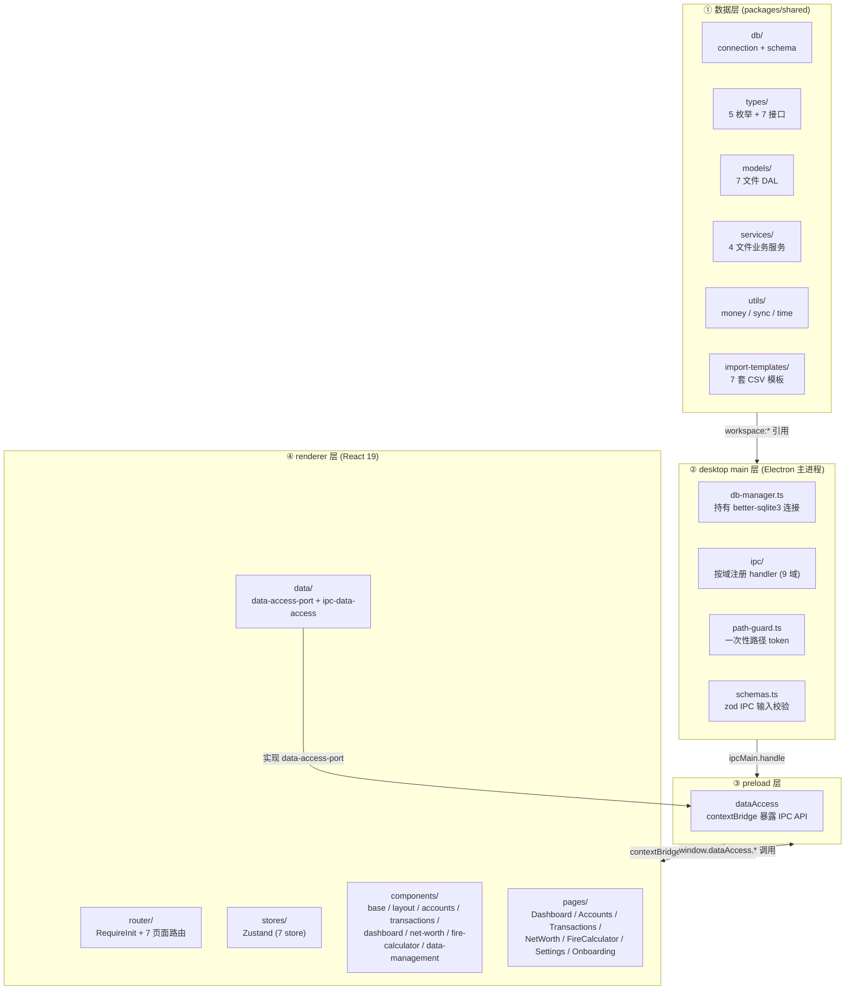

# FIRE APP Code Wiki

> **最后更新**: 2026-07-30
> **版本**: v2.0
> **代码基准**: pnpm workspace monorepo（`packages/shared` 数据层 + `apps/desktop` Electron 桌面端）
> **知识库基础**: `fire-knowledge-schema.yaml` v5.0
> **原则**: 代码为权威（Code is Authority）
> **导航**: 本页是 Wiki 主页 | [项目概览 →](01-overview.md)

---

## 1. 欢迎语与项目简介

### 1.1 一句话定位

FIRE APP 是一个基于 **TypeScript + better-sqlite3** 的个人 FIRE（Financial Independence, Retire Early，财务独立、提前退休）财务计算应用。它将 FIRE 方法论落地为可运行的数据模型与计算引擎，帮助个人用户追踪财务流水、量化净资产趋势并计算自己的 FIRE Number。

### 1.2 当前状态

| 维度 | 状态 |
|------|------|
| 数据层（数据库 / 类型 / Models / Services / Utils / 测试） | ✅ 已实现 |
| Electron 桌面端（main 主进程 / preload / renderer 渲染层） | ✅ 已实现 |
| 前端代码（IPC 通道 / React 19 组件 / Zustand 状态管理） | ✅ 已实现 |
| pnpm workspace monorepo（`packages/shared` + `apps/desktop`） | ✅ 已实现 |
| 加密同步层（LWW 引擎 / 跨设备同步） | ⏳ 规划中 |

当前仓库的核心成果是**完整的本地数据层、FIRE 计算引擎与 Electron 桌面端**——从数据库 schema、类型契约、CRUD 模型、事务化服务到测试覆盖（shared 22 文件 / 181 用例 + desktop 23 文件 / 293 用例，合计 45 文件 / 474 用例），再到 Electron 主进程 + IPC 桥 + React 渲染层，已构成可运行的桌面应用；跨设备加密同步为后续里程碑。

### 1.3 本 Wiki 的目的

本 Wiki 全面、结构化地记录 FIRE APP **已实现代码**的设计与实现细节，是代码的"镜像文档"。共 10 个子文件，覆盖：

- 项目概览与技术栈
- 数据库 7 张表 schema 与 9 个索引
- 类型系统（5 枚举 + 7 实体接口）
- 数据模型层 7 个文件 27 个函数
- 业务服务层 4 个文件（FIRE 计算 / 交易事务 / 补单引擎 / 快照聚合）
- 工具层（金额 / 同步 / 时间）
- 测试套件（vitest 配置与代码-测试映射）
- 设计文档导航与已知问题清单
- Desktop 主进程（Electron main + IPC + 安全加固）
- Renderer 渲染层（React 19 + Zustand + 7 页面 + 虚拟化/懒加载）

### 1.4 "代码为权威"原则说明

> **Wiki 描述以代码为准，设计文档作背景参考。**

设计文档（`docs/superpowers/specs/`）描述项目愿景与设计意图，而 Wiki 描述代码**实际落地**的状态。当两者不一致时，以代码为准。已知的设计-代码差异（均已修正）集中记录在 [08-design-index.md §4](08-design-index.md) 的"已知问题清单"中，例如：

- 设计文档曾写"17 个内置分类"，代码实际为 **18 个**（[category.ts](file:///workspace/packages/shared/src/models/category.ts) 的 `SEED_CATEGORIES`）
- 设计文档曾写"10 种 AccountType 枚举"，代码实际为 **11 种**（[types/index.ts](file:///workspace/packages/shared/src/types/index.ts)）

### 1.5 阅读建议

| 读者类型 | 建议路径 |
|----------|----------|
| **新手** | 从 [01-overview.md](01-overview.md) 开始顺序阅读，先建立全局认识（4 层架构、技术栈、设计原则），再依次进入数据库、类型、模型、服务、工具、测试 |
| **老手** | 直接按模块跳转——使用本页 [§3 Wiki 导航目录](#3-wiki-导航目录) 或 [§4 快速跳转](#4-快速跳转按主题查表) 定位目标章节 |
| **查代码-文档对应** | 使用 [§4.1 按代码文件查 Wiki 章节](#41-按代码文件查-wiki-章节) |
| **查设计问题答案** | 使用 [§4.2 按设计问题查 Wiki 章节](#42-按设计问题查-wiki-章节) |
| **查术语含义** | 使用 [§5 核心概念速查表](#5-核心概念速查表) |

---

## 2. 速览：技术栈与核心数字

| 维度 | 值 |
|------|------|
| 语言 / 模块系统 | TypeScript ^5.5.0 / ESM（`"type": "module"`，import 带 `.js`） |
| 数据库驱动 | better-sqlite3 ^11.0.0（同步 API，WAL 模式） |
| 主键策略 | UUID v4（`uuid` ^10.0.0，支持离线创建） |
| 测试框架 | vitest ^3.0.0（globals + node 环境，单线程） |
| 数据库表数 | 7 张（4 层领域架构） |
| 索引数 | 9 个（`transactions` 表占 4 个） |
| 类型定义 | 5 枚举别名 + 7 实体接口 |
| Models 函数数 | 27 个（跨 7 个文件） |
| Services 文件数 | 4 个（fire-calc / transaction-service / recurring-service / snapshot-service） |
| 测试规模 | shared 22 文件 / 181 it + desktop 23 文件 / 293 it（合计 45 文件 / 474 用例） |
| 金额存储 | 整数"分"（IEEE 754 两阶段取整规避浮点误差） |
| 利率存储 | 整数"基点"（1% = 100 基点） |

### 2.1 4 层架构总览

FIRE APP 采用 4 层架构（与 [01-overview.md §3.2](01-overview.md) 一致）：① 数据层（`packages/shared`）→ ② desktop main 层（Electron 主进程）→ ③ preload 层（contextBridge 桥）→ ④ renderer 层（React 19 渲染层）。数据层为单一权威，主进程持有 better-sqlite3 连接并通过 IPC 暴露，渲染层不直接接触数据库。



各层职责与代码位置详见 [09-desktop-main.md](09-desktop-main.md)（main + preload）与 [10-renderer.md](10-renderer.md)（renderer）。

---

## 3. Wiki 导航目录

本 Wiki 由主页（本文件）与 10 个子文件组成。子文件按"自顶向下"的代码层次组织：从项目概览到数据库、类型、模型、服务、工具、测试、设计文档索引，最后是 Desktop 主进程与 Renderer 渲染层。

### 3.1 子文件索引表

| # | 文件 | 主题 | 行数 | 对应代码 |
|---|------|------|------|----------|
| 01 | [01-overview.md](01-overview.md) | 项目概览 | 543 | `packages/shared/src/` + `apps/desktop/src/` |
| 02 | [02-database.md](02-database.md) | 数据库 Schema | 501 | `packages/shared/src/db/` |
| 03 | [03-types.md](03-types.md) | 类型系统 | 723 | `packages/shared/src/types/` |
| 04 | [04-models.md](04-models.md) | 数据模型层 | 600 | `packages/shared/src/models/` |
| 05 | [05-services.md](05-services.md) | 业务服务层 | 682 | `packages/shared/src/services/` |
| 06 | [06-utils.md](06-utils.md) | 工具模块 | 399 | `packages/shared/src/utils/` |
| 07 | [07-tests.md](07-tests.md) | 测试套件 | 273 | `packages/shared/tests/` + `apps/desktop/tests/` |
| 08 | [08-design-index.md](08-design-index.md) | 设计文档导航 | 466 | `docs/superpowers/` |
| 09 | [09-desktop-main.md](09-desktop-main.md) | Desktop 主进程 | 175 | `apps/desktop/src/main/` + `apps/desktop/src/preload/` |
| 10 | [10-renderer.md](10-renderer.md) | Renderer 渲染层 | 237 | `apps/desktop/src/renderer/` |

### 3.2 各子文件摘要

#### 01 — 项目概览（[01-overview.md](01-overview.md)）

FIRE APP 的全局导览：项目定位（个人 FIRE 财务计算应用）、技术栈（TypeScript + better-sqlite3 + vitest）、4 层领域架构（用户层 / 财务追踪层 / 快照层 / FIRE 投影层）、知识库 v5.0 对齐映射、仓库目录结构、模块依赖图（单向分层无循环）。理解项目的起点。

#### 02 — 数据库层（[02-database.md](02-database.md)）

数据库连接管理（WAL 模式 + 外键 PRAGMA）与 schema 初始化（`initSchema` 幂等）。逐表详解 7 张表 DDL（users / accounts / categories / transactions / recurring_transactions / net_worth_snapshots / fire_scenarios），含字段表、CHECK 约束、外键关系、索引。ER 图展示星型结构与自引用树。9 个索引全部以 `user_id` 为前导字段。

#### 03 — 类型系统（[03-types.md](03-types.md)）

纯类型导出文件（编译后 `.js` 为空）。5 个枚举别名（`AssetClass` / `AccountType` / `TransactionType` / `CategoryType` / `Frequency`）与 schema CHECK 约束一一对应。7 个实体接口与 7 张表一一对应，字段名使用 snake_case 与表列完全一致。含 0/1 标志位约定、UTC 时间戳约定、同步元数据三件套说明。

#### 04 — 数据模型层（[04-models.md](04-models.md)）

数据访问层（DAL），7 个文件 27 个函数，每文件对应一张表。详解 `seedCategories`（18 个内置分类）、`softDeleteAccount`（关联交易保护）、`updateAccountBalance`（不递增 sync_version 的例外）、`updateRecurring`（锁定 5 字段）等关键函数。含写操作与 sync_version 关系表、软删除过滤策略表。

#### 05 — 业务服务层（[05-services.md](05-services.md)）

业务逻辑层，4 个文件。`fire-calc.ts` 是纯计算引擎（FIRE 数公式 / 两阶段投影 / 600 月度数据点）。`transaction-service.ts` 用 `db.transaction` 保证交易记录与账户余额的原子性（含转账双账户联动）。`recurring-service.ts` 是补单引擎（while 循环生成逾期交易）。`snapshot-service.ts` 按月生成幂等净资产快照。含 3 个 Mermaid 流程图。

#### 06 — 工具模块（[06-utils.md](06-utils.md)）

3 个纯函数模块。`money.ts` 用 IEEE 754 两阶段取整规避 `1.005 × 100 = 100.4999...` 陷阱。`sync.ts` 提供 LWW 冲突判定原语（`shouldRemoteWin` 用 `>=` 避免同步死锁）。`time.ts` 处理月末溢出（1 月 31 日 + 1 月 → 2 月 28/29 日）与 UTC 时区约定。sync.ts 依赖 time.ts 的 `nowMs`，是 utils 内部唯一依赖。

#### 07 — 测试套件（[07-tests.md](07-tests.md)）

vitest 3.0 配置（globals + node + 单线程）。**shared 22 个测试文件 / 181 用例 + desktop 23 个测试文件 / 293 用例（合计 45 文件 / 474 用例）**，与各自 `src/` 目录镜像。代码-测试映射表统计每个测试文件的 describe / it 数与覆盖范围。含内存数据库约定、beforeEach/afterEach 模式、断言风格、集成测试用例（建账→记账→快照→FIRE 计算端到端验证）。

#### 08 — 设计文档导航（[08-design-index.md](08-design-index.md)）

设计文档与实施计划的索引。6 份 spec（用户数据模型 / 前端架构 / UI-UX / 初始化 / 缺失文档规划 / 跨文档审查）+ 3 份 plan（数据模型实施 / 桌面 MVP 里程碑 1 / 阶段 1 设计文档）。已知问题清单（2 个已修正错误）。尚未实现的规划（加密同步层）。

#### 09 — Desktop 主进程（[09-desktop-main.md](09-desktop-main.md)）

Electron 主进程是应用核心宿主层，承担四项职责：应用生命周期与窗口管理、SQLite 连接单例、IPC 桥接（按 9 域注册 handler）、M9 安全加固（sandbox:true + contextIsolation:true + nodeIntegration:false + CSP + 一次性路径 token + zod 输入校验）。入口 [index.ts](file:///workspace/apps/desktop/src/main/index.ts) 在 `app.whenReady()` 中依次执行：固定 userData 路径 → 初始化数据库 → 注册 IPC handlers → 注入 CSP → 创建窗口。preload 经 `contextBridge` 暴露 `window.dataAccess` 命名空间，主进程本身不实现业务逻辑，仅做注册、校验、脱敏与文件 I/O 守卫。

#### 10 — Renderer 渲染层（[10-renderer.md](10-renderer.md)）

渲染层运行在 BrowserWindow 中，技术栈 **React 19 + Zustand 5 + react-router-dom 7 + Tailwind 4 + Recharts 2**，经 electron-vite 打包。不直接接触 better-sqlite3，所有数据操作经 `window.dataAccess` 下发到主进程。结构：入口与路由（RequireInit 守卫 + 7 页面）、7 个 Zustand store、data 抽象（DataAccessPort + IPC 实现 + 单例）、components（base / layout / auxiliary / accounts / transactions / dashboard / net-worth / fire-calculator / data-management）、7 页面（Dashboard / Accounts / Transactions / NetWorth / FireCalculator / Settings / Onboarding）、M9 性能加固（Table 行数 > 20 启用 `@tanstack/react-virtual` 虚拟化、7 页面 React.lazy 懒加载 + manualChunks 分包 react-vendor/recharts/zustand、TransactionsPage `PAGE_SIZE=50` 服务端分页）。

### 3.3 阅读顺序建议

```
01-overview → 02-database → 03-types → 04-models → 05-services → 06-utils → 07-tests → 08-design-index → 09-desktop-main → 10-renderer
   概览        数据库       类型      数据模型     业务服务      工具       测试        设计文档          Desktop 主进程     Renderer
```

每个子文件底部含导航链接，可顺序浏览；10-renderer 末尾的"下一节"回到本主页（CODE_WIKI），本页是各子文件的返回入口。

---

## 4. 快速跳转：按主题查表

### 4.1 按代码文件查 Wiki 章节

下表列出所有主要源文件及其在 Wiki 中的对应章节。源码链接使用 `file:///` 协议，Wiki 链接为相对路径。

| 代码文件 | Wiki 位置 | 说明 |
|----------|-----------|------|
| [packages/shared/src/db/schema.ts](file:///workspace/packages/shared/src/db/schema.ts) | [02-database.md §2-3](02-database.md) | 7 张表 DDL + 9 索引 + `initSchema` 幂等 |
| [packages/shared/src/db/connection.ts](file:///workspace/packages/shared/src/db/connection.ts) | [02-database.md §1](02-database.md) | 连接创建 / WAL 模式 / 外键 PRAGMA |
| [packages/shared/src/types/index.ts](file:///workspace/packages/shared/src/types/index.ts) | [03-types.md §2-3](03-types.md) | 5 枚举别名 + 7 实体接口 |
| [packages/shared/src/models/user.ts](file:///workspace/packages/shared/src/models/user.ts) | [04-models.md §2](04-models.md) | 用户 CRUD + 中国市场默认提款率 |
| [packages/shared/src/models/account.ts](file:///workspace/packages/shared/src/models/account.ts) | [04-models.md §3](04-models.md) | 账户 CRUD + 可投资余额 + 软删除保护 |
| [packages/shared/src/models/category.ts](file:///workspace/packages/shared/src/models/category.ts) | [04-models.md §4](04-models.md) | 分类 CRUD + seedCategories (18 个) |
| [packages/shared/src/models/transaction.ts](file:///workspace/packages/shared/src/models/transaction.ts) | [04-models.md §5](04-models.md) | 交易查询（仅读，写操作在 services） |
| [packages/shared/src/models/recurring.ts](file:///workspace/packages/shared/src/models/recurring.ts) | [04-models.md §6](04-models.md) | 经常性模板 CRUD |
| [packages/shared/src/models/scenario.ts](file:///workspace/packages/shared/src/models/scenario.ts) | [04-models.md §7](04-models.md) | FIRE 场景 CRUD |
| [packages/shared/src/models/snapshot.ts](file:///workspace/packages/shared/src/models/snapshot.ts) | [04-models.md §8](04-models.md) | 快照查询与插入（无 update） |
| [packages/shared/src/services/fire-calc.ts](file:///workspace/packages/shared/src/services/fire-calc.ts) | [05-services.md §2](05-services.md) | FIRE 计算（纯引擎，不写库） |
| [packages/shared/src/services/transaction-service.ts](file:///workspace/packages/shared/src/services/transaction-service.ts) | [05-services.md §3](05-services.md) | 交易事务 + 余额联动 |
| [packages/shared/src/services/recurring-service.ts](file:///workspace/packages/shared/src/services/recurring-service.ts) | [05-services.md §4](05-services.md) | 补单引擎（while 循环） |
| [packages/shared/src/services/snapshot-service.ts](file:///workspace/packages/shared/src/services/snapshot-service.ts) | [05-services.md §5](05-services.md) | 月度快照幂等生成 |
| [packages/shared/src/utils/money.ts](file:///workspace/packages/shared/src/utils/money.ts) | [06-utils.md §2](06-utils.md) | 元↔分 + 基点→小数 |
| [packages/shared/src/utils/sync.ts](file:///workspace/packages/shared/src/utils/sync.ts) | [06-utils.md §3](06-utils.md) | LWW 冲突判定原语 |
| [packages/shared/src/utils/time.ts](file:///workspace/packages/shared/src/utils/time.ts) | [06-utils.md §4](06-utils.md) | 时间戳 + 年月 + 月份运算 |
| [packages/shared/vitest.config.ts](file:///workspace/packages/shared/vitest.config.ts) | [07-tests.md §1](07-tests.md) | vitest 配置（单线程） |
| [packages/shared/package.json](file:///workspace/packages/shared/package.json) | [01-overview.md §2](01-overview.md) | 依赖与版本 |

### 4.2 按设计问题查 Wiki 章节

下表针对常见设计问题，指向 Wiki 中解答该问题的章节。

| 问题 | Wiki 位置 |
|------|-----------|
| 金额如何存储？为什么用整数分？ | [06-utils.md §2](06-utils.md) + [02-database.md §3](02-database.md) |
| 同步冲突如何解决？LWW 规则是什么？ | [06-utils.md §3](06-utils.md) |
| FIRE Number 如何计算？4% 法则如何体现？ | [05-services.md §2](05-services.md) |
| 经常性交易如何执行？离线补单如何工作？ | [05-services.md §4](05-services.md) |
| 为什么 db/ 不被 models / services 直接 import？ | [01-overview.md §6](01-overview.md) |
| 软删除如何工作？查询默认过滤策略？ | [04-models.md §9.2](04-models.md) |
| 账户余额如何随交易联动？事务如何保证原子性？ | [05-services.md §3](05-services.md) |
| 月度快照的幂等性如何保证？ | [05-services.md §5](05-services.md) + [02-database.md §3.6](02-database.md) |
| 为什么 `updateAccountBalance` 不递增 sync_version？ | [04-models.md §3.3](04-models.md) |
| 18 个种子分类是什么？哪些关联 FIRE 概念？ | [04-models.md §4.3](04-models.md) |
| 4 层架构如何划分？层间数据流如何？ | [01-overview.md §3](01-overview.md) |
| 转账交易如何处理双账户余额？ | [05-services.md §3.2](05-services.md) |
| 为什么所有时间用 UTC？跨时区同步如何一致？ | [06-utils.md §5](06-utils.md) |
| 中国市场默认提款率为什么是 3.5%？ | [04-models.md §2.3](04-models.md) + [01-overview.md §4](01-overview.md) |
| FIRE 投影结果为什么不持久化？ | [05-services.md §2](05-services.md) + [02-database.md §3.7](02-database.md) |
| 测试为什么用单线程？内存数据库如何工作？ | [07-tests.md §4](07-tests.md) |
| 设计文档与代码有哪些已知差异？ | [08-design-index.md §4](08-design-index.md) |

---

## 5. 核心概念速查表

下表汇总 FIRE APP 的核心术语与设计决策，与设计文档术语表保持一致。

| 术语 | 含义 | 代码位置 |
|------|------|----------|
| 金额=分 | 1 元 = 100 分，整数存储避免 IEEE 754 浮点误差 | [money.ts](file:///workspace/packages/shared/src/utils/money.ts) `yuanToCents` |
| 基点（basis point） | 1% = 100 基点，350 = 3.5%；利率字段统一用基点整数存储 | [types/index.ts](file:///workspace/packages/shared/src/types/index.ts) + [money.ts](file:///workspace/packages/shared/src/utils/money.ts) `basisPointsToDecimal` |
| 软删除（soft delete） | `deleted_flag = 1` 标记删除，不物理删除；查询默认过滤 `deleted_flag = 0` | 所有 models（例外：`getTransactionById` 不过滤） |
| LWW（Last-Write-Wins） | 同步冲突解决策略，按 `updated_at` 比较决定胜者（`>=` 避免死锁） | [sync.ts](file:///workspace/packages/shared/src/utils/sync.ts) `shouldRemoteWin` |
| sync_version | 同步版本号，每次本地修改 +1（单调递增）；不参与 LWW 判定（跨设备无全局可比性） | 所有 7 张表 |
| UUID v4 主键 | 所有表 `id` 为 UUID v4（TEXT），支持离线创建无冲突 | 所有 models（`uuid` 包 `v4 as uuidv4`） |
| 4 层架构 | User / Financial Tracking / Snapshot / FIRE Projection 四层领域分层 | [01-overview.md §3](01-overview.md) |
| FIRE Number | 达到财务独立所需的可投资资产总额 = 年支出 × (10000 / 提款率基点) | [fire-calc.ts](file:///workspace/packages/shared/src/services/fire-calc.ts) `calculateFireNumber` |
| 4% 法则 | 退休后每年提取 4%（25 倍年支出）；中国市场下调至 3.5%（约 28.57 倍） | [users](file:///workspace/packages/shared/src/db/schema.ts) `default_withdrawal_rate` |
| 可投资余额 | `liquid + invested` 两类账户余额之和（自住房产 use_asset 不计入） | [account.ts](file:///workspace/packages/shared/src/models/account.ts) `getInvestableBalance` |
| seedCategories | 18 个内置分类（11 支出 + 7 收入），`is_system = 1` 用户不可删；其中 5 个关联 FIRE 知识库概念 | [category.ts](file:///workspace/packages/shared/src/models/category.ts) `SEED_CATEGORIES` |
| 统一符号余额 | 资产余额 ≥ 0，负债余额 ≤ 0；净资产 = `SUM(current_balance)` 一条 SQL 完成 | [account.ts](file:///workspace/packages/shared/src/models/account.ts) `getNetWorth` |
| 同步元数据三件套 | `sync_version` / `updated_at` / `deleted_flag` 三字段，所有表统一含 | [sync.ts](file:///workspace/packages/shared/src/utils/sync.ts) `SyncMeta` 接口 |
| 结果不持久化 | FIRE 投影结果（600 月度数据点）由 `runProjection` 实时计算，不存库 | [fire-calc.ts](file:///workspace/packages/shared/src/services/fire-calc.ts) `runProjection` |
| 事务强一致 | 交易写操作包裹在 `db.transaction` 内，任一步失败整体回滚 | [transaction-service.ts](file:///workspace/packages/shared/src/services/transaction-service.ts) |
| CSP 内容安全策略 | prod 严格（`script-src 'self'`），dev 放宽（`unsafe-inline` + `ws://localhost` 支持 HMR）；启动时按环境注入 `<meta>` | [index.ts](file:///workspace/apps/desktop/src/main/index.ts) |
| Electron 沙箱 | `sandbox: true` + `contextIsolation: true` + `nodeIntegration: false`，渲染层无 Node 访问 | [index.ts](file:///workspace/apps/desktop/src/main/index.ts) |
| 路径安全 | 文件 dialog 签发一次性 token，消费后即失效；强制绝对路径且不允许 `..` 穿越到 userData 之外 | [path-guard.ts](file:///workspace/apps/desktop/src/main/ipc/path-guard.ts) |
| 表格虚拟化 | Table 行数 > 20 启用 `@tanstack/react-virtual`，仅渲染可视行（账户/交易大列表性能） | [Table.tsx](file:///workspace/apps/desktop/src/renderer/src/components/base/Table.tsx) |
| 路由懒加载 | 7 页面用 `React.lazy` 动态导入 + vite `manualChunks` 分包（react-vendor / recharts / zustand），减小首屏 | [router/index.tsx](file:///workspace/apps/desktop/src/renderer/src/router/index.tsx) |
| 服务端分页 | TransactionsPage `PAGE_SIZE = 50`，分页参数下发主进程 SQL `LIMIT/OFFSET`，避免一次性加载全表 | [TransactionsPage.tsx](file:///workspace/apps/desktop/src/renderer/src/pages/TransactionsPage.tsx) |

---

## 6. 项目状态总览

### 6.1 已实现 vs 规划中

| 模块 | 状态 | Wiki 章节 |
|------|------|-----------|
| 数据库 schema（7 表 + 9 索引） | ✅ 已实现 | [02](02-database.md) |
| 类型系统（5 枚举 + 7 接口） | ✅ 已实现 | [03](03-types.md) |
| Models CRUD（7 文件 / 27 函数） | ✅ 已实现 | [04](04-models.md) |
| Services（4 文件：FIRE 计算 / 交易事务 / 补单 / 快照） | ✅ 已实现 | [05](05-services.md) |
| Utils（money / sync / time） | ✅ 已实现 | [06](06-utils.md) |
| 测试套件（shared 22 / 181 + desktop 23 / 293 = 45 文件 / 474 用例） | ✅ 已实现 | [07](07-tests.md) |
| Electron 主进程（持有 better-sqlite3 + IPC handler + 安全加固） | ✅ 已实现 | [09](09-desktop-main.md) |
| React 渲染层（React 19 + Tailwind 4 + Zustand 5） | ✅ 已实现 | [10](10-renderer.md) |
| IPC 通道（`db:init` / `db:user:getFirst` 等 9 域） | ✅ 已实现 | [09](09-desktop-main.md) |
| DataAccessPort 抽象层 | ✅ 已实现 | [10](10-renderer.md) |
| 用户引导流程（首次启动向导） | ✅ 已实现 | [10](10-renderer.md) |
| pnpm workspace monorepo（`packages/shared` + `apps/desktop`） | ✅ 已实现 | 根 `pnpm-workspace.yaml` |
| 加密同步层（LWW 引擎 / 跨设备同步 / 密钥管理） | ⏳ 规划中 | — |
| 数据导出 / 备份 | ⏳ 规划中 | — |

> **关键说明**：当前已实现的是**本地数据层、FIRE 计算引擎与 Electron 桌面端**。数据层代码位于 `packages/shared`，桌面端代码位于 `apps/desktop`（main / preload / renderer 三层）。桌面端实施计划见 [桌面 MVP 里程碑 1](file:///workspace/docs/superpowers/plans/2026-07-15-fire-app-desktop-mvp-milestone1.md)。加密同步层规划在阶段 3（详见 [08-design-index.md §5](08-design-index.md)）。

### 6.2 设计文档索引摘要

设计文档与实施计划的完整导航见 [08-design-index.md](08-design-index.md)。摘要如下：

| 类型 | 数量 | 位置 | 摘要 |
|------|------|------|------|
| spec（设计文档） | 6 份 | `docs/superpowers/specs/` | 用户数据模型 / 前端架构 / UI-UX / 初始化 / 缺失文档规划 / 跨文档审查 |
| plan（实施计划） | 3 份 | `docs/superpowers/plans/` | 数据模型实施（已完成）/ 桌面 MVP 里程碑 1（已完成）/ 阶段 1 设计文档（已完成） |

**已知问题清单**：[08-design-index.md §4](08-design-index.md) 记录 2 个已修正错误（种子分类数 17→18、AccountType 枚举数 10→11），Wiki 全文以代码为权威描述。

---

## 7. 如何贡献本 Wiki

### 7.1 "代码为权威"原则

修改代码后**同步更新对应 Wiki 章节**。Wiki 与代码不一致时，以代码为准并更新 Wiki 描述，而非反之。新增的文档-代码差异记录在 [08-design-index.md §4](08-design-index.md) 的已知问题清单中。

### 7.2 文件头部格式规范

每个子文件头部应包含以下元信息块：

```markdown
# NN-name.md — 章节标题

> **最后更新**: YYYY-MM-DD
> **对应代码**: `packages/shared/src/xxx/`
> **导航**: [← 返回主页](CODE_WIKI.md) | [上一节](NN-prev.md) | [下一节](NN-next.md)

---
```

- **最后更新**：每次实质性修改后更新日期
- **对应代码**：该章节描述的代码目录或文件
- **导航**：主页返回链接 + 前后章节链接（首章无"上一节"，末章无"下一节"）

### 7.3 Mermaid 图表使用约定

- 使用 ```` ```mermaid ```` 代码块嵌入图表
- 图表类型按内容选择：架构图用 `flowchart TD`，时序图用 `sequenceDiagram`，ER 图用 `erDiagram`
- 节点标识符用英文，标签可用中文
- 详见各子文件中的 Mermaid 示例（如 [01-overview.md §3.1](01-overview.md) 的架构总览图、[05-services.md §2.3](05-services.md) 的投影流程图）

### 7.4 源码链接格式约定

引用源码文件时使用 `file:///` 协议：

```markdown
[schema.ts](file:///workspace/packages/shared/src/db/schema.ts)
```

- 路径前缀统一为 `file:///workspace/`（monorepo 根），数据层文件位于 `packages/shared/`，桌面端文件位于 `apps/desktop/`
- 行号引用格式：`[schema.ts:16-29](file:///workspace/packages/shared/src/db/schema.ts#L16-L29)`
- Wiki 内部导航链接使用相对路径（如 `[01-overview.md](01-overview.md)`），不带 `file:///` 前缀

### 7.5 内容更新检查清单

修改代码后，对照以下检查项更新 Wiki：

- [ ] 表 / 字段 / 函数签名是否与代码一致？
- [ ] 行数引用是否需要更新（用 `wc -l` 确认）？
- [ ] 源码链接的行号锚点是否仍有效？
- [ ] 是否引入了新的文档-代码差异？若有，记录到 [08-design-index.md §4](08-design-index.md)
- [ ] 子文件头部的"最后更新"日期是否需要刷新？

---

## 8. 页脚

> **导航**: 本页是 Wiki 主页 | [项目概览 →](01-overview.md)
> **维护**: 当代码变更时同步更新对应 Wiki 章节
